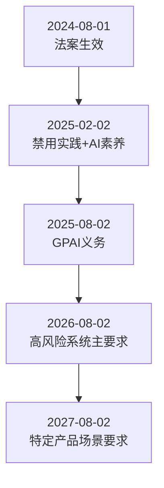
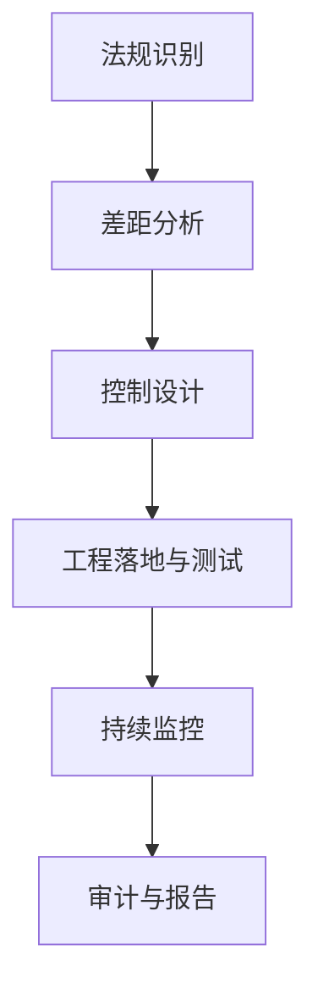

## 11.1 AI 法规与合规要求

随着生成式 AI 技术的广泛落地，全球 AI 监管已进入“持续更新”的密集活跃期。面对合规挑战，组织不能仅停留在关注“是否有法”的阶段，而应建立前瞻性的响应机制。本节将首先探讨 AI 监管的核心动因与目标，随后梳理全球重点地区（欧盟、美国、中国等）的监管框架与生效时间线，最后介绍基于国际标准的工程化合规实施路径与常见挑战。

### 11.1.1 AI 监管的动因与目标

人工智能（尤其是大语言模型）的突破性进展，在赋能千行百业的同时，也带来了前所未有的复杂风险。实施 AI 监管并非为了限制技术演进，而是要在科技创新与社会安全之间寻找合理的平衡点。

总体而言，全球推进 AI 监管的核心目的主要集中在以下几个方面：

- **防范系统性风险，守住安全底线**：大语言模型具备强大的生成和逻辑推理能力，若未加限制或被恶意利用，可能被用于自动生成网络攻击代码、批量制造具有迷惑性的虚假信息，甚至用于开发危险物质，从而对国家安全、公共安全和社会稳定构成系统性威胁。监管旨在通过分级分类评估，划定不可触碰的技术红线，阻断极其危险的滥用场景。
- **保护基本权利，确保公平正义**：AI 系统已开始深入参与甚至主导信贷评估、人员招聘、医疗诊断和司法辅助等关键领域的决策。如果模型训练数据包含历史偏差，系统将固化并以不可见的方式放大歧视。监管机构要求增强透明度和算法可解释性，旨在审查并纠正模型偏见，确保算法决策遵循公平、公正原则，守护公民的基本权利免遭自动化系统侵害。
- **捍卫数据隐私，保护知识产权**：生成式 AI 的“智能”建立在对海量数据的吞噬与拟合之上，这一过程不可避免地会卷入个人敏感信息与受版权保护的作品。监管框架致力于规范数据采集、清洗标注与模型训练的全生命周期处理规则，防止滥用个人隐私，并构建合理的创作者利益保护机制。
- **厘清责任边界，建立问责机制**：面对 AI 模型因“幻觉”导致的误导性输出或错误执行引发的实际损失，传统的侵权责任认定面临挑战。法律体系需要一套新的规则来合理划定基础模型提供方、应用层开发者、服务部署方以及最终用户之间的责任分配与风险共担机制，确保受害者能够获得有法可依的合理救济。
- **夯实信任基石，促进可持续创新**：通过出台统一、透明的合规审查标准与技术认证体系，为企业提供清晰可预期的“游戏规则”。这不仅能制止部分企业为抢先发布而忽视安全的恶性竞争，还能实质性增强公众和市场对 AI 系统的信任。以安全合规为前提的创新，才是能够长远发展的可持续创新。

### 11.1.2 全球监管概览

| 地区 | 代表框架/法规 | 截至 2026 年 2 月状态 | 对 LLM 组织的含义 |
|------|----------------|-----------------------|-------------------|
| 欧盟 | EU AI Act | 已分阶段生效 | 需要按生效批次落地控制 |
| 美国 | 联邦政策 + 州级立法 + 行业监管 | 动态变化 | 需要“联邦+州+行业”并行合规 |
| 中国 | 生成式 AI 服务管理相关规则 | 已实施 | 强调内容安全、备案与数据合规 |
| 国际标准 | NIST AI RMF、ISO/IEC 42001 等 | 持续演进 | 作为跨法域治理底座 |

> 注：监管变化快，建议建立“法规雷达机制”，至少每月复核一次权威来源（附录 C-3、C-36、C-37）。

### 11.1.3 EU AI Act：关键时间线

欧盟 AI 法案（Regulation (EU) 2024/1689）已于 **2024-08-01** 生效，按阶段落地：

| 日期 | 关键里程碑 | 组织动作建议 |
|------|------------|--------------|
| 2025-02-02 | 禁止类 AI 实践开始适用；AI 素养相关要求开始生效 | 完成“禁止场景”排查与培训 |
| 2025-08-02 | GPAI（通用 AI）相关义务开始适用（按法案规定分层） | 完成模型文档、评估与披露机制 |
| 2026-08-02 | 大部分高风险系统要求开始适用（含 Annex III 类） | 建立全套风险管理与技术文档链路 |
| 2027-08-02 | 部分嵌入受监管产品的高风险系统要求进一步落地 | 补齐行业产品耦合场景控制 |

```mermaid
flowchart TB
    A["2024-08-01<br/>法案生效"] --> B["2025-02-02<br/>禁用实践+AI素养"]
    B --> C["2025-08-02<br/>GPAI义务"]
    C --> D["2026-08-02<br/>高风险系统主要求"]
    D --> E["2027-08-02<br/>特定产品场景要求"]
```

图 11-1：EU AI Act 分阶段生效时间线

### 11.1.4 美国与中国：合规实践要点

**美国（实践视角）**
- 联邦政策与机构规则会变动，需持续跟踪白宫与联邦公报更新。
- 州级 AI/隐私法律差异大，跨州业务需按最严格要求收敛。
- 在医疗、金融、教育等行业，还要叠加行业监管规则。

**中国（实践视角）**
- 面向公众提供生成式 AI 服务时，需要关注备案、内容安全、数据治理与用户权益保护等要求。
- 企业内部 LLM 平台也应将“内容安全+数据合法性+审计留痕”作为基础控制。

### 11.1.5 标准与合规实施

**推荐的控制底座**
- **ISO/IEC 42001**：建立组织级 AI 管理体系，形成可审计治理流程。
- **NIST AI RMF + GenAI Profile（AI 600-1）**：把“治理-映射-测量-管理”映射到生成式 AI 风险场景。

```mermaid
flowchart TB
    A["法规识别"] --> B["差距分析"]
    B --> C["控制设计"]
    C --> D["工程落地与测试"]
    D --> E["持续监控"]
    E --> F["审计与报告"]
```

图 11-2：AI 合规实施闭环流程图

**关键步骤**
1. 识别适用司法辖区和行业规则。
2. 建立法规条款到控制项的映射矩阵。
3. 将控制项转为工程门禁（测试、发布、运营）。
4. 保留可审计证据（日志、评估报告、变更记录）。
5. 定期复核法规更新并回灌到控制体系。

### 11.1.6 合规挑战

| 挑战 | 常见表现 | 应对策略 |
|------|----------|----------|
| 生效节奏错配 | 业务上线快于合规落地 | 使用法规时间线驱动项目排期 |
| 跨境差异 | 同一功能在不同法域要求不同 | 建立“最严法域优先”基线 |
| 证据不足 | 做了控制但无法审计证明 | 默认留痕、模板化证据采集 |
| 组织协同弱 | 法务/安全/产品分散 | 设立跨职能 AI 治理委员会 |

理解法规是起点，把法规转成“可执行、可验证、可持续”的工程控制，才是合规落地的核心。
