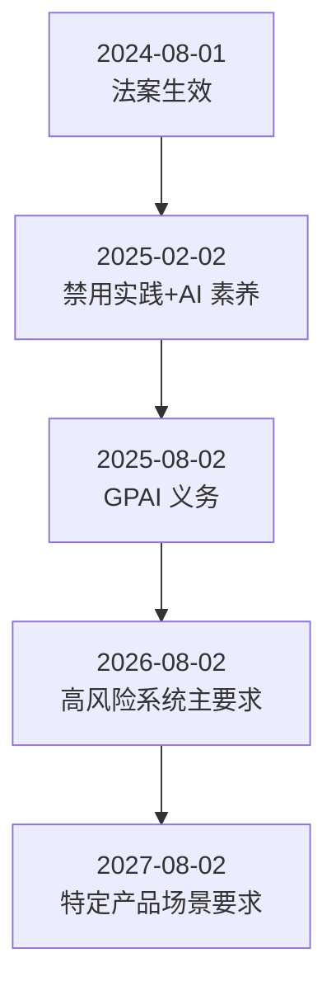

## 11.1 AI 法规与合规要求

随着生成式 AI 技术的广泛落地，全球 AI 监管已进入“持续更新”的密集活跃期。面对合规挑战，组织不能仅停留在关注“是否有法”的阶段，而应建立前瞻性的响应机制。本节将首先探讨 AI 监管的核心动因与目标，随后梳理全球重点地区（欧盟、美国、中国等）的监管框架与生效时间线，最后介绍基于国际标准的工程化合规实施路径与常见挑战。

### 11.1.1 AI 监管的动因与目标

人工智能（尤其是大语言模型）的突破性进展，在赋能千行百业的同时，也带来了前所未有的复杂风险。实施 AI 监管并非为了限制技术演进，而是要在科技创新与社会安全之间寻找合理的平衡点。

总体而言，全球推进 AI 监管的核心目的主要集中在以下几个方面：

- **防范系统性风险，守住安全底线**：大语言模型具备强大的生成和逻辑推理能力，若未加限制或被恶意利用，可能被用于自动生成网络攻击代码、批量制造具有迷惑性的虚假信息，甚至用于开发危险物质，从而对国家安全、公共安全和社会稳定构成系统性威胁。监管旨在通过分级分类评估，划定不可触碰的技术红线，阻断极其危险的滥用场景。
- **保护基本权利，确保公平正义**：AI 系统已开始深入参与甚至主导信贷评估、人员招聘、医疗诊断和司法辅助等关键领域的决策。如果模型训练数据包含历史偏差，系统将固化并以不可见的方式放大歧视。监管机构要求增强透明度和算法可解释性，旨在审查并纠正模型偏见，确保算法决策遵循公平、公正原则，守护公民的基本权利免遭自动化系统侵害。
- **捍卫数据隐私，保护知识产权**：生成式 AI 的“智能”建立在对海量数据的吞噬与拟合之上，这一过程不可避免地会卷入个人敏感信息与受版权保护的作品。监管框架致力于规范数据采集、清洗标注与模型训练的全生命周期处理规则，防止滥用个人隐私，并构建合理的创作者利益保护机制。
- **厘清责任边界，建立问责机制**：面对 AI 模型因“幻觉”导致的误导性输出或错误执行引发的实际损失，传统的侵权责任认定面临挑战。法律体系需要一套新的规则来合理划定基础模型提供方、应用层开发者、服务部署方以及最终用户之间的责任分配与风险共担机制，确保受害者能够获得有法可依的合理救济。
- **夯实信任基石，促进可持续创新**：通过出台统一、透明的合规审查标准与技术认证体系，为企业提供清晰可预期的“游戏规则”。这不仅能制止部分企业为抢先发布而忽视安全的恶性竞争，还能实质性增强公众和市场对 AI 系统的信任。以安全合规为前提的创新，才是能够长远发展的可持续创新。

### 11.1.2 全球监管概览

| 地区 | 代表框架/法规 | 截至 2026-04-18 状态 | 对 LLM 组织的含义 |
|------|----------------|-----------------------|-------------------|
| 欧盟 | EU AI Act | 已分阶段生效 | 需要按生效批次落地控制 |
| 美国 | 联邦政策 + 州级立法 + 行业监管 | 动态变化 | 需要“联邦+州+行业”并行合规 |
| 中国 | 生成式 AI 服务管理相关规则 | 已实施 | 强调内容安全、备案与数据合规 |
| 国际标准 | NIST AI RMF、ISO/IEC 42001 等 | 持续演进 | 作为跨法域治理底座 |

> 注：监管变化快，建议建立“法规雷达机制”，至少每月复核一次权威来源（附录 C-3、C-36、C-37）。

### 11.1.3 EU AI Act：关键时间线

欧盟 AI 法案（Regulation (EU) 2024/1689）已于 **2024-08-01** 生效，按阶段落地：

| 日期 | 关键里程碑 | 组织动作建议 |
|------|------------|--------------|
| 2025-02-02 | 禁止类 AI 实践开始适用；AI 素养相关要求开始生效 | 完成“禁止场景”排查与培训 |
| 2025-08-02 | `Chapter III Section 4`、`Chapter V`、`Chapter VII`、`Chapter XII` 与 `Article 78` 开始适用，其中 GPAI 义务按普通 GPAI 与系统性风险 GPAI 分层 | 完成技术文档、向下游提供信息、版权合规政策与训练数据摘要等机制 |
| 2026-08-02 | 大部分高风险系统要求开始适用（主要对应 Annex III 场景） | 建立全套风险管理、技术文档、日志与人工监督链路 |
| 2027-08-02 | `Article 6(1)` 及相关义务开始适用，主要对应嵌入 Annex I 产品安全立法框架的高风险系统 | 补齐受监管产品耦合场景控制 |

```mermaid
flowchart TB
    A["2024-08-01<br/>法案生效"] --> B["2025-02-02<br/>禁用实践+AI 素养"]
    B --> C["2025-08-02<br/>GPAI 义务"]
    C --> D["2026-08-02<br/>高风险系统主要求"]
    D --> E["2027-08-02<br/>特定产品场景要求"]
```

图 11-1：EU AI Act 分阶段生效时间线

**处罚力度**：EU AI Act 对严重违规者的惩罚力度极高——最高可达 3500 万欧元或全球年营业额的 7%（取较高值）。需要注意的是，AI Act 的义务是**分阶段、分风险等级**落地的；即便到 2026 年 8 月 2 日，高风险 AI 系统也并非在所有场景下一次性“全面适用”，其中嵌入受规制产品的部分要求仍有更长过渡期。因此，部署企业级 AI 智能体的组织应尽早完成合规准备，但不能把时间线理解为单一截点。

### 11.1.4 美国与中国：合规实践要点

**美国（实践视角）**

联邦层面与州层面的 AI 监管呈现快速演进态势。以下为代表性的州级立法与联邦指南（截至 2026 年 2 月）：

**州级立法示例**
- **加州（California）- 持续演进中的 AI 州级立法**
  - 需要区分“已签署生效”的法案与“提出后被否决”的草案。`SB 1047` 已被州长否决，不能把它当作现行合规义务。
  - 组织应重点关注已经生效的透明性、深度伪造和消费者告知相关州法。

- **科罗拉多州（Colorado）- SB 24-205 （2024 年签署）**
  - 要求高风险 AI 系统进行影响评估（AI Impact Assessment）。
  - 重点覆盖就业、教育、金融/信贷、医疗、住房、保险、法律服务和关键政府服务等 consequential decisions 场景。
  - 企业需建立 AI 风险评估与缓解的制度框架。

**联邦层面指南与标准**
- **NIST AI 600-1 （生成式 AI Profile，2024 年发布）**
  - 它是 `AI RMF 1.0` 的生成式 AI profile / companion resource，而不是一套独立的四项固定要求。
  - 可与 AI RMF 的 `Govern / Map / Measure / Manage` 结构配合使用。

- **联邦层面的最新治理文件**
  - 行政命令来自白宫而非 NIST；旧的 `EO 14110` 已被撤销。
  - 当前更应关注 `EO 14179` 以及 `OMB M-25-21`、`OMB M-25-22` 等联邦治理与采购文件。

**行业机构规则**
- 在医疗（FDA）、金融（SEC/CFPB）、教育等领域，还要叠加行业监管规则。

**实施建议**
- 联邦政策与机构规则会变动，需持续跟踪白宫与联邦公报更新。
- 州级 AI/隐私法律差异大，跨州业务需按最严格要求（例如加州与科罗拉多的标准）收敛。
- 在医疗、金融、教育等行业，还要叠加行业监管规则。

**中国（实践视角）**

中国对生成式 AI 的监管框架已形成多层次的法规体系，关键法规包括：

- **《生成式人工智能服务管理暂行办法》**（2023 年 8 月 15 日施行）
  - 明确生成式 AI 服务提供者的内容安全、数据治理与用户权益保护义务。
  - 其中安全评估与按算法推荐规定履行备案手续，需结合 `Article 17` 的适用条件理解，并非对所有提供者一刀切适用。
  - 要求对生成内容进行实时监测，防止生成违法违规内容。
  - 对用户信息和个人隐私的保护有具体要求。

- **《互联网信息服务算法推荐管理规定》**（2022 年 3 月 1 日施行）
  - 规范算法推荐行为，要求透明度与用户自主权。
  - 虽非专门针对大模型，但对 RAG 和信息推荐场景同样适用。

- **《互联网信息服务深度合成管理规定》**（2023 年 1 月 10 日施行）与 **《人工智能生成合成内容标识办法》**（2025 年 9 月 1 日施行）
  - 前者为深度合成服务提供基础监管框架，后者进一步细化了 AI 生成合成内容的标识要求。
  - 相关义务需按服务类型、平台属性和适用条款具体判断，不能简单压缩成“所有 AI 输出一律显著标识”。

- **《数据安全法》和《个人信息保护法》**
  - 为 AI 训练数据的采集、清洗、标注与存储提供法律框架。
  - 明确个人信息的处理原则与用户权利（访问、删除、数据携带权等）。

- **网信办大模型备案制度**（持续推进）
  - 面向公众提供服务的大模型通常需结合安全评估、备案与持续监管要求理解，具体义务应以最新公告和适用条款为准。
  - 包括对模型能力、风险评估、安全措施的详细披露。

**实施建议**
- 面向公众提供生成式 AI 服务时，需要关注备案、内容安全、数据治理与用户权益保护等要求。
- 企业内部 LLM 平台也应将“内容安全+数据合法性+审计留痕”作为基础控制。
- 建议定期咨询法务团队，跟踪最新的监管动态与执行指南。

### 11.1.5 标准与合规落地：从风险语言到工程证据

合规不能仅停留在法务的纸面审查上，必须借助成熟的标准框架，将其转化为工程团队可执行、审计团队可验证的控制点。推荐采用“管理体系 + 风险框架”的组合底座：

#### 1. ISO/IEC 42001：AI 管理体系标准

ISO/IEC 42001 的核心定位是建立 **人工智能管理体系（AIMS）**。它不强求具体的极客防线细节，而是强调“生命周期治理”与“风险管理过程的制度化”。
- **落地价值**：可与研发系统（如 Jira/GitLab）中的威胁建模、控制证据链条完美串联。
- **对组织的要求**：证明安全工作是“体系化运转”而非“打补丁”。像 AI 风险容忍度声明、跨部门评审委员会等，更适合作为可选治理设计示例，而不是直接当作 ISO 公共资料中的明文要求。

#### 2. NIST AI RMF：风险语言与组织流程的骨架

美国国家标准与技术研究院发布的 NIST AI RMF（风险管理框架）及其生成式 AI 补充指南（NIST AI 600-1），提供了全行业统一的“风险基准语言”。该框架围绕四个核心功能展开：
- **治理（Govern）**：确立全组织的 AI 风险文化与责任机制。
- **映射（Map）**：梳理 AI 系统的上下文、参与者与潜在影响（对应前期的威胁建模分析）。
- **测量（Measure）**：量化评估风险水位（对应红队与自动化验证指标）。
- **管理（Manage）**：执行风险优先级排序与缓解策略（对应技术纵深防御与操作流程限制）。

通过 ISO/IEC 42001（确保体系正常运转）结合 NIST AI RMF（确保技术动作标准化），组织可以将抽象合规要求转换为结构化的可审计控制点。

#### 3. 治理与工程交付物清单（示例）

合规检查的最终落脚点是“证据”。以下是跨部门应该准备的最小工程交付物基线：

| 生命周期阶段 | AIMS / RMF 控制点要求 | 具体工程交付物（证据项） |
|--------------|-----------------------|--------------------------|
| **立项与设计**| Map（识别上下文与风险） | 1.**系统级威胁建模报告**（标明数据流、信任边界与系统级攻击面） 2.**AI 系统卡（System Card）**（清晰描述预期用途、已知限制与强制禁用场景） |
| **开发与训练**| Manage（缓解内在风险） | 3.**模型卡（Model Card）**（说明基座防线能力、训练数据集的版权与合规清洗结论） 4.**依赖组件安全报告（SBOM）**（包含所引入的 LangChain 等第三方框架/插件的审查结论） |
| **测试与评估**| Measure（量化残余风险） | 5.**红队演练报告**（按 OWASP Top 10 结构化输出安全漏洞与绕过路径记录） 6.**自动化安全回归报告**（证明新版本在注入拦截率、可用性损失上未出现断崖式劣化） |
| **部署与上线**| Govern / Manage | 7.**变更评审记录（Change Log）**（包含产品、安全、核心研发联合签署的关键配置/权限发布工单） 8.**上线前例外审批记录**（记录系统存在的残余风险、被主管接受的理由与后续跟进排期） |
| **运营与监控**| Govern / Measure | 9.**结构化安全审计日志**（带有明确的 `attack_type` 与 `confidence`，达到法定存留期要求） 10.**安全事件响应复盘库**（真实发生的风险事件 RCA 根因追溯与策略熔断记录） |

通过这份清单，法务能向监管方证明合规，工程师能明确开发自测的目标点，形成真实闭环。

### 11.1.6 合规挑战

| 挑战 | 常见表现 | 应对策略 |
|------|----------|----------|
| 生效节奏错配 | 业务上线快于合规落地 | 使用法规时间线驱动项目排期 |
| 跨境差异 | 同一功能在不同法域要求不同 | 建立“最严法域优先”基线 |
| 证据不足 | 做了控制但无法审计证明 | 默认留痕、模板化证据采集 |
| 组织协同弱 | 法务/安全/产品分散 | 设立跨职能 AI 治理委员会 |

理解法规是起点，把法规转成“可执行、可验证、可持续”的工程控制，才是合规落地的核心。
