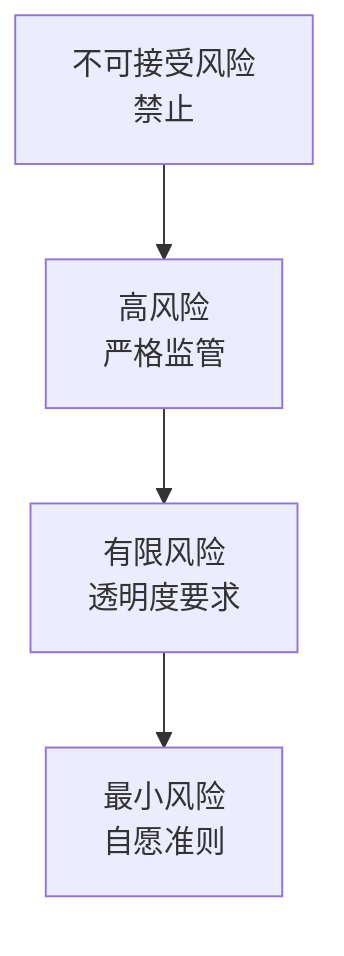
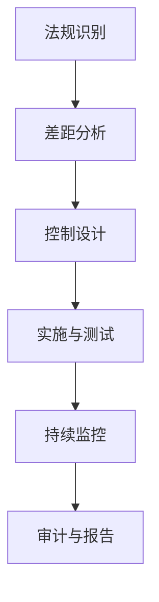

## 11.1 AI 法规与合规要求

全球 AI 监管正在快速发展，组织需要了解并遵守相关法规。

### 11.1.1 全球监管概览

**主要法规**：

| 地区 | 法规 | 状态 | 核心要求 |
|------|------|------|----------|
| 欧盟 | EU AI Act | 生效 | 风险分级监管 |
| 美国 | 联邦行政命令/机构规则（随时间变化） | 动态调整 | 可能涉及安全评估、报告与透明度 |
| 中国 | 生成式 AI 管理办法 | 生效 | 内容安全、备案 |
| 英国 | AI 安全峰会承诺 | 进行中 | 自愿性框架 |
| 其它 | ISO/NIST 标准 | 广泛采纳 | 国际通用实践 |

> 注：AI 监管在不同司法辖区变化较快；实践中应按最新法律法规、监管指引与机构规则逐项核对（参见附录 C-33、C-34）。

### 11.1.2 EU AI Act

欧盟 AI 法案是全球首部全面的 AI 监管法规。

**风险分级**：

```mermaid
flowchart TB
    A["不可接受风险<br/>禁止"] --> B["高风险<br/>严格监管"]
    B --> C["有限风险<br/>透明度要求"]
    C --> D["最小风险<br/>自愿准则"]
```

> 说明：若阅读环境不支持 Mermaid 渲染，可将风险分级理解为：禁止类（不可接受风险）→严格监管（高风险）→透明度要求（有限风险）→自愿准则（最小风险）。

**对 LLM 的影响**：

| 要求 | 内容 |
|------|------|
| 透明度 | 披露 AI 生成内容 |
| 风险评估 | 系统性风险评估 |
| 技术文档 | 详细技术说明 |
| 人类监督 | 确保人类控制 |

### 11.1.3 中国 AI 监管

**生成式 AI 管理暂行办法**：

| 方面 | 要求 |
|------|------|
| 内容安全 | 不得生成违法内容 |
| 备案要求 | 服务备案 |
| 数据管理 | 训练数据合法性 |
| 用户权益 | 保护用户权益 |

**算法备案**：

- 提供服务前完成备案
- 定期进行安全评估
- 保持内容安全

### 11.1.4 标准与合规实施

**国际标准与框架**：

- **ISO/IEC 42001**: 全球首个 AI 管理体系标准，为组织负责任地开发和使用 AI 提供可认证的框架。
- **NIST AI RMF**: 美国国家标准技术研究院发布的 AI 风险管理框架，提供识别、测量和管理 AI 风险的详细指南。

**合规实施框架**：

```mermaid
flowchart TB
    A["法规识别"] --> B["差距分析"]
    B --> C["控制设计"]
    C --> D["实施与测试"]
    D --> E["持续监控"]
    E --> F["审计与报告"]
```

> 说明：若阅读环境不支持 Mermaid 渲染，可将合规实施理解为：识别法规→差距分析→设计控制→实施与测试→持续监控→审计与报告。

**关键步骤**：

1. 识别适用法规
2. 评估当前状态
3. 制定合规计划
4. 实施控制措施
5. 持续监控和改进

### 11.1.5 合规挑战

| 挑战 | 应对 |
|------|------|
| 法规多变 | 建立法规追踪机制 |
| 跨境合规 | 采用最严格标准 |
| 技术可行性 | 与监管方沟通 |
| 成本控制 | 合规自动化 |

了解法规要求是合规的前提，企业需要建立持续的法规跟踪和合规管理机制。
