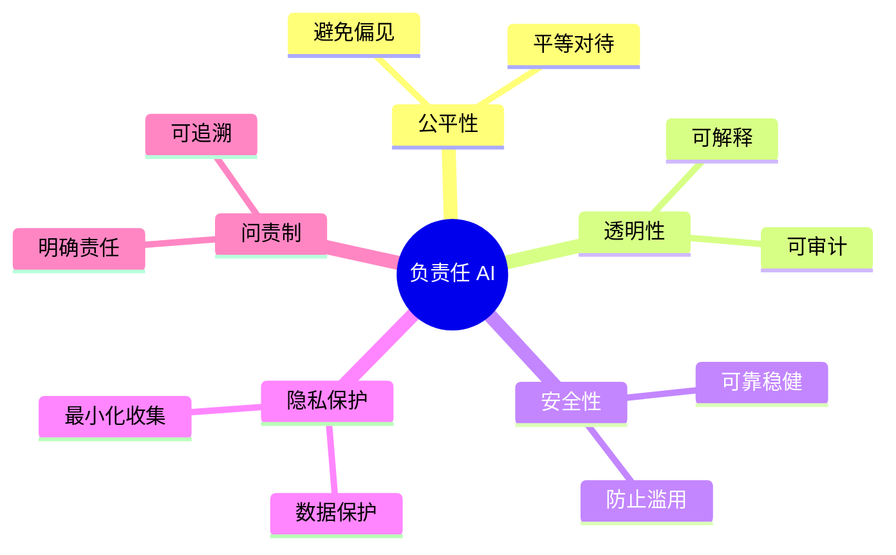
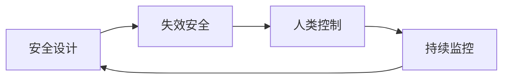

## 11.2 负责任 AI 实践

负责任的 AI 开发和使用是企业社会责任的重要组成部分。

### 11.2.1 负责任 AI 原则

**核心原则**：



图 11-1：负责任 AI 原则思维导图

### 11.2.2 公平性与偏见

**识别偏见**：

| 偏见类型 | 描述 | 示例 |
|----------|------|------|
| 数据偏见 | 训练数据不均衡 | 某群体代表性不足 |
| 算法偏见 | 模型放大偏见 | 强化既有歧视 |
| 部署偏见 | 应用场景偏差 | 不适用于特定人群 |

**缓解措施**：

- 数据多样性审查
- 偏见检测评估
- 公平性指标监控
- 持续改进

### 11.2.3 透明度与可解释性

**透明度层次**：

| 层次 | 内容 |
|------|------|
| 模型透明 | 公开模型信息 |
| 过程透明 | 解释决策过程 |
| 使用透明 | 明确 AI 使用场景 |
| 结果透明 | 说明影响 |

**用户告知**：

```
示例：
"您正在与 AI 助手对话。
此 AI 可能会产生不准确的信息，
请自行验证重要信息。"
```

### 11.2.4 安全与可靠性

**设计原则**：



图 11-2：安全与可靠性流程图

**关键措施**：

- 故障情况下默认安全
- 保持人类最终决策权
- 建立监控和干预机制
- 定期安全评估

### 11.2.5 隐私保护

**隐私实践**：

| 实践 | 描述 |
|------|------|
| 数据最小化 | 只收集必要数据 |
| 目的限制 | 明确使用目的 |
| 保留期限 | 设置数据保留期 |
| 用户控制 | 支持访问和删除 |

### 11.2.6 组织实践

**建立 AI 伦理委员会**：

职责包括：
- 审查高风险 AI 项目
- 制定 AI 伦理准则
- 处理伦理问题
- 推动培训教育

**AI 伦理影响评估**：

```
评估内容：
1. 项目目标和预期影响
2. 潜在风险和危害
3. 受影响群体分析
4. 缓解措施
5. 监控计划
```

负责任 AI 不仅是道德要求，也是赢得用户信任的基础。
