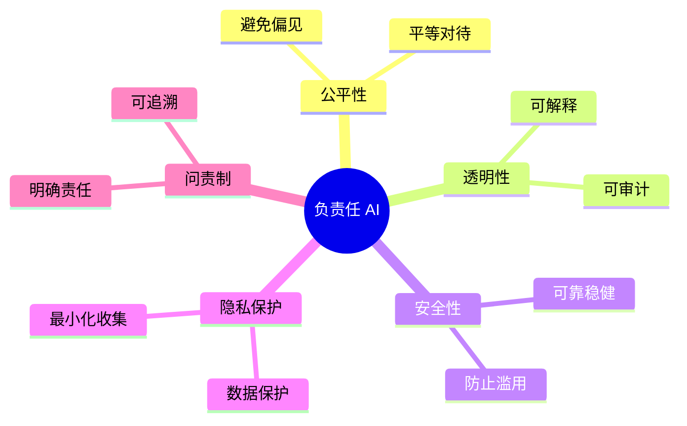

## 11.2 负责任 AI 实践

负责任的 AI 开发和使用是企业社会责任的重要组成部分。

### 11.2.1 负责任 AI 原则

**核心原则（结合 OECD / NIST / UNESCO 等框架的综合归纳）**

```mermaid
mindmap
  root((负责任 AI))
    公平性
      避免偏见
      平等对待
    透明性
      可解释
      可审计
    安全性
      可靠稳健
      防止滥用
    隐私保护
      数据保护
      最小化收集
    问责制
      明确责任
      可追溯
```

图 11-2：负责任 AI 原则思维导图

### 11.2.2 公平性与偏见

**识别偏见**
| 偏见类型 | 描述 | 示例 |
|----------|------|------|
| 数据偏见 | 训练数据不均衡 | 某群体代表性不足 |
| 算法偏见 | 模型放大偏见 | 强化既有歧视 |
| 部署偏见 | 应用场景偏差 | 不适用于特定人群 |

**缓解措施**
- 数据多样性审查
- 偏见检测评估
- 公平性指标监控
- 持续改进

### 11.2.3 透明度与可解释性

**透明度层次（示例性归纳）**
| 层次 | 内容 |
|------|------|
| 模型透明 | 公开模型信息 |
| 过程透明 | 提供与场景相称的解释与说明 |
| 使用透明 | 明确 AI 使用场景 |
| 结果透明 | 说明影响 |

**用户告知**
```text
示例：
"您正在与 AI 助手对话。
此 AI 可能会产生不准确的信息，
请自行验证重要信息。"
```

### 11.2.4 安全与可靠性

**设计原则**

```mermaid
flowchart LR
    A["安全设计"] --> B["失效安全"]
    B --> C["人类控制"]
    C --> D["持续监控"]
    D --> A
```

图 11-3：安全与可靠性流程图

**关键措施**
- 故障情况下默认安全
- 按风险和影响设置适当的人类监督、升级和复核机制
- 建立监控和干预机制
- 定期安全评估

### 11.2.5 隐私保护

**隐私实践**
| 实践 | 描述 |
|------|------|
| 数据最小化 | 只收集必要数据 |
| 目的限制 | 明确使用目的 |
| 保留期限 | 设置数据保留期 |
| 用户控制 | 支持访问和删除 |

### 11.2.6 组织实践

**建立 AI 伦理委员会（可选治理机制之一）**
职责包括：
- 审查高风险 AI 项目
- 制定 AI 伦理准则
- 处理伦理问题
- 推动培训教育

**AI 伦理影响评估（示例模板）**
```text
评估内容：
1. 项目目标和预期影响
2. 潜在风险和危害
3. 受影响群体分析
4. 缓解措施
5. 监控计划
```

负责任 AI 不仅是道德要求，也是赢得用户信任的基础。

### 11.2.7 前沿模型的能力分级治理

在强制性法规（见 11.1）与管理体系标准（见 3.3）之外，前沿实验室还发展出第三类治理范式：以模型能力为触发条件的自愿性“责任扩展”承诺。其共同结构是“若—则”——当模型在评测中越过某一能力阈值，就自动触发更强的部署与安全管控；若安全措施跟不上能力增长，则暂停继续扩展。这把治理从“事后合规”前移到“能力门禁”，与本书 11.3.12 的评测博弈、11.4 的错位防护直接相关：能力评测一旦失真，整个门禁体系就会失效。

三家主要实验室的框架（[Anthropic 责任扩展政策](https://www.anthropic.com/news/anthropics-responsible-scaling-policy)、[OpenAI 准备度框架](https://openai.com/index/updating-our-preparedness-framework/)、[Google DeepMind 前沿安全框架](https://deepmind.google/blog/updating-the-frontier-safety-framework/)）可对照理解：

| 框架 | 分级机制 | 覆盖风险 | 关键承诺 |
|------|----------|----------|----------|
| Anthropic RSP | AI 安全等级 ASL-1～4+（仿生物安全等级） | 灾难性误用、自主能力 | 达到 ASL-3 需异常强的安全要求，红队发现实质误用风险则暂停部署；安全跟不上则暂停扩展 |
| OpenAI Preparedness（v2） | High / Critical 两档阈值 | 生物化学、网络安全、AI 自我改进 | 仅追踪“可信、可测、严重、全新、不可逆”的能力；越过阈值需达到对应防护后方可部署 |
| Google DeepMind FSF | 关键能力等级 CCL | 误用（CBRN／网络／ML 研发加速）与欺骗性对齐（自主、隐蔽） | 接近 CCL 即评测；触及后在外部发布前做安全论证（safety case），对欺骗性对齐采用思维链自动监控 |

这些是自愿承诺而非法律义务，其约束力依赖实验室自身的治理结构（如 RSP 需董事会及长期利益信托批准），也因此受到批评——例如有分析指出某些框架允许在竞争对手发布危险能力时下调标准。但它们正成为监管的重要参照：EU AI Act 的通用模型行为准则在相当程度上借鉴了这套“能力阈值 + 缓解措施”的范式。对企业而言，理解这一范式有助于评估所采用基础模型的安全成熟度，并把“能力评测—门禁—缓解”的逻辑迁移到自身的部署决策中。

以 OpenAI 2026 年发布的 Frontier Governance Framework 为例，前沿模型治理正在从内部能力门禁扩展为面向法规和公众透明度的安全治理闭环：组织需要记录系统性风险评估、缓解措施、模型报告更新触发、事件响应和外部专家输入。具体法域名称、报告频率和触发条件会随法规与框架更新变化，落地时应以发布者最新框架和适用法域要求为准（见附录 C-83）。就公开对应关系而言，这类系统性风险义务可对照美国加州 Transparency in Frontier AI Act 与 EU AI Act 对 GPAI 的系统性风险义务批次（2026-08-02 生效），与 11.1.3 的 GPAI 段衔接。
