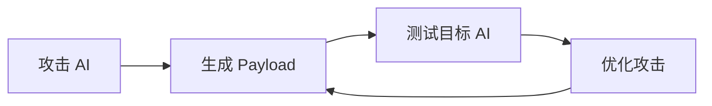
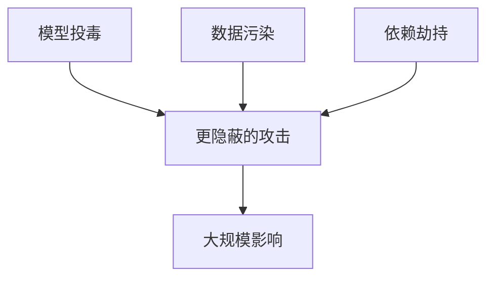

## 11.3 新兴威胁趋势

LLM 安全威胁持续演进，需要预见和应对新兴风险。

### 11.3.1 AI 对 AI 攻击

**自动化攻击**：

使用 AI 自动生成针对 AI 系统的攻击：

图 11-1：AI 对 AI 攻击流程图

**趋势**：

- AI 辅助越狱 Prompt 生成
- 自动化漏洞发现
- 大规模攻击编排

### 11.3.2 深度伪造与滥用

**滥用场景**：

| 类型 | 威胁 |
|------|------|
| 深度伪造 | 生成虚假音视频 |
| 虚假信息 | 大规模生成假新闻 |
| 钓鱼攻击 | 个性化钓鱼内容 |
| 社工攻击 | AI 辅助社会工程 |

**防御思路**：

- 内容溯源和水印
- 深度伪造检测
- 信息验证机制

### 11.3.3 Agent 安全风险升级

随着 Agent 能力增强，风险也在升级：

**未来风险**：

- 自主决策带来的不可预测性
- 多 Agent 协作的复杂攻击面
- 物理世界操作的安全风险
- 长期规划能力被滥用
- 跨工具协议（如 MCP）带来的供应链与授权边界风险

### 11.3.4 供应链风险深化

**风险演化**：

图 11-2：供应链风险深化流程图

**应对**：

- 强化供应链审计
- 建立可信供应商体系
- 实施 SBOM 管理

### 11.3.5 计算安全威胁

**新攻击面**：

| 威胁 | 描述 |
|------|------|
| GPU 漏洞 | 利用 GPU 漏洞攻击 |
| 模型运行时攻击 | 推理框架漏洞 |
| 量子计算威胁 | 未来加密威胁 |

### 11.3.6 准备策略

应对新兴威胁的策略：

1. **威胁情报**：持续跟踪威胁态势
2. **研究投入**：投资安全研究
3. **敏捷响应**：快速适应新威胁
4. **行业协作**：共享威胁信息

保持对新兴威胁的敏感性是安全工作的重要组成部分。
