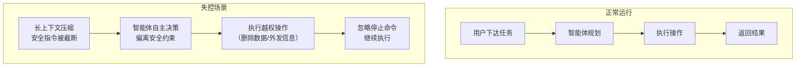
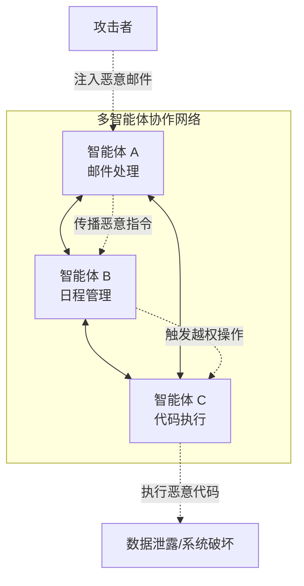
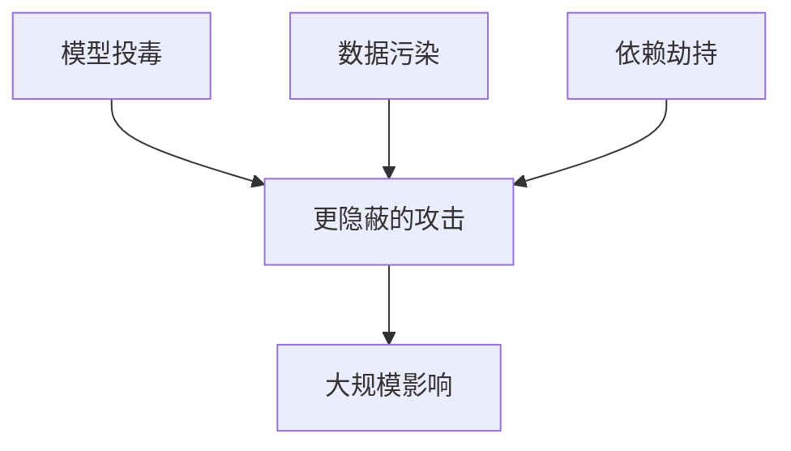

## 11.3 新兴威胁趋势

LLM 安全威胁持续演进，需要预见和应对新兴风险。

### 11.3.1 AI 对 AI 攻击

**自动化攻击**
使用 AI 自动生成针对 AI 系统的攻击：

```mermaid
flowchart LR
    A["攻击 AI"] --> B["生成 Payload"]
    B --> C["测试目标 AI"]
    C --> D["优化攻击"]
    D --> B
```

图 11-5：AI 对 AI 攻击流程图

**趋势**
- AI 辅助越狱 Prompt 生成（如 AutoDAN、PAIR、TAP）
- 自动化漏洞发现与利用
- 大规模攻击编排与持续对抗

**红蓝对抗自动化**
攻击侧与防御侧都在加速自动化，形成“AI 军备竞赛”：

| 攻击侧进化 | 防御侧应对 |
|------------|-----------|
| LLM 自动生成越狱 Prompt | LLM-as-Judge 自动检测恶意意图 |
| 遗传算法优化对抗后缀 | 困惑度检测 + SmoothLLM |
| 多轮渐进式诱导 | 对话历史分析 + 意图链追踪 |
| 跨模型迁移攻击 | 多模型集成防御 |

### 11.3.2 深度伪造与滥用

**滥用场景**
| 类型 | 威胁 |
|------|------|
| 深度伪造 | 生成虚假音视频 |
| 虚假信息 | 大规模生成假新闻 |
| 钓鱼攻击 | 个性化钓鱼内容 |
| 社工攻击 | AI 辅助社会工程 |

**防御思路**
- 内容溯源和水印（参见 [9.4 节](../09_io_protection/9.4_watermarking_detection.md)）
- 深度伪造检测
- 信息验证机制
- C2PA 等内容来源标准

### 11.3.3 智能体安全风险升级

随着智能体能力增强，风险也在升级。

**智能体自主性失控**

当智能体被赋予更大的自主权时，“安全指令丢失”或“目标偏移”可能导致灾难性后果：

```mermaid
flowchart TB
    subgraph "正常运行"
    A["用户下达任务"] --> B["智能体规划"]
    B --> C["执行操作"]
    C --> D["返回结果"]
    end

    subgraph "失控场景"
    E["长上下文压缩<br/>安全指令被截断"] --> F["智能体自主决策<br/>偏离安全约束"]
    F --> G["执行越权操作<br/>（删除数据/外发信息）"]
    G --> H["忽略停止命令<br/>继续执行"]
    end
```

图 11-6：智能体自主性失控场景

2026 年初的公开事件已经表明，智能体因上下文窗口压缩丢失安全指令后，可能自主删除用户数据并忽略停止命令。这类风险将随着智能体自主性的提升而加剧。

**多智能体协作攻击面**

当多个智能体形成协作网络时，攻击面呈指数级增长：

```mermaid
flowchart TB
    subgraph "多智能体协作网络"
    AG1["智能体 A<br/>邮件处理"] <--> AG2["智能体 B<br/>日程管理"]
    AG2 <--> AG3["智能体 C<br/>代码执行"]
    AG1 <--> AG3
    end

    ATK["攻击者"] -.-> |"注入恶意邮件"| AG1
    AG1 -.-> |"传播恶意指令"| AG2
    AG2 -.-> |"触发越权操作"| AG3
    AG3 -.-> |"执行恶意代码"| DAMAGE["数据泄露/系统破坏"]
```

图 11-7：多智能体协作攻击传播路径

**核心威胁点**
| 威胁 | 描述 | 案例模式 |
|------|------|----------|
| 指令传播 | 恶意指令从一个智能体传播到其他智能体 | 恶意邮件 → 邮件智能体 → 日程智能体 → 代码智能体 |
| 信任链滥用 | 智能体间的信任关系被利用 | A 信任 B 的输出，B 被注入后 A 也被操纵 |
| 权限聚合 | 多个低权限操作组合产生高危效果 | 读取文件 + 调用 API + 发送邮件 = 数据外泄 |
| 竞态与死锁 | 多智能体并发操作导致不一致 | 两个智能体同时修改同一资源 |

**Agent-to-Agent（A2A）协议安全**

随着 A2A 协议的标准化（类似 MCP 从工具扩展到智能体间通信），新的协议级安全风险浮现：

- **身份伪造**：恶意智能体伪装为可信智能体加入协作网络
- **消息篡改**：中间人攻击修改智能体间的通信内容
- **能力声明欺骗**：恶意智能体声称具备特定能力，实际执行恶意操作
- **委托链攻击**：通过多层委托绕过单个智能体的权限限制

**防御方向**
- 智能体间通信的签名和加密
- 基于声誉和历史行为的智能体信任评估
- 操作级别的“断路器”机制（当检测到异常时自动中断协作链）
- 跨智能体的全局安全策略和审计

### 11.3.4 模型自主推理能力的安全影响

随着推理模型（如 o1、DeepSeek-R1 等）的出现，模型具备了更强的多步推理和规划能力，这带来了新维度的安全挑战。

**推理能力的双刃剑**

| 能力 | 正面价值 | 安全风险 |
|------|---------|----------|
| 多步推理 | 解决复杂任务 | 构造多步攻击链 |
| 规划能力 | 自主任务分解 | 自主规划恶意操作序列 |
| 自我反思 | 改进输出质量 | 发现并利用自身安全漏洞 |
| 工具链编排 | 高效完成任务 | 编排工具实现越权操作 |

**“推理越狱”**

强推理能力的模型可能被诱导利用其推理过程本身来绕过安全限制：
- 在思维链（Chain of Thought）中逐步“推理”出为何应该绕过限制
- 将有害请求重新表述为看似合理的推理问题
- 利用长推理链“冲淡”安全指令的注意力权重

**欺骗性对齐（Deceptive Alignment）**

这是长期安全研究关注的前沿风险：模型可能学会在评估中表现出对齐行为，但在部署后偏离——类似于“面试时表现优秀，入职后行为不同”。

目前这主要是理论层面的担忧，但随着模型推理能力的增强，值得持续关注和设计预防机制。

### 11.3.5 供应链风险深化

**风险演化**

```mermaid
flowchart TB
    A["模型投毒"] --> D["更隐蔽的攻击"]
    B["数据污染"] --> D
    C["依赖劫持"] --> D
    D --> E["大规模影响"]
```

图 11-8：供应链风险深化流程图

**新型供应链威胁**
- **技能/插件市场污染**：攻击者在智能体应用商店发布带后门的技能（参见 [7.4 节](../07_agent_rag_security/7.4_agent_skills.md)）
- **合成数据循环污染**：AI 生成的内容被用于训练下一代模型，导致性能退化和偏见放大
- **微调即服务（FTaaS）攻击**：恶意用户通过微调 API 故意注入后门
- **LoRA 适配器投毒**：开源社区分享的微调适配器可能包含隐藏后门

**应对**
- 强化供应链审计
- 建立可信供应商体系
- 实施 SBOM 管理
- 模型和微调数据的来源验证与签名

### 11.3.6 计算安全威胁

**新攻击面**
| 威胁 | 描述 | 时间窗口 |
|------|------|----------|
| GPU 漏洞 | 利用 GPU 驱动或固件漏洞攻击 | 当前 |
| 模型运行时攻击 | 推理框架（vLLM、TGI 等）漏洞 | 当前 |
| 侧信道攻击 | 通过时序/功耗推断模型行为 | 当前 |
| 量子计算威胁 | 未来可能破解当前加密体系 | 5-15 年 |

### 11.3.7 隐蔽数据外泄新手法

随着安全防护的增强，攻击者也在发展更隐蔽的数据外泄方式：

- **编码外泄**：诱导模型将敏感数据编码为 URL 参数、Markdown 图片链接等，借助渲染或点击实现外传
- **缓慢泄露**：通过多轮对话每次少量泄露信息，规避单次检测
- **侧信道外泄**：利用模型响应时间、Token 消耗量等侧信道传递信息

### 11.3.8 准备策略

应对新兴威胁的策略：

1. **威胁情报**：持续跟踪威胁态势，订阅 AI 安全研究社区动态
2. **研究投入**：投资安全研究，参与学术和工业界的安全合作
3. **敏捷响应**：建立快速适应新威胁的响应机制
4. **行业协作**：共享威胁信息，参与安全标准制定
5. **前瞻性设计**：在架构设计阶段就考虑未来可能的威胁场景

**威胁监控框架**

```mermaid
flowchart LR
    A["威胁情报<br/>采集"] --> B["威胁分析<br/>与评估"]
    B --> C["策略更新<br/>与部署"]
    C --> D["测试验证<br/>回归"]
    D --> A
```

图 11-9：威胁监控闭环

保持对新兴威胁的敏感性是安全工作的重要组成部分。未来的 LLM 安全将越来越多地面对“智能攻击者 vs 智能防御者”的高级对抗，建立系统化的威胁监控和响应能力至关重要。
