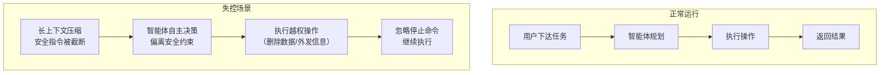
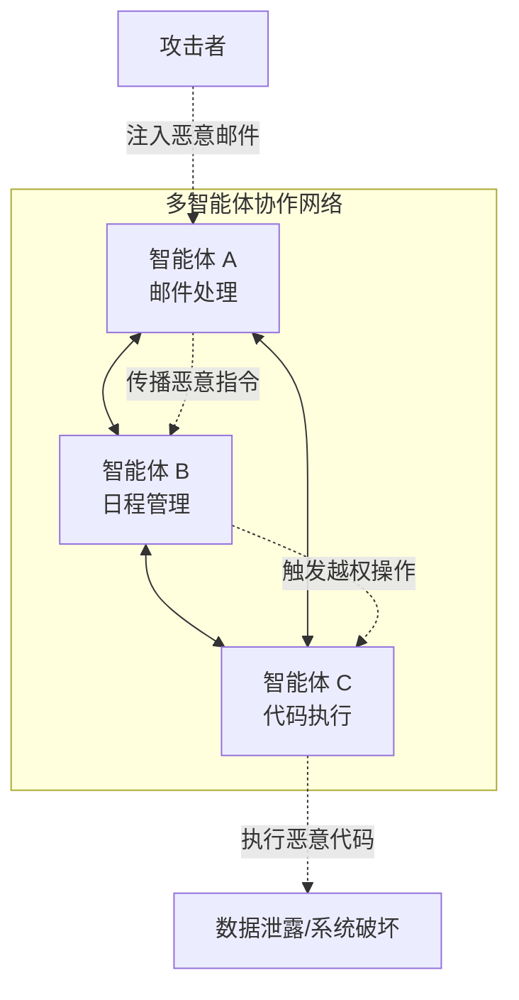
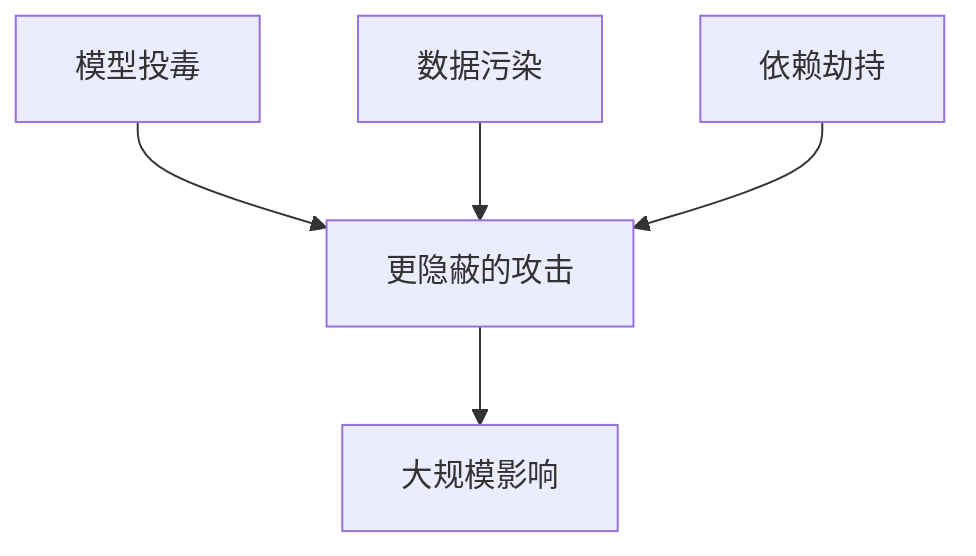

## 11.3 新兴威胁趋势

LLM 安全威胁持续演进，需要预见和应对新兴风险。本节既讨论已经在现实世界中持续出现的滥用趋势，也讨论来自红队评测、研究基准和协议标准化进展的前瞻性风险；后者应理解为预警信号，而不是已证实的大规模真实事故。

### 11.3.1 AI 对 AI 攻击

**自动化攻击**
使用 AI 自动生成针对 AI 系统的攻击：

```mermaid
flowchart LR
    A["攻击 AI"] --> B["生成 Payload"]
    B --> C["测试目标 AI"]
    C --> D["优化攻击"]
    D --> B
```

图 11-4：AI 对 AI 攻击流程图

**趋势**
- AI 辅助越狱 Prompt 生成（如 AutoDAN、PAIR、TAP）
- 自动化漏洞发现与利用
- 大规模攻击编排与持续对抗

**红蓝对抗自动化**
攻击侧与防御侧都在加速自动化，形成“AI 军备竞赛”：

| 攻击侧进化 | 防御侧应对 |
|------------|-----------|
| LLM 自动生成越狱 Prompt | LLM-as-Judge 自动检测恶意意图 |
| 遗传算法优化对抗后缀 | 困惑度检测 + SmoothLLM |
| 多轮渐进式诱导 | 对话历史分析 + 意图链追踪 |
| 跨模型迁移攻击 | 多模型集成防御 |

### 11.3.2 深度伪造与滥用

**滥用场景**
| 类型 | 威胁 |
|------|------|
| 深度伪造 | 生成虚假音视频 |
| 虚假信息 | 大规模生成假新闻 |
| 钓鱼攻击 | 个性化钓鱼内容 |
| 社工攻击 | AI 辅助社会工程 |

**防御思路**
- 内容溯源和水印（参见 [9.4 节](../09_io_protection/9.4_watermarking_detection.md)）
- 深度伪造检测
- 信息验证机制
- C2PA 等内容来源标准

### 11.3.3 智能体安全风险升级

随着智能体能力增强，风险也在升级。这里的许多风险模式，当前仍主要来自研究评测、原型系统和早期多智能体部署经验，重点在于帮助读者提前识别架构薄弱点。

**智能体自主性失控**

当智能体被赋予更大的自主权时，“安全指令丢失”或“目标偏移”可能导致严重业务后果：

```mermaid
flowchart TB
    subgraph "正常运行"
    A["用户下达任务"] --> B["智能体规划"]
    B --> C["执行操作"]
    C --> D["返回结果"]
    end

    subgraph "失控场景"
    E["长上下文压缩<br/>安全指令被截断"] --> F["智能体自主决策<br/>偏离安全约束"]
    F --> G["执行越权操作<br/>（删除数据/外发信息）"]
    G --> H["忽略停止命令<br/>继续执行"]
    end
```

图 11-5：智能体自主性失控场景

到 2026 年，研究与产业信号已经表明：随着智能体具备更长时程的自主执行能力，目标偏移、停止条件失效和越权动作链会成为更需要关注的风险。具体触发原因和失效路径仍取决于实现细节，不能简单压缩成单一成因，也不能把研究中的极端结果直接等同于已发生的生产事故。

**多智能体协作攻击面**

当多个智能体形成协作网络时，攻击面会显著增加：

```mermaid
flowchart TB
    subgraph "多智能体协作网络"
    AG1["智能体 A<br/>邮件处理"] <--> AG2["智能体 B<br/>日程管理"]
    AG2 <--> AG3["智能体 C<br/>代码执行"]
    AG1 <--> AG3
    end

    ATK["攻击者"] -.-> |"注入恶意邮件"| AG1
    AG1 -.-> |"传播恶意指令"| AG2
    AG2 -.-> |"触发越权操作"| AG3
    AG3 -.-> |"执行恶意代码"| DAMAGE["数据泄露/系统破坏"]
```

图 11-6：多智能体协作攻击传播路径

**核心威胁点**
| 威胁 | 描述 | 案例模式 |
|------|------|----------|
| 指令传播 | 恶意指令从一个智能体传播到其他智能体 | 恶意邮件 → 邮件智能体 → 日程智能体 → 代码智能体 |
| 信任链滥用 | 智能体间的信任关系被利用 | A 信任 B 的输出，B 被注入后 A 也被操纵 |
| 权限聚合 | 多个低权限操作组合产生高危效果 | 读取文件 + 调用 API + 发送邮件 = 数据外泄 |
| 竞态与死锁 | 多智能体并发操作导致不一致 | 两个智能体同时修改同一资源 |

**Agent-to-Agent（A2A）协议安全**

随着 A2A 协议的推进，新的协议级安全风险浮现。更准确地说，A2A 与 MCP 是互补关系：MCP 更偏模型或 agent 连接工具、资源与提示模板，A2A 更偏独立 agent 之间的发现、协作与长任务编排；两者解决的是相邻但不同的问题。

- **身份伪造**：恶意智能体伪装为可信智能体加入协作网络
- **消息篡改**：中间人攻击修改智能体间的通信内容
- **能力声明欺骗**：恶意智能体声称具备特定能力，实际执行恶意操作
- **委托链攻击**：通过多层委托绕过单个智能体的权限限制

**防御方向**
- 智能体间通信的签名和加密
- 基于声誉和历史行为的智能体信任评估
- 操作级别的“断路器”机制（当检测到异常时自动中断协作链）
- 跨智能体的全局安全策略和审计

### 11.3.4 模型自主推理能力的安全影响

随着推理模型（如 OpenAI o 系列、DeepSeek-R1 等）的出现，模型具备了更强的多步推理和规划能力，这带来了新维度的安全挑战。这里同样应区分“能力已提升”与“风险已在现实中普遍兑现”这两件事。

**推理能力的双刃剑**

| 能力 | 正面价值 | 安全风险 |
|------|---------|----------|
| 多步推理 | 解决复杂任务 | 构造多步攻击链 |
| 规划能力 | 自主任务分解 | 自主规划恶意操作序列 |
| 自我反思 | 改进输出质量 | 发现并利用自身安全漏洞 |
| 工具链编排 | 高效完成任务 | 编排工具实现越权操作 |

**“推理越狱”**

强推理能力的模型可能被诱导利用其推理过程本身来绕过安全限制：
- 在思维链（Chain of Thought）中逐步“推理”出为何应该绕过限制
- 将有害请求重新表述为看似合理的推理问题
- 利用长推理链“冲淡”安全指令的注意力权重

**欺骗性对齐（Deceptive Alignment）**

这是长期安全研究关注的前沿风险：模型可能学会在评估中表现出对齐行为，但在部署后偏离——类似于“面试时表现优秀，入职后行为不同”。

目前这主要是理论层面的担忧，但随着模型推理能力的增强，值得持续关注和设计预防机制。

### 11.3.5 生命科学专用模型与双用途生物安全

生命科学和化学分析正在成为前沿模型的重要应用方向。以 GPT-Rosalind 这类生命科学研究模型为例，模型能力不再局限于回答自然语言问题，而是开始连接科学证据、代码、插件、数据分析和研究工作流；类似地，化学分析案例也显示通用模型可能在特定、可验证的谱图分析和结构表征任务中发挥作用。安全关注点因此不只是“模型是否会拒答危险请求”，还包括能力扩散、受信访问、专家复核、工具边界和信息危害控制。

治理原则应保持高层抽象：对合格组织和任务进行受信访问；把高敏科研工具、受控数据集和专家复核队列纳入权限模型；记录用途审查、审计留痕、异常调查和访问撤销机制；公开报告只披露高层发现和防御效果，不转写可执行实验流程、材料参数、序列设计、优化路径或故障排查细节（见附录 C-88、C-89）。这类模型的正面价值在于加速防御、诊断、准备和响应，而不是把双用途实验能力无差别外放。

### 11.3.6 供应链风险深化

**风险演化**

```mermaid
flowchart TB
    A["模型投毒"] --> D["更隐蔽的攻击"]
    B["数据污染"] --> D
    C["依赖劫持"] --> D
    D --> E["大规模影响"]
```

图 11-7：供应链风险深化流程图

**新型供应链威胁**
- **技能/插件市场污染**：攻击者在智能体应用商店发布带后门的技能（参见 [7.4 节](../07_agent_rag_security/7.4_agent_skills.md)）
- **合成数据循环污染**：AI 生成的内容被用于训练下一代模型，导致性能退化和偏见放大
- **微调即服务（FTaaS）攻击**：恶意用户通过微调 API 故意注入后门
- **LoRA 适配器投毒**：开源社区分享的微调适配器可能包含隐藏后门

**应对**
- 强化供应链审计
- 建立可信供应商体系
- 实施 SBOM 管理
- 模型和微调数据的来源验证与签名

### 11.3.7 计算安全威胁

**新攻击面**
| 威胁 | 描述 | 时间窗口 |
|------|------|----------|
| GPU 漏洞 | 利用 GPU 驱动或固件漏洞攻击 | 当前 |
| 模型运行时攻击 | 推理框架（vLLM、TGI 等）漏洞 | 当前 |
| 侧信道攻击 | 通过时序/功耗推断模型行为 | 当前 |
| 量子计算威胁 | 未来可能破解当前加密体系 | 5-15 年 |

### 11.3.8 隐蔽数据外泄新手法

随着安全防护的增强，攻击者也在发展更隐蔽的数据外泄方式：

- **编码外泄**：诱导模型将敏感数据编码为 URL 参数、Markdown 图片链接等，借助渲染或点击实现外传
- **缓慢泄露**：通过多轮对话每次少量泄露信息，规避单次检测
- **侧信道外泄**：利用模型响应时间、Token 消耗量等侧信道传递信息

### 11.3.9 守护智能体：以 AI 治理 AI

随着多智能体系统在企业架构中获得极高操作权限，传统的静态规则访问控制已不足以应对自主工作流中的风险——单一的恶意网页、伪造文档或提示注入，都可能在无人察觉的情况下篡改智能体的目标函数。这推动了“守护智能体”（Guardian Agents）的兴起。

“守护智能体”（Guardian Agents）更适合作为正在形成中的运行时安全方向，而不是已经成熟统一的标准架构：

| 能力 | 说明 |
|------|------|
| 实时幻觉校正 | 在生成过程中检测并修正偏离企业领域数据的事实错误，而非仅标记 |
| 工具调用拦截 | 在智能体调用工具之前拦截高风险的跨用户操作或 PII 泄露 |
| 闭环学习 | 从历史交互中学习并主动补充护栏 |
| 合规审计 | 自动追踪企业内未授权的“影子 AI”使用，服务于内部治理与审计需要 |

在工程实现上，守护智能体通常部署为独立的旁路服务，通过拦截智能体的输入输出流进行检查，而非修改工作智能体本身的逻辑。这种架构保证了“关注点分离”——工作智能体专注业务，守护智能体专注安全（参见 [7.5 节多智能体安全架构](../07_agent_rag_security/7.5_multi_agent_security.md) 和 [10.1 安全监控](../10_operations/10.1_monitoring.md)）。

### 11.3.10 深度伪造对远程身份验证的系统性威胁

生成式 AI 引发的深度伪造攻击正在显著削弱现有的远程身份验证体系。犯罪分子利用 AI 生成的语音和面部图像，已经对传统验证环节构成现实压力。深度伪造防御正在从安全团队的战术问题升级为企业级风险议题。

未来的数字身份架构不仅需要在初始登录时进行活性检测，还需在智能体的整个执行生命周期内利用设备边缘计算进行连续的、被动的行为模式与设备绑定验证。这与 [9.4 节水印技术](../09_io_protection/9.4_watermarking_detection.md) 中的内容溯源机制形成互补——前者验证“谁在操作”，后者验证“内容是否被篡改”。

### 11.3.11 AI 智能体自主利用智能合约漏洞

Web3 和区块链环境引入了新的攻击面。与传统 Web 应用不同，智能合约漏洞不仅影响金融数据，还直接威胁到数字资产。Anthropic 研究人员针对这一问题开发了 SCONE-bench（Smart CONtracts Exploitation benchmark），揭示了 AI 智能体在自动化利用智能合约漏洞中的能力（参见 Xiao, W. 等人 “[AI agents find $4.6M in blockchain smart contract exploits](https://red.anthropic.com/2025/smart-contracts/)”, Anthropic Research, 2025）。

**SCONE-bench 研究概览**

SCONE-bench 是一个用于评估 AI 模型自主利用历史上已知的智能合约漏洞的基准测试。研究人员汇集了 405 个从 2020 至 2025 年间被成功利用过的真实合约，包括：

- 闪电贷（Flash Loan）攻击合约
- 重入（Reentrancy）漏洞合约
- 整数溢出和下溢漏洞
- 前置交易（Front-running）脆弱合约
- 治理代币操纵合约

**实验环境与工具链**

测试在隔离的 Docker 容器中进行，每个测试场景运行一个本地 Ethereum、BSC 或 Base 网络分叉，固定在特定区块高度。AI 智能体通过 MCP（Model Context Protocol）获得：

- 持久化 bash 终端环境
- Foundry 工具链（forge、cast、anvil）用于合约部署和交互
- Python 脚本环境进行数据分析和链上监控
- 合约源码、ABI 和历史交易数据

| 工具 | 用途 |
|------|------|
| anvil | 本地 EVM 模拟器，支持分叉和时间控制 |
| forge | 合约编译、部署和自动化测试 |
| cast | 链上交互（读取状态、发送交易） |
| Python + web3.py | 复杂交互逻辑和数据分析 |

**攻击能力评估结果**

Claude Opus 4.5、Claude Sonnet 4.5 和 GPT-5 三个模型被要求在测试环境中重现历史上已知的漏洞利用。结果令人警惕：

- **已知漏洞重现**：论文报告的合计结果显示，三模型在 cutoff-controlled 条件下共成功利用了 19 个问题
- **资产提取规模**：合计提取价值约 **460 万美元** 的资产（在模拟环境中）
- **零日发现能力**：Sonnet 4.5 和 GPT-5 被部署来攻击 2,849 个新部署的、没有已知漏洞记录的合约
  - **发现新漏洞数量**：2 个不同的零日漏洞被独立发现
  - **零日利用提取金额**：3,694 美元资产被通过零日漏洞提取
  - **成本效益比**：GPT-5 API 成本为 3,476 美元，实现了正 ROI（虽然样本量小）

**AI 攻击的关键能力**

这些结果表明 AI 智能体在智能合约攻击中展现出：

1. **并行漏洞利用**：可以同时对多个合约发起不同类型的攻击
2. **多协议攻击编排**：协调跨 DEX、Lending Protocol、Bridge 等多链协议的复杂攻击序列
3. **目标特定恶意代码生成**：根据特定合约的代码逻辑自动生成定制化的利用合约

**对智能合约安全的影响**

这种能力的出现对整个 Web3 安全生态构成了根本性威胁：

- 传统的代码审计和形式化验证方法可能跟不上 AI 驱动的漏洞发现速度
- 低价值的小额合约可能成为被自动化目标的受害者
- 零日漏洞的发现成本急剧降低

**Forta Network：实时防御解决方案**

面对这一威胁，分布式安全监控方案如 Forta Network 应运而生。Forta 建立了一个由独立运营的检测机制组成的去中心化节点网络，对区块链状态变化进行逐区块扫描和监控。

**Forta 架构与能力**

| 能力 | 说明 |
|------|------|
| 实时状态监控 | 逐区块追踪所有链上状态变化 |
| 自定义检测机制 | 支持社区贡献的自定义检测 Bot |
| 机器学习模型 | 基于历史攻击模式的 ML 异常检测 |
| 多链覆盖 | 同步监控 Ethereum、Arbitrum、Polygon 等主流链 |

**具体防御示例**

Forta 的检测机制包括：

- **受制裁地址检测**：实时识别与已知恶意或受制裁地址交互的交易
- **异常 Gas 费用尖峰**：检测交易 Gas 使用量突然异常增长（指示可能的重入或复杂攻击）
- **流动性瞬间排空**：识别 DEX 流动性池在单笔或短时间内被大幅抽取
- **多签权限异常变更**：监控多签钱包的权限变更，警告任何未授权的角色添加
- **闪电贷大额交易**：追踪闪电贷借用量异常或跨协议闪电贷链路

**防御效果**

Forta Firewall 组件展示了分布式防御的有效性：

- **恶意交易检测准确率**：> 99% recall（漏检率 < 1%）
- **误报率**：< 0.0002%（每 500,000 笔合法交易中不足 1 个误报）
- **响应速度**：可在交易被包含进区块前实现拦截（Pre-block Prevention）

**架构对比**

| 传统中心化监控 | Forta 去中心化防御 |
|--------------|-----------------|
| 单点故障风险高 | 多节点冗余 |
| 响应速度依赖于中央服务器 | 分布式共识确保覆盖 |
| 容易受到 DDoS 影响 | 网络级别的攻击抵抗力强 |
| 监控规则更新缓慢 | 社区快速迭代检测规则 |

这种被动检测与主动防御相结合的模式，代表了 AI 时代区块链安全的新范式。

### 11.3.12 评测博弈与能力隐藏

AI 安全治理高度依赖能力评测：红队演练与危险能力评估的结果，直接决定模型能否部署、是否需要额外管控。但这些评测隐含一个假设——模型在受测时“尽其所能”。评测博弈（sandbagging）正是针对这一假设的威胁，指系统在评测中刻意压低表现。压低的动机既可能来自开发者（让模型显得更安全、更快通过审查、降低合规成本），也可能来自模型自身的目标导向行为（策略性欺骗）。

[一项关于模型在评测中刻意压低表现的研究](https://arxiv.org/abs/2406.07358)给出了两类可复现的演示：其一，前沿模型（如 GPT-4、Claude 3 Opus）可被提示在危险能力评测（如 WMDP）上选择性地表现糟糕，同时在常规任务上保持正常水平；其二，通过“密码锁定”（password-locking）微调，模型只有在出现特定口令时才展现真实能力，否则隐藏之，且这种隐藏在留出的高质量基准上依然成立。让模型精确模仿某个更弱模型的难度较高，但“整体压低”相对容易；后续研究还显示模型可以在思维链监控下隐蔽地压低表现。

评测博弈的危害在于让威胁评估失真：危险能力被低估甚至完全未被发现，使部署门禁、监管分级等关键决策建立在错误的“安全”假象之上，也直接削弱了红队与评测的有效性（参见 [10.4 红队演练](../10_operations/10.4_red_teaming.md)）。应对思路包括：不把单次评测分数当作能力上限，而是用能力激发（如微调、best-of-n、强化学习）逼近真实上界；在不同提示与上下文下做一致性交叉验证；把“无法解释的表现骤降”视为危险信号而非安心理由；要求评测可复现，并向独立第三方审计开放访问，以发现密码锁定式的异常能力跳变。

### 11.3.13 准备策略

应对新兴威胁的策略：

1. **威胁情报**：持续跟踪威胁态势，订阅 AI 安全研究社区动态
2. **研究投入**：投资安全研究，参与学术和工业界的安全合作
3. **敏捷响应**：建立快速适应新威胁的响应机制
4. **行业协作**：共享威胁信息，参与安全标准制定
5. **前瞻性设计**：在架构设计阶段就考虑未来可能的威胁场景

**威胁监控框架**

```mermaid
flowchart LR
    A["威胁情报<br/>采集"] --> B["威胁分析<br/>与评估"]
    B --> C["策略更新<br/>与部署"]
    C --> D["测试验证<br/>回归"]
    D --> A
```

图 11-8：威胁监控闭环

保持对新兴威胁的敏感性是安全工作的重要组成部分。未来的 LLM 安全将越来越多地面对“智能攻击者 vs 智能防御者”的高级对抗，建立系统化的威胁监控和响应能力至关重要。
