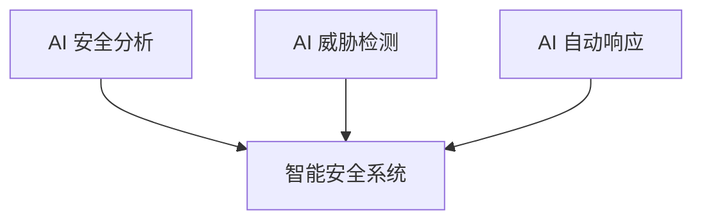

## 11.4 未来安全技术方向

展望 LLM 安全技术的发展趋势和研究方向。

### 11.4.1 更强的安全对齐

**研究方向**：

- 可扩展对齐：随模型规模增大保持对齐
- 鲁棒对齐：抵抗对抗攻击的对齐
- 可验证对齐：可证明的安全保证
- 价值学习：从人类反馈中学习价值观

### 11.4.2 形式化验证

**目标**：

用数学方法证明 AI 系统的安全属性。

图 11-1：形式化验证流程图

**挑战**：

- LLM 复杂度高
- 属性难以形式化
- 计算开销大

### 11.4.3 可信 AI 基础设施

**技术方向**：

| 方向 | 描述 |
|------|------|
| 可信执行环境（TEE） | 在受硬件保护的隔离环境中执行推理 |
| 机密计算 | 数据在使用中也受保护，降低侧信道与内存泄露风险 |
| 分布式验证 | 多方验证机制 |
| 区块链审计 | 不可篡改的审计 |

### 11.4.4 隐私增强技术

**技术演进**：

- 联邦学习进化
- 更实用的差分隐私
- 同态加密优化
- 安全多方计算

### 11.4.5 AI 驱动的安全

**用 AI 增强安全**：

图 11-2：AI 驱动的安全流程图

**应用场景**：

- 智能注入检测
- 自动化漏洞发现
- 实时行为分析
- 自适应防御

### 11.4.6 Agent 与协议层安全（前沿）

2025-2026 年，一个显著变化是：攻击面从“单模型”扩展到“多工具+多服务协议生态”。  
以 MCP 为代表的工具互联协议提高了开发效率，也引入了协议层信任风险。

**重点方向**：
- 协议级身份认证与授权最小化
- 工具能力声明（capability）校验
- 跨服务调用链的可观测与可追溯
- 安全策略代码化（Policy-as-Code）

### 11.4.7 标准与生态

**未来发展**：

- 统一的 LLM 安全标准
- 开放的安全评估框架
- 行业最佳实践库
- 安全认证体系

### 11.4.8 研究与实践的平衡

**关键挑战**：

- 理论研究与实际应用的差距
- 安全与功能的平衡
- 成本与效果的权衡
- 快速迭代与稳定安全的矛盾

LLM 安全是一个快速发展的领域，需要持续学习和适应。
