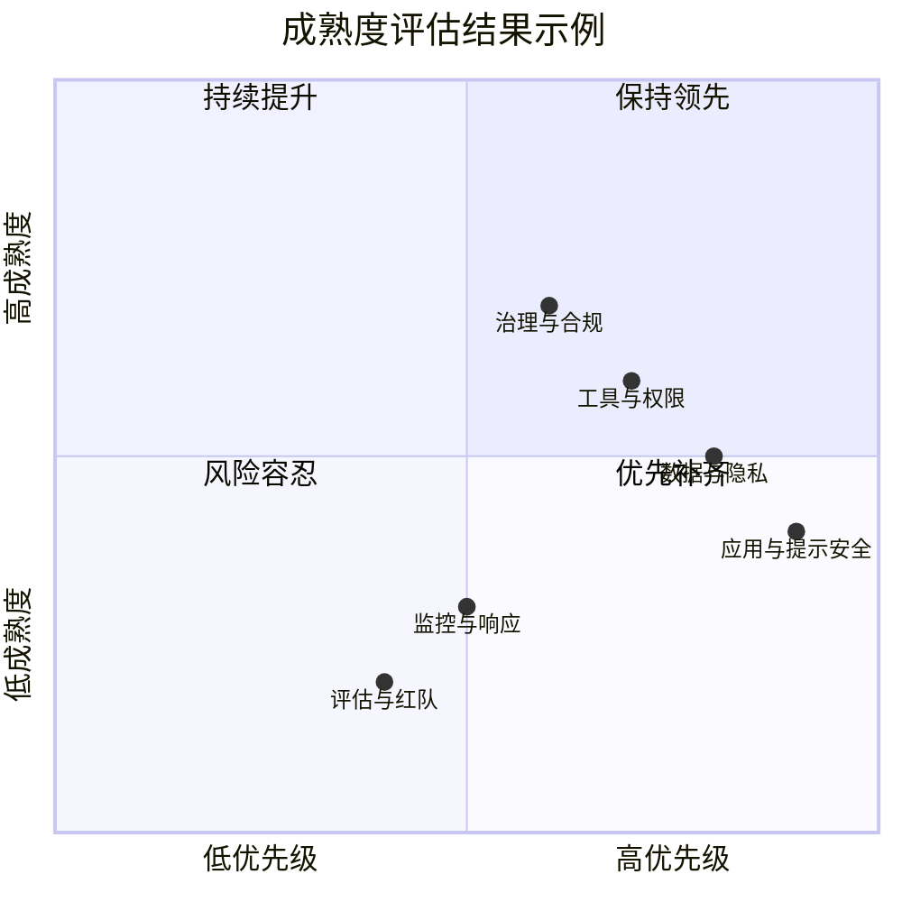

## 11.4 大语言模型安全成熟度模型

安全成熟度模型用于回答两个问题：**我们现在在哪里？下一步该做什么？**
它把零散的控制项组织成可评估、可对标、可规划的能力阶梯，帮助组织把“安全愿景”变成“落地路线图”。

### 11.4.1 成熟度维度（能力域）

建议至少从以下能力域评估 LLM 安全（可根据组织实际增删）：

| 能力域 | 关注点（示例） |
|--------|----------------|
| 治理与合规 | 责任划分、审批流程、法规映射、证据留存 |
| 风险管理 | 威胁建模、风险评估、例外管理、变更评审 |
| 数据与隐私 | 数据分级、最小化、脱敏、日志策略、保留期 |
| 模型与供应链 | 模型来源验证、SBOM、依赖扫描、版本治理 |
| 应用与提示安全 | 系统提示基线、注入防护、上下文隔离、越权防护 |
| 工具与权限 | 最小权限、参数校验、操作确认、回滚与审计 |
| 监控与响应 | 监控指标、告警分级、事件响应、复盘改进 |
| 评估与红队 | 基准测试、回归门禁、红队演练、对抗样本库 |

### 11.4.2 五级成熟度（示例定义）

下面给出一个可直接落地的五级模型示例（L0-L4）。组织可把它映射到自身 OKR 与发布门禁。

| 等级 | 定义 | 典型特征 |
|------|------|----------|
| L0 初始 | 基本无体系 | 依赖个人经验，缺少流程与证据 |
| L1 基线 | 有基本控制 | 有最小可行防线与准入，但不成体系 |
| L2 可重复 | 流程可执行 | 控制项可重复执行，有回归评测与审计留痕 |
| L3 可度量 | 指标驱动 | 有量化指标与门禁，能持续优化误报/漏报与体验成本 |
| L4 自适应 | 威胁驱动演进 | 结合威胁情报与红队持续演进，跨团队协同高效 |

**各等级能力域详细对照**

以“应用与提示安全”为例，展示从 L0 到 L4 的递进路径：

| 等级 | 能力特征 | 典型工件 |
|------|----------|----------|
| L0 | 系统提示硬编码在代码中，无审核流程 | 无 |
| L1 | 有标准化系统提示模板；基础输入过滤（关键词黑名单） | 提示模板文档、过滤规则清单 |
| L2 | 系统提示变更需审批；提示注入测试集可回归执行；有上下文隔离机制 | 变更审批记录、回归测试报告 |
| L3 | 注入成功率 < 5%（可量化）；误拒率 < 2%；指标异动触发自动告警 | 监控仪表盘、SLO 定义、告警记录 |
| L4 | 结合最新攻击情报自动补充测试集；多模态注入防护覆盖；跨团队持续红队 | 情报整合记录、红队闭环报告 |

### 11.4.3 各等级的“最小证据集”

成熟度评估要避免变成“写文档比赛”。建议为每个等级定义最小证据集：

**L1 基线**
- 输入输出过滤与脱敏策略文档
- 工具最小权限清单
- 最基本审计日志字段定义
- 系统提示模板及更新记录

**L2 可重复**
- 威胁建模记录（参照 STRIDE 或 AI-STRIDE）
- 发布前安全测试报告
- 例外审批记录（哪些风险被接受、由谁审批、有效期）
- 可回归的安全测试集（参见 [10.4 节](../10_operations/10.4_red_teaming.md)）

**L3 可度量**
- 关键安全指标仪表盘（注入成功率 / PII 泄露率 / 系统提示泄露率 / 误拒率）
- SLO 定义与阈值告警记录
- 月度安全复盘报告
- 误报/漏报趋势分析

**L4 自适应**
- 红队演练报告与修复闭环证据
- 威胁情报订阅与策略更新联动记录
- 跨法域合规映射矩阵（如同时满足 GDPR + PIPL）
- 多团队协同安全评审机制文档

### 11.4.4 案例：从 L0 到 L2 的升级路径

**案例一：SaaS 创业公司的智能客服**

该公司将 LLM 集成到客户支持流程中，初始状态为 L0。

```
起点（L0）：
├── 系统提示直接 hardcode 在代码中，包含 API 密钥
├── 无输入过滤，用户可直接注入指令
├── 无日志记录，出问题后无法追溯
└── 开发者兼任安全审核

第一阶段（→ L1，2 周）：
├── 将 API 密钥移出系统提示，改用环境变量
├── 编写标准化系统提示模板，明确角色边界和拒绝规则
├── 部署基础关键词过滤（提示注入常见 Payload）
├── 添加请求/响应审计日志（trace_id, timestamp, user_id）
└── 产出：提示模板文档、过滤规则清单、日志字段定义

第二阶段（→ L2，1-2 个月）：
├── 引入提示注入检测模型（Meta Prompt Guard 或 LLM-as-Judge）
├── 构建 30+ 条安全回归测试集，纳入 CI 流程
├── 系统提示变更需经技术负责人审批
├── 建立安全事件响应流程（发现→评估→修复→验证）
└── 产出：回归测试报告、变更审批记录、事件响应 SOP
```

**案例二：金融科技公司的投研助手**

该公司为基金经理提供 LLM 驱动的研究报告分析工具，数据敏感度高。

```
起点（L1）：
├── 有基础的输入过滤，但只针对英文 Payload
├── RAG 知识库无内容审核流程
├── 工具调用权限按角色粗粒度划分
└── 安全测试依赖人工抽检

升级路径（→ L3，3-6 个月）：
├── 多语言注入防护（覆盖中英文 + 低资源语言绕过）
├── RAG 文档入库前增加安全扫描与来源标记
├── 工具权限细化到"操作 × 数据范围 × 时间窗口"
├── 部署安全指标仪表盘：
│   ├── 注入成功率 < 3%（SLO）
│   ├── PII 泄露率 = 0（硬性要求）
│   ├── 误拒率 < 1.5%
│   └── 指标异动 5 分钟内触发告警
├── 季度红队演练 + 自动化回归
└── 产出：指标仪表盘、SLO 定义、红队报告、审计矩阵
```

### 11.4.5 自评检查表

组织可使用以下快速检查表进行粗粒度自评：

```
L1 基线检查：
□ 系统提示中不包含任何密钥或内部 URL
□ 有基础的输入过滤机制
□ 有审计日志记录关键操作
□ 工具调用有权限控制

L2 可重复检查：
□ 系统提示变更需审批
□ 有可自动执行的安全回归测试集
□ 有威胁建模文档
□ 有安全事件响应流程

L3 可度量检查：
□ 有安全指标仪表盘且定期查看
□ 关键指标有 SLO 和告警
□ 定期进行安全复盘
□ 误报/漏报趋势可追踪

L4 自适应检查：
□ 威胁情报驱动策略更新
□ 定期红队演练且闭环修复
□ 多团队协同安全评审
□ 跨法域合规持续映射
```

### 11.4.6 评分与落地方式（建议）

**评估频率**：建议季度评估一次；对高风险业务线可按月评估。

**评分方式**：按“能力域 × 等级”给出达标/部分达标/不达标，并附证据链接或工单编号。



图 11-9：成熟度评估结果象限图（示例）

**落地策略**：优先补齐“高优先级 + 低成熟度”象限的能力域（右下角），先达 L1-L2，再追求全面的 L3-L4。

成熟度模型的价值在于形成共识：安全不是“做没做”，而是“做到什么程度、是否可验证、能否持续改进”。
