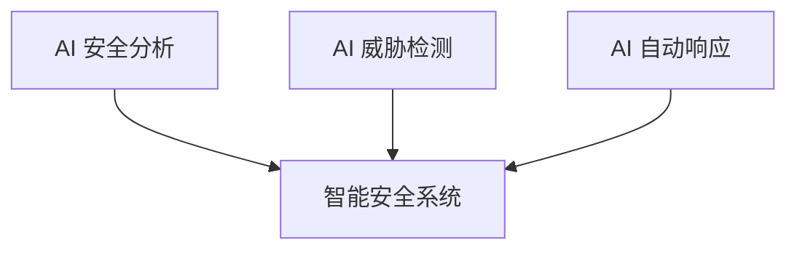

## 11.6 未来安全技术方向

展望 LLM 安全技术的发展趋势和研究方向。

### 11.6.1 更强的安全对齐

**研究方向**
- 可扩展对齐：随模型规模增大保持对齐
- 鲁棒对齐：抵抗对抗攻击的对齐
- 可验证对齐：可证明的安全保证
- 价值学习：从人类反馈中学习价值观

### 11.6.2 形式化验证

**目标**
用严格的数学方法证明 AI 系统在特定条件下的行为必然满足预设的安全属性，从而提供高于经验测试的安全保证。

图 11-10：形式化验证流程图

**当前可行性与局限**

形式化验证在 AI 安全中的应用仍面临重大计算可行性挑战：

- **规模限制**：当前形式化验证主要适用于小规模神经网络（数千参数量级）。对于数十亿参数的 LLM，完整的形式化验证在计算上不可行。这导致形式化验证的实用范围严格受限。

**可行的替代与过渡方向**

面对 LLM 规模过大的挑战，业界正在探索以下替代方案：

1. **局部安全属性验证**：
   - 对模型的特定安全属性进行局部验证（如输出不包含特定有害内容、敏感信息不泄露）。
   - 采用针对性的验证策略，而非全局验证。

2. **防护组件验证**：
   - 将焦点从模型本身转向防护层的正确性（如输入过滤器、权限控制逻辑、输出审核模块）。
   - 这些组件规模较小，形式化验证相对可行。

3. **统计验证方法**：
   - 使用概率性保证替代完整的形式化证明。
   - 通过大规模的对抗鲁棒性测试、红队评估等获得统计意义上的安全保证。

**发展方向与挑战**

- **从局部验证到全局属性**：当前形式化方法多用于验证神经网络的局部鲁棒性（如图像小范围扰动），未来需突破到验证语义层面的全局安全属性（如“绝对不执行系统提权命令”）。
- **缓解状态爆炸问题**：LLM 巨大的参数规模和离散的文本输出空间导致了验证过程中的计算爆炸，亟需开发新型的抽象解释方法和神经网络专属的定理证明器。
- **与对齐技术的融合**：通过“构造即安全”（Correct-by-Construction）理念，在模型训练阶段强制引入逻辑约束，而非事后验证。

**预期发展时间线**

未来几年值得关注的方向包括以下几个领域：
- **AI 系统的安全组件**（如输入过滤器、权限控制逻辑），而非模型本身。
- **特定的局部安全属性验证**，而非模型整体行为证明。
- **混合验证体系**（结合形式化方法、统计验证与红队测试）。

### 11.6.3 可信 AI 基础设施

**技术方向**
| 方向 | 描述 |
|------|------|
| 可信执行环境（TEE） | 在受硬件保护的隔离环境中执行推理 |
| 机密计算 | 数据在使用中也受保护，降低侧信道与内存泄露风险 |
| 分布式验证 | 多方验证机制 |
| 区块链审计 | 不可篡改的审计 |

### 11.6.4 PETs 的实用化

未来的隐私保护将从“性能妥协”走向“基础设施化”，真正实现在不可信环境中安全使用 LLM。

**核心技术演进**
- **机密计算（机密 AI）**：依托新一代硬件的 TEE（可信执行环境），推动云端更强的安全推理与数据保护，但不应把它表述为对云厂商的绝对“物理层面不可窃取”保证。
- **联邦学习进化（FLLM）**：打破跨组织数据壁垒，通过参数高效微调（PEFT）结合按需异步聚合，实现低带宽下的跨企业联合训练，在不共享原始数据的前提下共同提升模型能力。
- **混合密码学方案**：全同态加密（FHE）与安全多方计算（SMPC）目前在 LLM 推理上耗时极高，未来的突破点在于“算法-硬件协同设计”以及只对关键子网络加密的混合架构。
- **可证明的数据遗忘（Machine Unlearning）**：当用户行使“被遗忘权”或发现有毒数据时，如何快速、低成本地削弱相关记忆，而无需昂贵的全量重训，将成为重要研究方向；但它本身不是自动满足 GDPR 删除义务的万能答案，仍需结合训练数据、缓存、日志和模型输出中的个人数据残留情况综合判断。

### 11.6.5 AI 驱动的安全

**用 AI 增强安全**

图 11-11：AI 驱动的安全流程图

**应用场景**
- 智能注入检测
- 自动化漏洞发现
- 实时行为分析
- 自适应防御

### 11.6.6 内部可观测性与数据保证（前沿）

在传统软件安全里，威胁建模、代码审查、渗透测试这些“触点（touchpoints）”对应的是相对静态的源码与二进制。LLM 与 Agent 把两类新的工件抬到了第一位：

- **训练与微调过程**：作为新的攻击面（投毒、后门、对齐削弱、微调污染等），需要专门的**数据保证（data assurance）**——覆盖数据来源（provenance）、污染检测（contamination）、表征完整性（representational integrity）。这条线在软件安全里没有直接对应物，是 AI 安全必须独立建立的工程实践。
- **模型内部状态**：黑盒基准测试只能告诉你模型“在某个测试上表现如何”，无法告诉你“为什么”。逐层激活分析、特征电路（circuits）研究、refusal 方向定位等可解释性工作（详见 9.5 的级联激活探针实践）正在把“安全相关的内部信号”从概念变成可工程化的观测对象——这与软件安全从黑盒渗透测试发展到白盒静态分析的演进路径在结构上是一致的。

工程意义上，这两条线汇聚到同一个判断：**一个安全相关行为是不是真的来自模型内部、被定位在哪几层、是否在最近一次微调后被改写**，会比“在某个基准上得多少分”更有诊断价值。从外向内的黑盒红队仍然不可或缺，但只有补上“从内向外”的视角，安全保障才有机会从找问题（badness-ometer）走向证明不存在问题。

### 11.6.7 智能体与协议层安全（前沿）

2025-2026 年，一个显著变化是：攻击面从“单模型”扩展到“多工具+多服务协议生态”。
以 MCP 为代表的工具互联协议提高了开发效率，也引入了协议层信任风险。

**重点方向**
- 协议级身份认证与授权最小化
- 工具能力声明（capability）校验
- 跨服务调用链的可观测与可追溯
- 安全策略代码化（Policy-as-Code）

### 11.6.8 标准与生态

**未来发展**
- 统一的 LLM 安全标准
- 开放的安全评估框架
- 行业最佳实践库
- 安全认证体系

### 11.6.9 研究与实践的平衡

**关键挑战**
- 理论研究与实际应用的差距
- 安全与功能的平衡
- 成本与效果的权衡
- 快速迭代与稳定安全的矛盾

LLM 安全是一个快速发展的领域，需要持续学习和适应。
