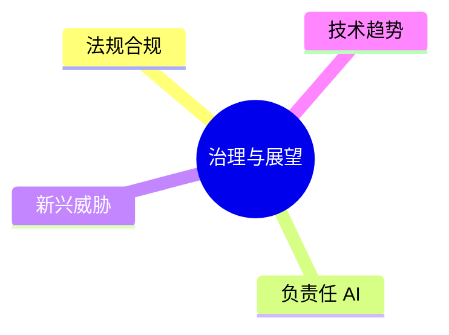

# 第十一章：安全治理与未来展望

LLM 安全不仅是技术问题，也涉及法规、伦理和社会责任。本章探讨更广泛的治理视角和未来发展方向。

本章聚焦于治理与展望，主要内容包括：

- **11.1 AI 法规与合规要求**：了解全球 AI 监管趋势
- **11.2 负责任 AI 实践**：构建负责任的 AI 开发文化
- **11.3 新兴威胁趋势**：预见未来的安全挑战
- **11.4 未来安全技术方向**：展望技术发展趋势

通过本章的学习，读者将建立起更宏观的安全视角。

