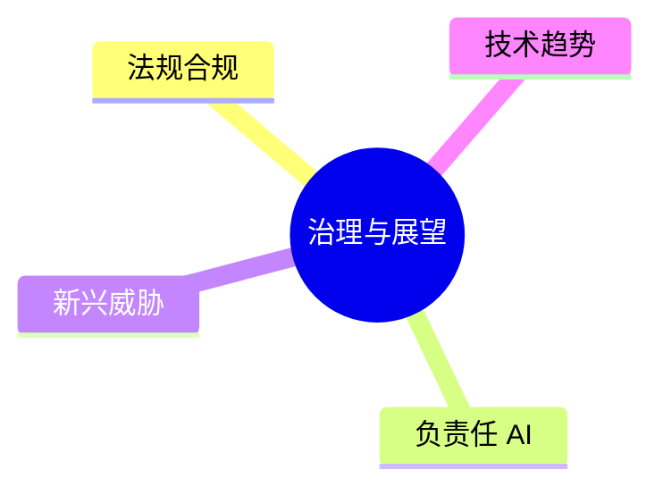

# 第十一章 安全治理与未来展望

LLM 安全不仅是技术问题，也涉及法规、伦理和社会责任。本章探讨更广泛的治理视角和未来发展方向。

本章聚焦于治理与展望，主要内容包括：

- **11.1 AI 法规与合规要求**：了解全球 AI 监管趋势
- **11.2 负责任 AI 实践**：构建负责任的 AI 开发文化
- **11.3 新兴威胁趋势**：预见未来的安全挑战
- **11.4 Agent 错位威胁：从压力测试到防护框架**：关注 agentic misalignment 等前沿风险
- **11.5 大语言模型安全成熟度模型**：量化组织安全能力水平并指导落地
- **11.6 未来安全技术方向**：展望技术发展趋势
- **11.7 AI 安全合规的可操作性指南**：提供可落地的合规实施路径
- **11.8 可信 Agent 框架：五大核心原则与生态标准化**：总结可信 Agent 的治理原则、落地检查点与标准化方向

其中，11.5 提供本章统一的安全成熟度阶梯，11.8 则聚焦 Agent 场景下的原则与生产就绪检查点，两者互补而不重复。

通过本章的学习，读者将建立起更宏观的安全视角。

```mermaid
mindmap
  root((治理与展望))
    法规合规
    负责任 AI
    新兴威胁
    技术趋势
```
