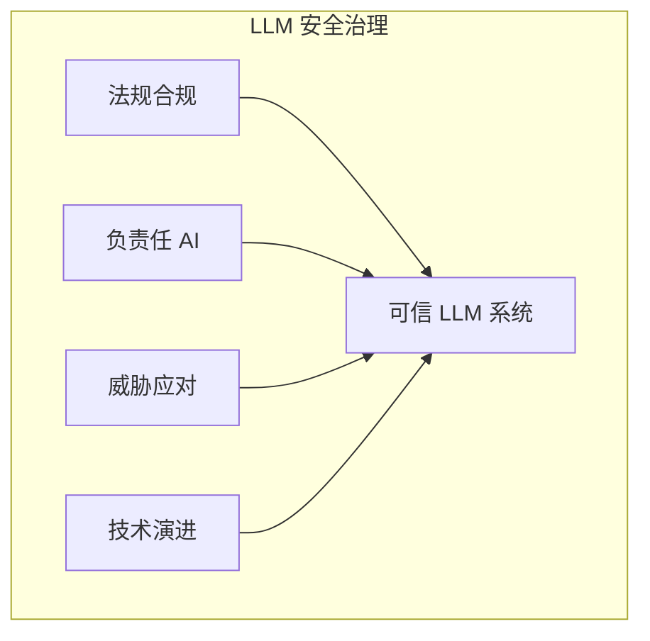

## 本章小结

本章从治理视角探讨了 LLM 安全的更广泛议题，包括法规合规、负责任 AI、新兴威胁和未来展望。

### 核心要点回顾

**AI 法规与合规**：全球 AI 监管正在快速发展。以 EU AI Act 为例，义务按 2025-02-02、2025-08-02、2026-08-02、2027-08-02 分阶段落地；组织需要建立持续的法规跟踪与控制映射机制。

**负责任 AI 实践**：公平性、透明性、安全性、隐私保护和问责制是负责任 AI 的核心原则。组织应建立 AI 伦理委员会和影响评估机制。

**新兴威胁趋势**：AI 对 AI 攻击、深度伪造滥用、Agent 风险升级、供应链风险深化等是需要关注的新兴威胁。

**未来技术方向**：更强的安全对齐、形式化验证、可信基础设施、隐私增强技术、AI 驱动安全等是技术发展方向。

### 治理框架

图 11-1：治理框架架构图

### 行动建议

| 维度 | 建议 |
|------|------|
| 合规 | 建立法规追踪和合规管理 |
| 伦理 | 制定 AI 伦理准则 |
| 安全 | 持续关注威胁演进 |
| 技术 | 投资安全研究和能力建设 |

### 总结

LLM 安全是一个多维度的挑战，需要技术、治理、伦理多方面的协同努力。本书从基础概念到攻击技术，从防御措施到运营实践，再到治理与展望，提供了全面的知识框架。希望读者能够将这些知识应用于实践，构建更安全、更负责任的 LLM 系统。

安全是一个持续的旅程，而非终点。随着 LLM 技术的发展，安全挑战和应对方法也会不断演进。保持学习、保持警惕、保持负责任的态度，是每一位从业者应有的姿态。
