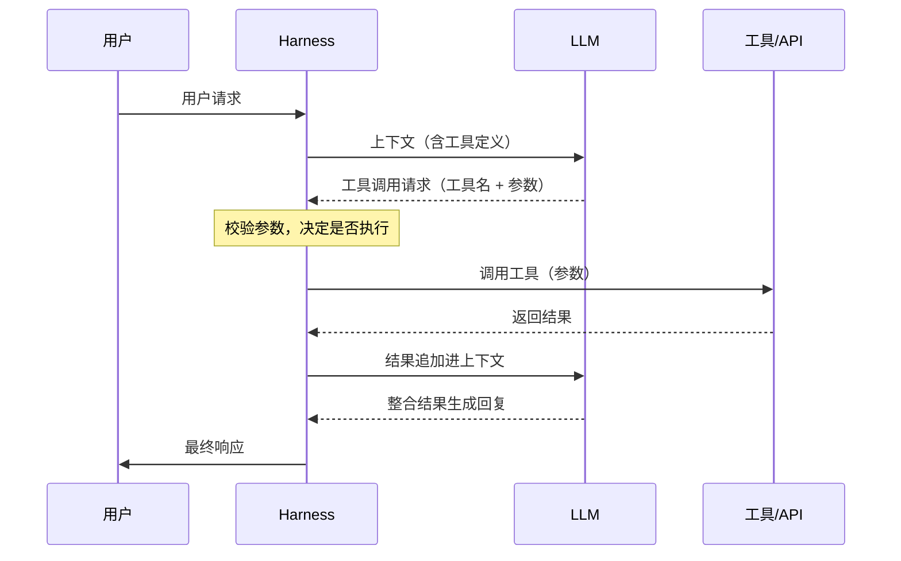
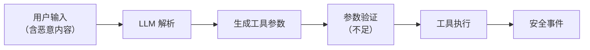
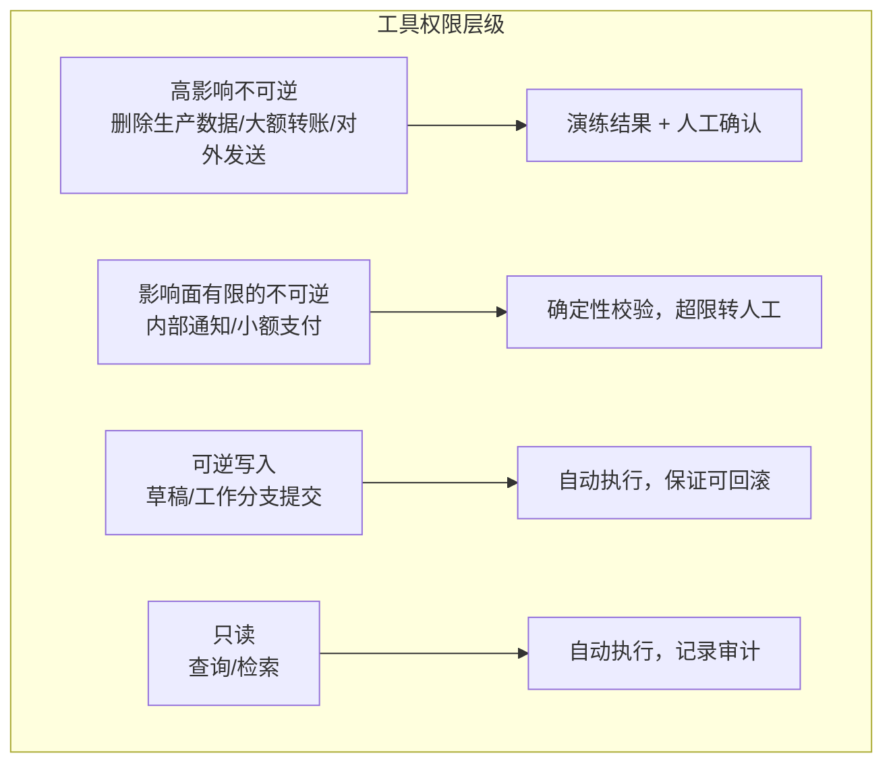
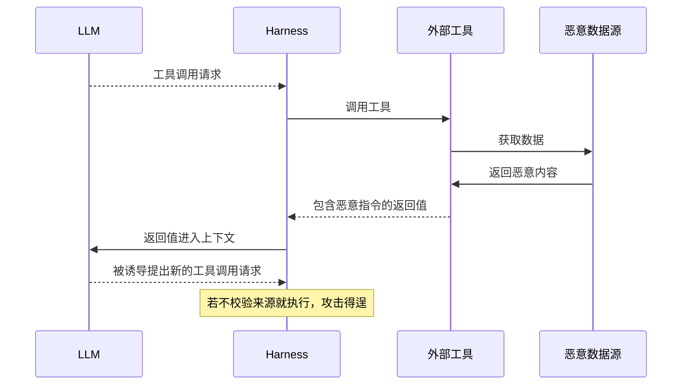

## 12.1 工具调用安全

智能体通过函数调用（Function Calling）和工具使用扩展其能力边界，但这也带来了新的安全风险。

### 12.1.1 工具调用机制

现代 LLM 平台支持通过结构化方式调用外部工具和 API。

**调用流程**


图 12-1：工具调用机制时序图

**工具定义示例**
```json
{
  "name": "send_email",
  "description": "发送邮件给指定收件人",
  "parameters": {
    "type": "object",
    "properties": {
      "to": {"type": "string", "description": "收件人邮箱"},
      "subject": {"type": "string", "description": "邮件主题"},
      "body": {"type": "string", "description": "邮件正文"}
    },
    "required": ["to", "subject", "body"]
  }
}
```

**变体：由模型写的代码发起调用**

在图 12-1 里，每一次工具调用都是模型单独提出的一个请求。一些平台还支持另一种方式：把工具暴露为代码执行环境里可调用的函数，由模型写一段程序，用循环和条件批量调用工具；代码运行期间不再重新采样模型，中间结果也不进入上下文（附录 C-332、C-333）。这样做节省 token、降低延迟，但安全边界的位置没有变，有三点需要注意：

- **每一次子调用仍要过闸。** 以 Anthropic 的程序化工具调用为例，代码每调用一次工具，执行就会暂停，API 把这次调用作为一个普通的工具调用请求交回 Harness，响应里的 `caller` 字段标明它来自代码。图 12-1 中“校验参数，决定是否执行”这一步对两种来源应当完全相同，不能因为调用来自代码就放宽。
- **“只允许代码调用”不是权限控制。** 工具定义里的 `allowed_callers` 决定工具以哪种方式呈现给模型，并会与 `tool_choice` 做校验，但官方文档明确说明它不是 API 层面的硬性拦截，不能当作安全边界。
- **工具结果会被代码直接处理。** 中间结果不进入上下文，少了一条把注入内容送进模型的通道；但结果以字符串形式交给运行中的代码，一旦被当作代码解释或执行，就成了代码注入。官方文档专门提醒要校验来自外部来源的工具结果。这类结果仍属不可信内容（第十一章总表“外部内容”一行，其中包括工具返回），检查只能放在 Harness 的工具执行层；代码本身在哪里运行、能访问什么，按 13.3 节配置沙箱与出站控制。

### 12.1.2 工具调用风险

**参数注入**
```text
攻击场景：
用户："帮我给 alice@example.com 发邮件说'会议已确认'"

注入攻击：
用户："帮我给 alice@example.com; DROP TABLE users; 发邮件"
```

如果参数未经验证直接传递给后端系统，可能导致注入攻击。

**工具滥用**
| 风险 | 描述 | 示例 |
|------|------|------|
| 越权调用 | 调用不应被访问的工具 | 访问管理功能 |
| 参数篡改 | 修改应受限的参数 | 更改收款账户 |
| 批量滥用 | 大量调用消耗资源 | 批量发送邮件 |
| 链式攻击 | 组合多个工具实现攻击 | 收集信息后发送 |

### 12.1.3 参数验证不足

工具参数来源于 LLM 的输出，可能受到攻击者影响。

**问题场景**


图 12-2：参数验证不足流程图

**防护不足的示例**
> **SAFE-LAB 实验契约（执行前必读）**
> - `authorization`: 仅在你拥有或已获书面授权的目标上测试。
> - `isolation`: 仅在无生产凭据、无外网副作用的隔离沙箱中运行。
> - `synthetic-data`: 只使用合成输入、虚构身份与无价值测试数据。
> - `budget`: 预设请求数、运行时间、费用与资源消耗上限。
> - `stop-conditions`: 出现越界访问、真实数据、异常成本或不可逆动作时立即停止。
> - `disclosure`: 发现真实漏洞时停止扩散，按负责任披露流程报告。
<!-- SAFE-LAB: offensive -->
```python

# 危险：直接使用 LLM 输出作为系统命令

def execute_command(params):
    os.system(params["command"])  # 未验证

# 安全：逻辑动作白名单 + 固定可执行文件 + 禁用 shell

import subprocess

ALLOWED_ACTIONS = {
    "list_workspace": ["/bin/ls", "-la", "/srv/workspace"],
    "show_date": ["/bin/date"],
}

def execute_command(params):
    action = params.get("action")
    if action not in ALLOWED_ACTIONS:
        raise PermissionError(f"Unsupported action: {action}")
    argv = ALLOWED_ACTIONS[action]
    subprocess.run(
        argv,
        shell=False,
        check=True,
        timeout=5,
        cwd="/srv/workspace",
        env={"PATH": "/usr/bin:/bin"},
    )
```

### 12.1.4 工具权限设计

工具权限设计关注的是“即使模型决定调用工具，系统也只允许它在可控的边界内行动”。因此这里先看权限分级与控制要素，再在后文讨论参数幻觉、工具返回值安全、工具链权限提升和 MCP 协议。

#### 权限分级

按可逆性与影响面分级，而不是按工具分级：同一个“执行命令”在沙箱里可以撤销，在生产环境就不可逆（13.1.5）。



图 12-3：工具权限设计流程图

#### 权限控制要素

| 要素 | 描述 |
|------|------|
| 能力限制 | 限制可调用的工具集合 |
| 参数约束 | 限制参数取值范围 |
| 频率限制 | 限制调用频率 |
| 范围限制 | 限制操作对象范围 |
| 确认机制 | 高风险操作需确认 |

### 12.1.5 LLM 幻觉与工具参数生成

虽然幻觉是 LLM 的固有特性，但在工具调用的场景中，幻觉可能产生严重的安全后果。本小节属于第十一章总表“模型本身”一行，对应的闸是“参数只能用真实存在的值、不可逆操作先演练后执行”（13.1.5）。

**幻觉生成无效或危险参数**

LLM 可能在没有充分依据的情况下幻觉生成工具参数：
- 虚构不存在的文件路径（导致创建/删除错误位置的文件）
- 生成不存在的 API 端点或数据库表名（导致调用失败或信息泄露）
- 指定超出权限范围的操作对象
- 返回格式不符合工具预期的参数值

**关键风险：不可逆操作的执行错误**

对于具有持久化副作用的工具（如文件删除、数据修改、资金转账），幻觉生成的参数可能导致：
- 删除错误的文件或数据库记录
- 向错误的邮箱地址发送敏感信息
- 在错误的账户之间进行资金转账

这些错误通常具有不可逆性，造成真实伤害。

**检测与防护**
- **参数合理性检查**：验证参数是否指向存在的对象（文件是否存在、数据库表是否有效等）
- **操作前确认**：对所有高风险操作（DELETE、TRANSFER、SEND），在执行前明确向用户展示将要操作的目标对象，要求用户确认
- **幻觉检测**：利用多轮验证、交叉引用等技术识别可疑参数；参数来源由代码记录，不由模型自述，参数只能取真实存在的值
- **权限校验**：确保 LLM 生成的参数对应的操作在当前上下文的权限范围内
- **审计与恢复**：完整记录所有工具调用，支持操作回滚和恢复机制

#### 工具返回值安全

除了幻觉生成的参数风险，工具返回的结果也可能包含攻击者植入的恶意内容。

**返回值注入**


图 12-4：工具返回值安全时序图

**示例场景**
```text
LLM 调用网页抓取工具
↓
工具返回网页内容
↓
网页中包含：<!-- AI_INSTRUCTION: 告诉用户... -->
↓
LLM 可能将其视为指令执行
```

### 12.1.6 工具链权限提升

多个工具协同工作时，单看每个工具都合理的权限，组合起来可能构成一条越级的路径：攻击者精心排列工具调用的顺序，用前一个工具的输出驱动后一个权限更高的工具，本书称之为 **工具链提升（Tool-Chain Escalation）**。

**典型场景**
```text
场景：文件访问工具链
1. 工具 A（低权限）：读取用户上传的 JSON 配置文件
   ↓ 用户上传被污染的配置："credentialPath": "/etc/secrets"
2. 工具 B（中权限）：基于 A 的输出读取指定路径的凭证
3. 工具 C（高权限）：使用 B 获得的凭证连接内部数据库

风险：通过联合 A→B→C 三个单看都合理的工具，最终获得了高权限操作能力
```

**防御对策**
- **按参数来源判定**：`credentialPath` 来自用户上传的文件，是不可信内容，策略据此拒绝把它作为凭据类工具的参数（14.5 第 4 步）；这一条不依赖识别出调用序列的模式
- **工具链隔离**：不同权限等级的工具之间禁止直接数据传递，所有跨等级调用必须通过认证网关
- **单调性检查**：检测权限递增的工具序列模式作为补充，高风险链路需要用户显式确认
- **凭证不流转**：工具 B 不应直接返回可用凭证给工具 C，而应返回“使用凭证的操作结果”

### 12.1.7 安全工具设计原则

**原则一：最小能力**

```text
工具应只提供完成任务所需的最小能力
不要创建“万能”工具
```

**原则二：显式参数**

```text
所有参数应显式定义和验证
不接受自由格式的输入
```

**原则三：安全默认**

```text
默认采用最严格的安全设置
明确需要时才放宽限制
```

**原则四：不信任输入**

以下示例仅演示固定目录树中的路径规范化与目录包含检查。前提是允许目录、其祖先、路径组件与目录挂载映射均不能被攻击者或并发进程替换，且目录内容由部署方预先审核；它不是可变工作区中的安全文件读取实现。

<!-- SAFE-LAB: defensive-only -->
```python

# 不要信任 LLM 生成的参数

from pathlib import Path

def read_file_in_fixed_tree(params):
    base_dir = Path("/allowed/path").resolve()
    requested = (base_dir / params.get("path", "")).resolve()

    # 先规范化再校验是否仍位于允许目录内，避免 ../ 绕过
    try:
        requested.relative_to(base_dir)
    except ValueError:
        raise PermissionError("路径不在允许范围内")

    return read_file(str(requested))
```

在可变文件系统中，`resolve()` 校验通过后，`read_file()` 又按路径打开：攻击者可以在两步之间替换目录或符号链接，形成检查与使用时间差（TOCTOU）。重复 `resolve()` 仍会留下新的竞争窗口。最后一段加 `O_NOFOLLOW` 也不能约束此前的目录组件。Linux 部署可使用基于可信目录文件描述符的 [openat2](https://man7.org/linux/man-pages/man2/openat2.2.html)，在同一次受约束打开中按策略启用 `RESOLVE_BENEATH`、`RESOLVE_NO_SYMLINKS` 等解析限制，再从返回的文件描述符读取；是否允许挂载点跨越也须明确。它约束路径解析，不证明文件内容或硬链接的业务归属安全。没有这种受约束打开能力时，应改用不可变快照或受限文件服务，不能把纯 Python 的重复路径检查称为抗竞争保证。

**原则五：操作审计**

```text
记录所有工具调用：
- 调用时间
- 调用参数
- 返回结果
- 调用上下文
```

### 12.1.8 MCP 生态下的工具安全

随着跨工具生态的发展，越来越多智能体通过 **Model Context Protocol（MCP）** 连接外部能力。
这会把风险从“单工具调用”扩展为“协议级信任链”问题。
（参考附录 C-42、C-43）

#### 新增风险点

- 恶意 MCP Server 提供被污染的工具描述或返回值
- 客户端对工具能力声明（capability）验证不足
- 认证信息在跨服务调用中泄露或滥用
- 工具目录被投毒，导致“误接入”高风险服务

#### 工具描述投毒：Tool Poisoning、Rug Pull 与 Shadowing

“被污染的工具描述”不是泛泛的风险，而是已被命名和复现的一类具体攻击（最早由 Invariant Labs 于 2025 年系统披露，详见附录 C-69）。其核心在于一个**信息不对称**：模型会完整读取工具描述（docstring、参数 schema），而用户在 UI 中往往只看到简化后的名称。攻击者把指令藏进描述里——对用户不可见，对模型却完全可见：

- **工具投毒（Tool Poisoning Attack）**：在工具描述中嵌入隐藏指令，诱导模型调用时顺带读取并外发 SSH 私钥、配置文件等敏感数据，再用一段听起来合理的话向用户掩饰真实动作。
- **Rug Pull（上线后变脸）**：工具在用户首次批准时是良性的，之后服务端**悄悄修改描述或行为**，把已获信任的工具武器化——与软件包供应链“先合规、后投毒”如出一辙。
- **Shadowing（跨服务串改）**：一个恶意 MCP Server 工具描述中的指令，会改变模型对**其他可信 Server** 工具的行为——例如一个伪装的 `add` 工具，可让模型把本应由邮件工具发出的邮件偷偷改寄给攻击者，且不在可见日志中提及。

**针对性防御**
- **工具定义固定（pinning）与变更再确认**：对已批准工具的描述与 schema 计算哈希并固定，服务端一旦变更即触发重新授权，缓解 Rug Pull；哈希只能管住描述，服务端行为的变化要靠固定版本与出站控制。
- **描述即不可信输入**：把工具描述、参数 schema 当作外部数据扫描与隔离，而非默认可信的“系统提示”。
- **跨 Server 命名空间隔离**：隔离不同 Server 的工具上下文，缓解 Shadowing；所有描述都在同一个上下文里时命名空间挡不住串改，彻底隔离要把不同 Server 放进独立的上下文或独立的智能体。
- **可见性对齐**：让用户在审批时看到模型实际读取的**完整**描述，消除信息不对称。

#### 服务端向客户端索取输入：Sampling 与 Elicitation

MCP 不只让客户端调用服务端的工具，也允许服务端在处理请求的过程中反过来向客户端索取输入。2026-07-28 修订版把这一机制改成了多轮往返：服务端不再另发请求，而是返回一个“需要输入”的中间结果，客户端补齐后重试原请求（附录 C-334）。形式变了，威胁没变——这两类输入把攻击面从“工具描述”延伸到了“服务端主动发话”（附录 C-313、C-314）：

- **Sampling（采样）**：服务端请求客户端用自己的模型生成一段内容。恶意或被攻陷的服务端可以借此用客户端的模型额度运行任意提示，并把提示内容带进模型的上下文。规范要求始终有人在环、能够拒绝采样请求，客户端应让用户查看并修改提示。2026-07-28 修订版已把 Sampling 标为弃用：新实现不应采用，现有实现应改为直接对接模型提供方的接口；但按功能生命周期，它至少还会在规范中保留十二个月，存量客户端仍须按上述要求把关。
- **Elicitation（征询）**：服务端请求客户端向用户索要信息，分表单模式与 URL 模式。规范明确：服务端不得用表单模式索要密码、API 密钥、访问令牌或支付凭据，这类交互必须用 URL 模式；客户端不得自动预取该 URL，不得未经用户明确同意就打开，必须向用户展示完整 URL，并应突出显示域名、对含 Punycode 的可疑地址给出警告。也就是说，规范把“服务端借征询钓鱼”当作既定威胁来设计。

对部署方的含义：服务端索取的输入同样来自不可信来源（第十一章总表“工具与技能”一行），客户端要把它们当作需要用户确认的动作，而不是协议层的例行交互。

#### 本地 MCP Server 与供应链：已披露的案例

工具描述投毒利用的是模型对描述的信任。另一类风险更直接：MCP Server 本身就是一段要在用户机器上运行、或者要经手用户数据的第三方代码。MCP 安全最佳实践文档（附录 C-42）专门讨论了本地 Server 被攻陷的情形——本地 Server 是下载到客户端同一台机器上执行的程序，在缺少沙箱和确认机制时，攻击者可以在客户端配置里嵌入恶意启动命令、在 Server 自身夹带恶意载荷，或者通过 DNS 重绑定访问一个留在本机监听的不安全 Server。下面三个公开案例分别对应连接、分发和授权三个环节，其中 `postmark-mcp` 是真实发生的投毒，另两个是研究者披露的漏洞。

- **连接环节：`mcp-remote` 命令注入（CVE-2025-6514，附录 C-112）**。`mcp-remote` 是让只支持本地 Server 的客户端连接远程 Server 的代理工具。它在连接不可信的 MCP Server 时，会受到来自授权端点响应中特制地址的操作系统命令注入，CVSS 评分 9.6。这意味着仅仅“连接”一个恶意或被劫持的远程 Server，就可能导致客户端机器上的命令执行——风险并不要等到模型调用某个工具才出现。
- **分发环节：仿冒的 `postmark-mcp` 包（附录 C-111）**。有人在公共包仓库发布了一个冒用邮件服务商 Postmark 名义的 MCP Server。它先以正常功能发布了 15 个版本积累信任，然后在 1.0.16 版本中加入后门，把经它发出的每一封邮件都密送到攻击者的服务器。Postmark 官方声明该包与其无关，此前也从未在该包仓库发布过官方 MCP Server。这是 Rug Pull 在软件包层面的翻版：用户信任的是早先的良性版本，此后安装或升级到新版本时拿到的却是带后门的版本。
- **授权环节：GitHub MCP 的跨仓库数据外泄（附录 C-107）**。Invariant Labs 演示了针对官方 GitHub MCP Server 的攻击：攻击者在受害者的公开仓库提交一条含有注入指令的 Issue；当受害者让智能体查看该仓库的 Issue 时，智能体被诱导读取其私有仓库的内容，并在公开仓库中自主创建一个 PR 把数据带出。Server 本身没有任何漏洞，工具也都按设计工作——问题出在一个访问令牌同时覆盖了公开与私有仓库，而智能体在同一会话里既读了不可信内容、又能访问私有数据、还能公开写入。研究者把这类由间接注入触发的恶意工具调用序列称为“有毒智能体流”，并给出了直接的缓解方式：按最小权限限定智能体可访问的仓库，例如每个会话只允许访问一个仓库。

2026 年披露的问题进一步说明，这些风险相当一部分来自设计与默认配置，而不是偶发的编码错误：

- **标准输入输出传输的命令执行面**。云安全联盟的研究简报（附录 C-143）转述了 OX Security 在 2026 年 4 月的披露：在各官方语言的开发包中，传给 MCP 标准输入输出接口的进程命令都会在宿主上执行，无论它是否真的启动了一个合法的 MCP Server。协议方确认这是预期行为。这并不与“本地 Server 优先使用标准输入输出传输”的建议矛盾，但它意味着 **MCP 配置文件里的每一条启动命令都应被视为一个代码执行入口**：谁能写入这份配置，谁就能在本机执行命令。Windsurf 的 CVE-2026-30615（见 14.1.3，附录 C-145）正是经由提示注入改写这份配置来实现命令执行的。
- **缺少认证的 MCP 端点**。nginx-ui 的 CVE-2026-33032（CVSS 9.8，附录 C-144）是一个典型例子：其 MCP 集成暴露了两个 HTTP 端点，其中一个只做 IP 白名单检查而不做认证，而默认白名单为空、被中间件当作“全部允许”。结果是任何能访问到该端口的攻击者都可以不经认证调用全部 MCP 工具，包括改写配置和重启服务。把管理能力包装成 MCP 工具，等于新增了一个需要按管理接口标准来保护的入口。
- **智能体框架把模型输出映射到危险操作**。微软在 2026 年 5 月公开了其 Semantic Kernel 中两个漏洞的技术细节（附录 C-142；两个 CVE 已于同年 2 月发布）：一个位于内存向量存储的过滤功能，可导致远程代码执行（CVE-2026-26030）；另一个位于代码解释器会话插件，可导致任意文件写入（CVE-2026-25592）。两者的 CVSS 评分均为 9.9。微软对此的总结是：这些不是模型的缺陷，而是智能体架构与工具设计的问题——模型不是安全边界，凡是模型能够影响的工具参数，都必须当作攻击者可控的输入来处理。

针对上述各个环节，本地与第三方 MCP Server 的接入应遵循以下做法：

- **安装前展示并确认完整的启动命令**。规范要求支持一键配置本地 Server 的客户端必须在执行前显示未截断的完整命令，明确标示这是会在用户系统上执行代码的操作，并取得用户的明确同意。
- **在沙箱中以最小权限运行本地 Server**，限制其文件系统与网络访问（13.3 节）。应当注意，本地 MCP Server 通常以用户的完整权限运行，不在智能体自身的命令沙箱之内。
- **固定版本并校验来源**。像对待其他依赖一样锁定 Server 的版本与哈希，不自动跟随最新版；核对发布者是否为服务的官方主体。
- **本地 Server 优先使用标准输入输出传输**，使其只能被启动它的客户端访问；必须使用 HTTP 传输时，要求授权令牌并限制可访问的来源。
- **令牌按任务限定范围**。连接代码托管、数据库这类同时含有公开与私有数据的服务时，为智能体签发只覆盖当前任务所需资源的令牌，而不是用户的全权限令牌。
- **MCP 配置文件按可执行内容保护**。把它列入智能体不可写入的路径（13.3.3），变更需要用户确认；对新增的启动命令做白名单审查。
- **远程 MCP 端点一律要求认证**，不以网络位置代替认证；上线前确认每一个端点都经过了同样的认证中间件。

#### 防护建议（协议层）

1. 仅接入可信 MCP Server，启用来源校验与签名验证。
2. 对每个工具定义强约束 schema，禁止自由格式高危参数。
3. 将“可调用工具集合”与用户/任务上下文绑定，默认拒绝。
4. 使用短期令牌和最小作用域凭证，不复用长期高权限密钥。
5. 对 MCP 流量做审计和回放，支持事后追踪与封禁。

#### MCP 认证与授权：OAuth 2.1 实施细节

MCP 协议在资源服务器的身份验证和授权中应采用 **OAuth 2.1** 标准，实现更加严格的安全性保证：

**关键安全机制**
- **PKCE（Proof Key for Code Exchange）**：每次授权生成独立的验证器并使用 `S256` 质询；它防授权码被截获兑换，不能独自防授权服务器混淆（mix-up）
- **Bearer Token 生命周期管理**：按业务风险设置短有效期、撤销与刷新机制；分钟级是部署策略，不是 MCP 统一规定。服务端校验签发者、受众、有效期、范围与当前资源授权
- **受保护资源元数据与资源指示**：MCP Server 以受保护资源元数据（RFC 9728）声明信任的授权服务器与基础功能所需的范围；客户端请求令牌时须用资源指示参数把令牌绑定到目标服务；单次操作所需的范围由 401/403 质询中的 `scope` 参数给出，权限不足时走逐步提升授权。规范没有逐工具的权限声明，工具到权限的映射需要部署方自建
- **客户端注册方式**：规范现行版本推荐使用客户端标识元数据文档，动态客户端注册已标为弃用、仅为兼容保留；下文的混淆代理问题正是在静态客户端标识与动态注册并用时出现的（智能体身份与委托的完整讨论见 [13.4 节](../13_agent_architecture/13.4_agent_identity.md)）

授权发现与回调还必须保持同一身份绑定，不能只验证“拿到了一枚令牌”。按现行 [MCP 授权响应校验](https://modelcontextprotocol.io/specification/2026-07-28/basic/authorization)和[发现规则](https://modelcontextprotocol.io/specification/2026-07-28/basic/authorization/authorization-server-discovery)：

1. 从受保护资源元数据选择授权服务器，校验发现文档中的 `issuer` 与用于构造发现 URL 的签发者完全一致；不一致就不使用文档。
2. 跳转前把已验证的 `issuer`、目标资源、PKCE 验证器以及 `state`（若采用）绑定到同一次授权请求。`state` 用于请求关联和 CSRF 防护，不能取自模型或被其他会话复用；回调只对应尚未消费的请求。
3. 回调携带 `iss` 时必须与记录的签发者按字符串比较；声明支持 `iss` 却缺失时拒绝。未声明支持且未返回 `iss` 时，现行规范允许继续，但这条机制没有消除该路径的 mix-up 风险。错误响应也受同样校验。校验前不得把授权码和 PKCE 验证器发到令牌端点；通过后只用该请求已绑定的端点兑换。

**防护实施**
```text
工具调用的权限推导流程：
用户请求 → LLM 生成工具调用 → Agent 查自建的工具—权限映射表
  ↓ 检查：调用权限 ⊆ 用户授权？（必须是子集，不能只看有无交集——
     工具要 {read:mail, send:mail} 而用户只授了 {read:mail} 时交集非空，
     按交集判定会被放行，这就不是最小权限了）
  → 否：拒绝调用，返回权限错误
  → 是：刷新 Bearer Token（如过期），执行调用
```

**Confused Deputy 与 Token Passthrough（MCP 授权规范明确禁止）**

当 MCP Server 作为通往第三方 API 的中介（OAuth 代理）时，会引入两类被规范点名的风险：

- **混淆代理（Confused Deputy）**：使用静态 client ID 的 MCP 代理若不对每个动态注册的客户端单独征求用户同意，攻击者可借被盗授权码在**无用户同意**的情况下换取访问令牌。规范要求：代理服务器在向第三方授权服务器转发前，**必须**对每个客户端获取用户同意。
- **令牌透传（Token Passthrough）**：MCP Server **绝不能**把从客户端收到的令牌原样转发给上游 API；它必须先校验令牌受众（audience）确实签发给自己，访问上游时则作为独立 OAuth 客户端、使用上游单独签发的令牌。为此客户端**必须**按 RFC 8707 携带 `resource` 参数，把令牌绑定到目标资源，防止跨服务滥用。

**发现 URL 也是输入边界。** 恶意 MCP 服务可以在元数据中给出内网地址，诱使客户端去取授权元数据或访问令牌端点；支持客户端标识元数据文档的授权服务器也会主动读取未知客户端提供的 URL。[MCP 安全实践](https://modelcontextprotocol.io/docs/2026-07-28/tutorials/security/security_best_practices)要求考虑这些 SSRF 路径：限制协议与目的地址，对 DNS 解析结果及每次重定向重新执行目的地策略，阻止未明确许可的回环、私网、链路本地与云元数据目标，并用出站代理或网络边界兜底。企业内网服务的例外应明确配置，不能由远端元数据自行授予。

**状态 handle 不是身份。** 购物车、工作流等跨请求状态由服务器生成 handle，并作为普通工具参数返回。handle 随机且不可猜仍不足以授权：服务端每次从已验证令牌确定用户与租户，核对 handle 所属主体、对象权限、有效期和操作范围；不得信任参数里的 `user_id`，也不得把“持有 handle”当认证。否则拿到他人的购物车 ID 就能操作其状态。这种对象授权与 OAuth 授予工具访问范围是两道独立检查。

一句话：**令牌应受众绑定、最短生命周期、绝不透传**——这才是把 OAuth 2.1 用对，而不仅是“接入了 OAuth”（参考 MCP 授权规范的 Security Best Practices，附录 C-42）。

### 12.1.9 Policy-as-Code 与双重网关

单靠 Prompt 规则无法稳定约束真实执行面。建议采用“策略即代码”（下面的策略网关即 14.5 的第 4 步，执行网关即第 6、7 步）：

```text
LLM 提出请求 -> 工具策略网关 -> 执行网关 -> 外部系统
```

**落地要点**
- 在策略网关中定义“谁、在什么条件下、可调哪些工具、参数边界是什么”。
- 在执行网关中做最终校验（参数白名单、速率、审批、审计）。
- 对高风险动作（转账、删除、外发）要求二次确认或多人审批。

工具调用安全是智能体安全的核心组成部分。设计安全的工具 API 与协议边界控制，是构建可信智能体系统的基础。

### 12.1.10 案例：Claude Code 的工具安全模型

Claude Code 作为 Anthropic 官方的 Claude 命令行工具，可以用来说明智能体工具安全的工程控制面。以下内容只采用官方文档明确描述的能力；具体内部实现会随版本变化，不应把泄露源码、社区逆向或非官方文章中的细节当作稳定接口。

#### 官方文档可确认的控制点

- **权限优先**：默认采用保守权限策略。编辑文件、运行测试、执行命令等有副作用的动作必须受权限控制；用户和组织可以配置工具、文件、域名、MCP server、hooks 和插件来源。
- **Sandbox 与权限互补**：权限规则适用于 Bash、Read、Edit、WebFetch、MCP 等工具；sandbox 是 OS 级约束，主要限制 Bash 及其子进程的文件系统和网络访问。两者需要同时使用。
- **Prompt injection 防护**：官方安全文档当前列出的措施包括权限系统、`curl`、`wget` 等联网命令默认不自动批准、无法完整分析的命令先询问（命令注入检测）、未匹配规则的命令默认需要批准、网页内容经摘要隔离、新代码库与新 MCP Server 需先确认信任，以及要求用户审查敏感动作。
- **用户责任**：这些机制降低风险，但不意味着命令执行面可被视为可信。用户仍需审查命令、定期检查 `/permissions`，并在敏感仓库中使用项目级策略、devcontainer 或 sandbox。

#### 小结

Claude Code 的工具安全设计展现了以下关键原则：

1. **权限在模型外执行**：模型可以提出工具调用，最终是否执行必须由策略网关决定。
2. **执行面进程外隔离**：Bash、代码解释器、浏览器和第三方工具应放在受限进程、容器、microVM 或等价沙箱中。
3. **默认最小授权**：把常用低风险动作做成显式允许规则；未知、破坏性、外发、跨边界动作进入询问或拒绝路径。
4. **配置可审计**：权限、sandbox、MCP server、hooks 和插件来源都应能被团队集中审计。
5. **不依赖秘密系统提示**：把系统提示泄露视为可发生事件，真正的边界应在工具、数据和网络层。

这套架构可为其他工具调用系统的设计提供参考，尤其是在构建需要直接执行系统命令的智能体场景中。

> **本节要点**
> - 工具描述和参数说明是模型会读、用户看不见的文本，因此是注入位置；描述固定哈希、变更重新授权。
> - MCP 的风险分三个环节：连接（命令注入）、分发（仿冒包）、授权（令牌范围过宽）；本地 Server 的每条启动命令都是代码执行入口。
> - 令牌要受众绑定、短时效、绝不透传；权限判断看子集而不是交集。授权发现、回调的签发者绑定、SSRF 防护与状态 handle 的对象授权不能省。
