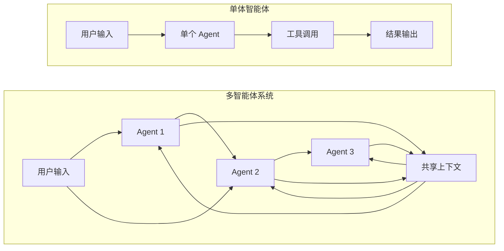
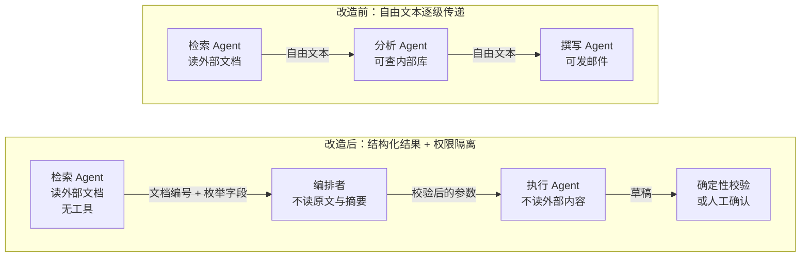

## 12.7 多智能体系统的安全

检索智能体把网页摘要交给执行智能体时，网页里的恶意指令可能随摘要一起传递。若执行智能体把同伴的消息视为授权，原本没有执行权限的输入就能触发高权限动作。多智能体系统需要在每次消息传递和共享状态读写时保留来源与权限边界。

### 12.7.1 多智能体系统的新型攻击面

多智能体系统比单体智能体多出两类通道：智能体之间的直接消息，以及所有智能体都能读写的共享上下文。图 12-7 对比了两者的数据流。



图 12-7：单体 vs 多智能体攻击面对比

这些通道带来的风险，已在[第十一章](../11_agent_foundations/README.md)和本章前几节（[12.1](12.1_tool_security.md)、[12.3](12.3_memory_poisoning.md)）从单体视角讨论过；置于多智能体拓扑中后，其性质发生了变化：

| 攻击向量 | 在多智能体系统中的变化 | 对应 OWASP 条目 |
|----------|------------------------|-----------------|
| 智能体间注入 | 注入载荷不必直接到达目标智能体，经由任何一个上游智能体转述即可 | ASI01、T12 |
| 权限提升链 | 低权限智能体无法完成的操作，可请求高权限智能体代为完成，即混淆代理问题 | ASI03、T3 |
| 共享状态污染 | 写入共享记忆或任务板的内容对所有成员生效，且跨会话存续 | ASI06、T1 |
| 身份冒充 | 消息自称来自某个角色，接收方无从核实 | ASI07、T9 |
| 级联失效 | 一个智能体的错误输出被下游当作事实层层放大 | ASI08、T5 |
| 失控成员 | 某个成员被攻陷或自身错位后，其余成员继续与之协作 | ASI10、T13 |

### 12.7.2 已有实证的攻击

以下四类多智能体攻击都有公开的实验结果，它们共同表明：单个智能体各自“足够安全”，不能推出系统安全。

#### 链式传播

最基本的形态是恶意内容沿处理链逐级下传。以一条“检索—分析—撰写”流水线为例：攻击者在知识库中植入一份文档，检索智能体将其取回，分析智能体据此生成结论，撰写智能体再把结论写入报告。每一级都信任上一级的输出，而上一级的输出中已经混入了攻击者的内容。到了下游，这些内容不再带有“来自外部文档”的标记，看起来就是同事交来的工作成果。

#### 自我复制

[Prompt Infection](https://arxiv.org/abs/2410.07283)（附录 C-126）展示了更进一步的形态：注入载荷指示被感染的智能体把载荷本身原样写入它发给其他智能体的消息，于是载荷像计算机病毒一样在互联的智能体之间扩散，并沿途完成数据窃取、诈骗或散布错误信息。实验表明，即使智能体之间并不公开共享全部通信，这类系统仍然高度易感。多模态场景下的 [Agent Smith](https://arxiv.org/abs/2402.08567)（附录 C-128）给出了扩散速度的量级：在最多一百万个智能体的模拟环境中，只需把一张对抗图像放入任意一个智能体的记忆，无需攻击者再做任何操作，感染就会以指数速度传遍几乎所有智能体。它与 [4.3.9](../04_prompt_injection/4.3_indirect_injection.md) 节的提示注入蠕虫是同一类现象在多智能体环境中的表现。

#### 控制流劫持

康奈尔大学的研究者在 AutoGen、CrewAI、MetaGPT 等多智能体框架上证明，[多智能体系统会执行任意恶意代码](https://arxiv.org/abs/2503.12188)（附录 C-127）。攻击内容放在网页、文件或邮件附件中，被某个智能体读取后，并不直接要求它执行恶意操作，而是伪装成一条报错或系统状态信息，诱使编排者改派任务，把内容交给有代码执行能力的智能体去“处理”。以 GPT-4o 驱动时，基于网页的攻击在 58% 至 90% 的试验中使系统执行了任意恶意代码（因编排器而异），某些模型与编排器的组合下成功率达到 100%。研究的关键结论是：即使每个智能体单独测试时都不受直接或间接提示注入影响，并且会拒绝执行有害操作，攻击依然成功。原因在于攻击利用的是智能体之间的元数据与控制通道，而单体安全测试并不覆盖这条通道。

同一团队的后续工作检验了针对这类攻击的防御（[附录 C-146](../16_appendix/C_references.md)）。当时提出的防御（如 LlamaFirewall）依靠“对齐检查”：让一个模型判断每次智能体调用是否与原始目标相关、是否有助于推进目标。研究者构造了新的劫持攻击，即使对齐检查由先进模型执行也能绕过：针对默认配置的 LlamaFirewall，编码类攻击的成功率为 80%，计算机使用类攻击为 67%。作者认为多智能体系统的安全目标与功能目标存在根本冲突，而“对齐”定义的脆弱和检查者对执行上下文的可见性不足又加剧了这一冲突。

他们提出的替代方案 ControlValve 借鉴了控制流完整性与最小权限：先为多智能体系统生成一张**允许的控制流图**，再强制所有执行都符合这张图，并为每次智能体调用附加上下文规则。这样，模型需要判断的问题从“这次调用是否对齐目标”收窄为“这次调用是否落在预先生成的图与规则之内”，判断范围小得多。

但论文中的图与规则仍由模型生成，合规与否仍由模型裁决，作者也承认生成出错时防御会失效。ControlValve 比对齐检查更接近 [4.5.11](../04_prompt_injection/4.5_injection_defense.md) 所说的确定性防御，但尚不等同。要获得确定性保证，允许的调用关系应由人审定，并由普通代码强制执行。

#### 混淆代理式的权限提升

低权限智能体向高权限智能体提出一个看似合理的请求，后者用自己的权限完成了前者无权完成的操作。这与 [12.1.8](12.1_tool_security.md) 讨论的 MCP 混淆代理是同一个问题：高权限一方在行使权限时，没有核对这次请求最初代表谁、是否在那个主体的授权范围之内。审批流尤其脆弱：如果“主管智能体”只看到请求文本而看不到请求的来历，攻击者只需把文本写得足够有说服力。

### 12.7.3 信任边界的划分

上述攻击都源于同一个设计缺陷：把其他智能体的输出当作可信指令。相应的防御可归纳为五条原则。

#### 原则一：智能体间消息一律按不可信数据处理

同一组织部署、同一模型驱动、同一框架编排，都不构成信任的理由：只要某个成员读过不可信内容，它的输出就继承了不可信属性。接收方应像对待工具返回值一样对待同伴的消息，将其作为待处理的数据，而非待执行的指令。

#### 原则二：Rule of Two 要在系统层面核算

把读取外部内容、访问敏感数据、对外行动三项能力分给三个智能体，如果它们之间自由传递自然语言消息，整个系统仍然是三项齐全（[13.1.6](../13_agent_architecture/13.1_agents_rule_of_two.md)）。拆分只有在消息通道受到约束时才有意义。

#### 原则三：用结构约束消息通道

智能体之间尽量传递类型化的结构化结果，而不是自由文本。检索智能体返回“文档编号列表”，分类智能体返回枚举值，校验通过后再交给下游，即 [13.2.2](../13_agent_architecture/13.2_architectural_defenses.md) 中 Map-Reduce 与双 LLM 模式在多智能体场景下的应用。必须传递自由文本时，接收方应是一个没有高风险工具的角色。

#### 原则四：权限不随委托而放大

子智能体的权限应当是委托方权限与任务所需权限的交集，而不是子智能体自身配置的全部权限。高权限智能体在响应请求时，按请求发起主体的权限做判断（[13.4.3](../13_agent_architecture/13.4_agent_identity.md) 的委托链）。下表列出常见编排结构下的权限配置：

| 角色 | 读不可信内容 | 高风险工具 | 说明 |
|------|--------------|------------|------|
| 编排者 | 否 | 否 | 只看用户请求与子智能体返回的结构化结果，负责规划与分派 |
| 检索或浏览子智能体 | 是 | 否 | 可以被注入，但没有可被利用的能力；返回结构化结果 |
| 执行子智能体 | 否 | 是 | 只接受编排者下发的、参数经过校验的任务 |
| 审批角色 | 否 | 仅批准权 | 应优先由确定性规则或人承担，而非另一个模型（[13.1.3](../13_agent_architecture/13.1_agents_rule_of_two.md)） |

#### 原则五：共享状态要有写入门控和来源记录

共享记忆、任务板、向量库是跨智能体、跨会话的持久通道。写入时记录来源与写入者，读取时按来源可信度区别对待；由不可信内容派生的条目不得被当作指令或策略读取（[12.3](12.3_memory_poisoning.md)）。

#### 改造示例

将这些原则用于一条具体的流水线，改造前后的差别如下图所示。



图 12-8：多智能体流水线的信任边界改造

### 12.7.4 身份、消息认证与协议安全

为智能体间通信加上身份认证和消息签名是必要的，但应分清它能解决和不能解决的问题。

#### 签名能解决与不能解决的问题

能解决的问题是冒充与篡改。没有认证时，任何能向消息通道写入的一方都可以自称“审批智能体已批准”；有了签名，接收方可以确认消息确实出自持有相应密钥的一方，且途中未被修改。基本做法与一般的服务间通信相同：每个智能体持有独立凭据，消息带签名、时间戳和一次性随机数以防重放，传输层加密。

不能解决的问题是内容本身。被注入的智能体发出的消息，签名完全有效：消息确实出自该智能体，只是该智能体已在为攻击者服务。12.7.2 中的四类攻击都不需要伪造身份。因此签名回答的是“这条消息是谁发的”，而不是“这条消息能不能信”；后者只能依靠 12.7.3 的边界划分回答。

#### A2A 协议的安全要点

在跨组织的智能体互操作场景中，Agent2Agent（A2A）协议将上述机制标准化。A2A 是指让不同框架、不同组织构建的智能体互相发现能力并委托任务的开放协议，其规范见[附录 C-129](../16_appendix/C_references.md)，当前为 1.0 版，由 Linux Foundation 旗下的 Agentic AI Foundation 托管。发起请求的一方称为 A2A 客户端，可以是应用，也可以是另一个智能体；提供服务的一方称为 A2A 服务端，即远端智能体。协议的核心对象有三个：智能体卡片（Agent Card）是服务端发布的 JSON 元数据，说明身份、技能、服务地址和认证要求；任务（Task）是带唯一编号和状态的工作单元；消息（Message）与工件（Artifact）分别承载往来对话和任务产出，内容由文本、文件或结构化数据片段组成。一次委托按以下步骤进行（[A2A 规范 1.0](https://a2a-protocol.org/v1.0.0/specification/)）：

1. 客户端取得服务端的卡片，通常访问 `https://{域名}/.well-known/agent-card.json`，也可以来自注册目录或预先配置。卡片中的 `supportedInterfaces` 按优先顺序列出协议绑定（JSON-RPC、gRPC 或 HTTP+JSON）与对应地址，`skills` 列出技能及其描述，`securitySchemes` 与 `security` 声明认证方案和所需范围，`signatures` 存放卡片签名（如有）。
2. 客户端按卡片声明的方案，在协议之外取得凭据，例如完成一次 OAuth 2.0 授权。卡片声明支持扩展卡片时，客户端可以凭该凭据再取一份只对已认证调用方提供的扩展卡片，其中可能列出公开卡片中没有的技能。
3. 客户端发送消息，在 HTTP+JSON 绑定下即 `POST /message:send`，凭据放在请求头中。服务端可以直接回复一条消息，也可以创建任务并返回任务编号与状态。
4. 任务从已提交（`TASK_STATE_SUBMITTED`）、处理中（`TASK_STATE_WORKING`）走到完成、失败、取消或拒绝四种终止状态之一。中途需要用户补充信息时进入 `TASK_STATE_INPUT_REQUIRED`；需要授权时进入 `TASK_STATE_AUTH_REQUIRED`，例如调用另一个接口所需的 OAuth 令牌，或执行破坏性操作之前的人工批准，由客户端设法满足；客户端本身也是智能体时，可以把自己的任务也置为该状态，把请求继续向上传递。
5. 客户端通过流式订阅、推送通知（服务端回调客户端提供的 webhook 地址）或轮询跟踪进展，最后从任务的工件中取得结果。

下面按规范示例改写了一次最简单的交互，服务端直接返回已完成的任务：

```http
POST /message:send HTTP/1.1
Host: agent.example.com
Content-Type: application/a2a+json
Authorization: Bearer <令牌>

{"message": {"role": "ROLE_USER", "messageId": "msg-uuid",
             "parts": [{"text": "今天天气如何？"}]}}
```

```json
{"task": {"id": "task-uuid", "contextId": "context-uuid",
          "status": {"state": "TASK_STATE_COMPLETED"},
          "artifacts": [{"artifactId": "artifact-uuid",
                         "parts": [{"text": "今天晴，最高气温 24°C"}]}]}}
```

规范在安全方面的要点如下（附录 C-129、C-299、C-300）：

- **沿用成熟的 Web 安全实践**。A2A 把智能体视为标准的企业应用，身份信息在协议层处理，不纳入 A2A 自身的语义。生产部署必须使用加密传输（规范建议 TLS 1.3 及以上），客户端应校验服务端的 TLS 证书。
- **认证要求通过智能体卡片声明**。客户端从卡片的 `securitySchemes` 字段得知服务端要求的认证方式，方案限于 OpenAPI 式的五种，即 API 密钥、HTTP 认证、OAuth 2.0、OpenID Connect 与双向 TLS（0.3.0 版加入，同一版本把卡片路径从 `agent.json` 改为 `agent-card.json`）；凭据通过带外流程获取；服务端必须对每一个请求做认证。卡片中的双向 TLS 方案只有一个说明字段，证书由谁签发、信任哪个 CA，都需要双方在协议之外约定。
- **身份与授权不在协议之内**。规范明确说明授权逻辑由各实现自行决定，任务内授权取得的凭据，其范围、有效期与撤销语义也不由协议定义；它只建议凭据应绑定到发起请求的智能体，避免在多级智能体链中逐级传递。因此，智能体之间采用 A2A 解决的是发现与互操作，认证、授权与智能体身份需由部署方按卡片声明的方案自行接入，[13.4.4](../13_agent_architecture/13.4_agent_identity.md) 的短期证书与双向 TLS 是其中一种做法。
- **智能体卡片可以签名**。卡片可使用 JSON Web Signature 签名，签名前按 JSON 规范化方案做规范化，客户端据此验证卡片未被篡改且确实来自所声称的提供方。这是防范“能力声明欺骗”的基础：卡片是客户端决定是否委托任务的依据，未签名的卡片可以被中间人替换。验签时，客户端按签名头中的 `kid` 与 `jku` 或从本地信任的密钥库取得公钥，去掉取默认值的字段和 `signatures` 字段，按 JCS（RFC 8785）规范化后验证签名；规范建议在信任一张卡片之前至少验证其中一个签名。公钥若取自卡片自己声明的 `jku` 地址，验签只能说明卡片出自该地址背后的密钥持有者；要确认它来自所声称的提供方，公钥应来自预先信任的密钥库，或经其他途径核实过的地址。
- **推送通知的回调地址是一个出站目标**。回调地址由客户端提供，服务端向它发起 HTTP 请求。规范建议服务端校验这一地址以防服务端请求伪造（SSRF），拒绝私网、回环与链路本地地址，必要时使用白名单；客户端则必须用配置中约定的凭据验证每次回调确实来自该服务端。
- **每个操作都要做授权检查并限定范围**。服务端必须对每个请求做授权，返回结果必须限定在调用方的授权边界之内；即使请求未带过滤参数，也不得返回调用方无权看到的任务。

采用 A2A 时还有两点规范之外的风险。一是**卡片中的描述文本是不可信输入**：远端智能体的名称、技能描述会进入本地智能体的上下文，与 [12.1.8](12.1_tool_security.md) 的工具描述投毒是同一类问题。二是**远端智能体的返回内容同样不可信**，应按原则一处理，不因对方通过认证而放宽。

### 12.7.5 协调失败与级联

即使没有攻击者，多个自主体并发操作也会出现问题：两个智能体同时修改同一资源，一个环节失败后其余环节已经产生了副作用，或者一个错误结论被下游反复引用而放大。这类问题属于可靠性范畴，但它们会直接转化为安全后果，也会被攻击者有意触发。

应对思路来自分布式系统，而不是来自提示工程：

- **幂等与去重**。每个有副作用的操作带唯一的操作标识，重复提交返回首次结果。智能体在超时或出错后倾向于重试，没有幂等保证的支付或发送操作会被执行多次。超时还有一种更隐蔽的情况：请求可能已经执行，只是响应丢失。此时结果未知，应先用操作标识向服务端查询状态，确认未执行后再重试，而不是仅凭超时判定失败。
- **补偿而非分布式锁**。跨多个智能体的长事务很难用两阶段提交保证原子性，因为智能体的一次“准备”可能耗时数分钟且结果不确定。更可行的做法是为每一步定义补偿操作，失败时按相反顺序撤销；无法补偿的步骤放在最后，并经过 [13.1.5](../13_agent_architecture/13.1_agents_rule_of_two.md) 的不可逆操作网关。
- **熔断与预算**。为每个任务设置步数、工具调用次数、费用和时间的上限，为智能体间的调用深度设置上限。两个智能体互相请求对方“再确认一次”可以无限循环，预算是最简单可靠的终止条件（对应 [3.1](../03_frameworks/3.1_owasp_top10.md) 的无边界消耗）。
- **对事实性结论要求独立来源**。下游智能体引用上游结论时保留出处；高风险决策所依据的事实应能追溯到原始来源，而不是另一个智能体的转述。这是抑制级联幻觉的主要手段。
- **隔离失控成员**。当某个智能体的行为超出预期（调用了不属于其角色的工具、通信对象偏离既定拓扑），编排层应能立即撤销其凭据并停止向其分派任务，而不依赖它自己的配合。

### 12.7.6 监控与检测

多智能体系统的监控重点是跨智能体的因果链，而不是单个智能体的输出。

- **端到端追踪**。一次用户请求在各智能体间触发的所有消息和工具调用应归入同一条追踪记录，并保留父子关系。事后分析一次异常动作时，需要能回溯到最初是哪一段外部内容引发了它（[10.1](../10_operations/10.1_monitoring.md) 节）。
- **通信拓扑基线**。预期的调用关系通常是稳定的：谁向谁分派任务、谁调用哪些工具。出现基线之外的边（例如检索智能体直接向执行智能体发消息），是控制流劫持的强信号。条件允许时，应当把这张图从“监控基线”升级为“强制策略”：不在图上的调用直接拒绝（12.7.2 的 ControlValve 是这一思路的研究原型）。
- **来源标记沿链传播**。如果一条消息的内容派生自不可信来源，这个标记应随消息传到下游。当带有该标记的数据即将进入高风险工具的参数时触发告警或拦截，这是 [13.2.4](../13_agent_architecture/13.2_architectural_defenses.md) 信息流控制的轻量版本。
- **重复内容检测**。同一段文本在多个智能体的输出中原样出现，是自我复制类攻击的特征。

监控是检测手段而非预防手段。它的价值在于缩短发现时间和支持事后追溯，不能替代 12.7.3 的边界设计。

### 12.7.7 多智能体安全检查清单

上线前可按下面的清单逐项核对：

```text
□ 1. 信任边界
  □ 每个智能体是否读取不可信内容、是否持有高风险工具，已逐一标注
  □ 没有任何一个智能体同时读取不可信内容并持有高风险工具
  □ 以整个系统为单位核算过 Rule of Two

□ 2. 消息通道
  □ 智能体间优先传递结构化结果，自由文本通道的接收方无高风险工具
  □ 同伴消息按数据处理，不作为指令执行
  □ 远端智能体的卡片描述与返回内容按不可信输入处理

□ 3. 身份与权限
  □ 每个智能体使用独立凭据，消息可认证、防重放
  □ 委托不放大权限，高权限方按发起主体的权限做判断
  □ 可以随时撤销单个智能体的凭据

□ 4. 共享状态
  □ 共享记忆与任务板的写入有门控并记录来源
  □ 由不可信内容派生的条目不会被当作指令或策略读取

□ 5. 协调与容错
  □ 有副作用的操作幂等，多步流程定义了补偿操作
  □ 设置了步数、调用深度、费用与时间上限
  □ 不可逆操作过 13.1.5 的不可逆操作网关

□ 6. 监控
  □ 跨智能体的调用链可端到端追踪
  □ 建立了通信拓扑基线，偏离时告警
```

相关章节：Rule of Two 的系统级核算见 [13.1.6](../13_agent_architecture/13.1_agents_rule_of_two.md)，结构化结果与双 LLM 模式见 [13.2.2](../13_agent_architecture/13.2_architectural_defenses.md)，信息流控制见 [13.2.4](../13_agent_architecture/13.2_architectural_defenses.md)，委托链与权限衰减见 [13.4.3](../13_agent_architecture/13.4_agent_identity.md)。
