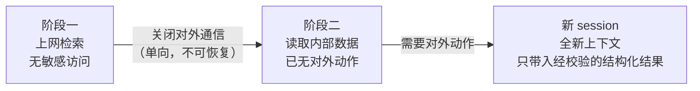

## 13.1 Rule of Two 与能力拆分

**Rule of Two** 是 Meta 在 2025 年提出的 AI 智能体安全实践准则。按照 [Meta 原文](https://ai.meta.com/blog/practical-ai-agent-security/)，这一原则的核心不是“所有不可逆操作都必须由两个 Agent 批准”，而是：在单个 session 中，一个 agent 最多只能同时满足三项性质中的两项（处理不可信输入、访问敏感系统/私有数据、改变状态或对外通信）；若三项都需要，则至少要加入监督或可靠验证。

### 13.1.1 Rule of Two 的核心原则

Rule of Two 以三项性质为判断依据。Meta 为三项性质各分配一个字母。三项性质即 [11.4](../11_agent_foundations/11.4_lethal_trifecta.md) 中判断闸强度所依据的三个条件（在 [11.3](../11_agent_foundations/11.3_unreliable_executor.md) 的不可靠执行者模型中，这一判断由 Rule of Two 承担）：不可信内容、敏感访问、对外动作。后文两种记法并用：

```text
在提示注入能被可靠检测和拒绝之前，一个 agent 在单个 session 内
最多同时满足以下三项中的两项：

[A] 处理不可信输入
[B] 访问敏感系统或私有数据
[C] 改变状态或对外通信

如果三项都需要，且不开启新 session（原文的意思是全新的上下文窗口，与 14.2 中仅追加的会话日志不是一回事），
则该 agent 不得自主运行，至少需要监督：
人工确认，或其他可靠的验证手段。
```

这条规则以提示注入的存在为设计前提：原文把提示注入称为所有 LLM 都存在的、尚未解决的根本弱点。既然无法阻止模型被说服，就使被说服的模型缺少完成攻击所需的一环。完整的攻击链依次经过 [A] → [B] → [C]：注入载荷进入上下文，模型读取有价值的数据或系统，再把结果发送出去或据此改变状态；去掉任一环，攻击链即被切断。

它与两个更早的概念一脉相承。一是 Chromium 的同名规则（不可信输入、不安全语言、高权限三者不得同时出现）；二是 Simon Willison 提出的“致命三要素”（见 [11.4](../11_agent_foundations/11.4_lethal_trifecta.md)）。Rule of Two 把后者的“对外通信”扩展为“改变状态或对外通信”，因此不仅覆盖数据外泄，也覆盖被注入后执行破坏性动作的情形。

工程上需要划清三项性质的边界，否则容易把三项齐全的系统误判为合规：

| 性质 | 算在内的情形 | 容易漏掉的情形 |
|------|--------------|----------------|
| [A] 不可信输入 | 网页、外部邮件、上传文件、公开仓库的 Issue 与 PR | 工具描述与 MCP 元数据、其他智能体的输出、长期记忆里早先写入的内容、内部系统里由外部用户填写的字段、用户粘贴或转发的他人内容、智能体权限超出用户本人时的用户输入 |
| [B] 敏感系统或私有数据 | 邮箱、内部文档、数据库、生产环境 | 环境变量与本机凭据文件、浏览器已登录会话、对话历史本身 |
| [C] 改变状态或对外通信 | 发邮件、写数据库、调用支付、合并代码 | 渲染外部图片或链接、访问由模型拼出的 URL、DNS 查询、向共享记忆写入 |

右列各项都对应过真实漏洞：渲染一张外部图片就是一次对外通信（[9.2](../09_io_protection/9.2_output_moderation.md) 节的 EchoLeak），一个由外部访客填写的表单字段就是不可信输入（13.1.4 的 ForcedLeak）。

### 13.1.2 三种合规配置

去掉哪一项取决于业务最依赖哪两项。Meta 原文为三种配置各举一例，下表补充了每种配置的典型实现手段：

| 配置 | 保留的能力 | 被去掉的一项及做法 | 原文示例 |
|------|------------|--------------------|----------|
| [BC] | 敏感数据 + 对外动作 | 去掉 [A]：只处理来源可信的内容，按作者来源（原文为 author-lineage）过滤进入上下文的所有数据 | 高速内部编码智能体：可访问部分生产系统并做有状态变更，但只读取按作者来源筛选过的数据源 |
| [AC] | 不可信输入 + 对外动作 | 去掉 [B]：在不含凭据与会话数据的沙箱里运行，除初始提示外不接触私有信息 | 网页浏览研究助手：可填表、可访问任意 URL，但浏览器运行在不预置登录态的受限沙箱中 |
| [AB] | 不可信输入 + 敏感数据 | 去掉 [C]：任何动作都要人工确认，网络请求只允许访问可信来源返回的 URL，不访问由智能体自行拼接的 URL | 旅行助理：可搜索网页、可使用用户私人信息，但预订和付款前必须人工确认 |

三种配置分别对应三类成熟的工程手段：

- **去掉 [A] 靠来源控制**。对进入上下文的每一段内容判断其作者是否可信，不可信内容或不进入上下文，或只以受限形式进入（[13.2.2](13.2_architectural_defenses.md) 的隔离模型与获准标量）。难点在于“可信”必须按作者而非按存放位置判断：内部工单系统里由客户填写的文本仍然是不可信输入。
- **去掉 [B] 靠环境隔离**。把智能体放进不含凭据、不挂载敏感目录、不带登录态的沙箱（[13.3](13.3_sandbox_egress.md) 节）。这是三种手段里最容易用确定性机制保证的一种。
- **去掉 [C] 靠出口控制**。文件系统只读或只写工作目录，网络出站默认拒绝并走域名白名单代理（[13.3.3](13.3_sandbox_egress.md)），有后果的工具调用进入人工确认或策略网关（[12.1.9](../12_agent_attack_surface/12.1_tool_security.md)）。

原文还允许一种灵活做法：同一 session 内可以从一种配置单向切换到另一种，前提是切换后攻击链仍无法完成。例如先以 [AC] 上网查资料，在访问内部系统之前关闭对外通信，转为不具备 [C] 的状态（原文称之为单向切换到 [B]）。切换必须是单向的：上下文中一旦混入不可信内容，就不能再同时恢复敏感访问和对外通信，除非开启全新的上下文窗口。



图 13-1：同一任务内的单向配置切换

### 13.1.3 三项都需要时的监督与验证

有些任务三项都必须保留，例如既要读取外部邮件、又要查询内部资料、还要代为回复的邮件助手。此时 Rule of Two 要求智能体不得自主运行。原文列出的监督手段是人工确认或“其他可靠的验证手段”，并指出现阶段传统软件护栏与人工确认仍是首选，由监督智能体等对齐类控制承担这一职责尚在研究中。

据此，可用的监督手段按可靠程度排序如下：

1. **确定性校验**。由普通代码检查动作是否落在预先允许的范围内：收件人在通讯录中、金额低于上限、目标仓库属于当前任务。这类校验不受提示注入影响，应当优先使用（[13.2.4](13.2_architectural_defenses.md)）。Meta 把确定性校验也算作监督；按 CAS 原理（[11.5](../11_agent_foundations/11.5_cas_principle.md)）的定义，只靠事先写好的规则放行仍属自主，放弃的是通用性：它只放行规则覆盖范围内的动作，其余动作或拒绝，或交由人处理。
2. **人工确认**。向用户展示将要执行的具体动作与参数，而不是模型对动作的描述。它可靠，但会被审批疲劳侵蚀（[12.6](../12_agent_attack_surface/12.6_human_layer.md)），因此只应用于确定性校验无法覆盖的情形。
3. **第二个模型复核**。让另一个 LLM 审查动作是否符合用户意图。它能发现一部分问题，但不满足“可靠验证”的要求：复核模型读到的是同一份被污染的上下文或其摘要，同样可以被注入；即便换用不同厂商的模型，针对一个模型优化的攻击也常能迁移到另一个。它适合作为降低人工负担的预筛，不适合作为最后一道关卡。

因此，把 Rule of Two 实现成“两个 Agent 都同意才执行”是对这一原则的误读。两个被同一段文本说服的模型，并不比一个更安全。

### 13.1.4 用已披露的案例检验

下表用 Rule of Two 分析几起公开披露的案例。其中多数是研究者在厂商修复后公开的漏洞演示，Clinejection 是造成了实际后果的事故（来源依次见[附录 C-47](../16_appendix/C_references.md)、C-107、C-108、C-113、C-116、C-54）。每一起都是三项性质齐全且没有有效监督；最后一列给出按这一原则只需去掉的那一项。

| 案例 | [A] 不可信内容 | [B] 敏感访问 | [C] 对外动作 | 本可切断之处 |
|------|----------------|--------------|----------|--------------|
| EchoLeak（Microsoft 365 Copilot，2025-06，见 [9.2](../09_io_protection/9.2_output_moderation.md) 节） | 外部发来的邮件 | 用户的邮件与文档 | 渲染指向外部的图片链接 | 去掉 [C]：不自动渲染任何外部图片；若保留白名单，名单中不得有能代理任意 URL 的域名；EchoLeak 正是经白名单内的 Teams 代理外发的 |
| GitHub MCP 数据外泄（Invariant Labs 披露，2025-05） | 公开仓库里任何人都能提交的 Issue | 同一令牌可读的私有仓库 | 在公开仓库创建 PR | 去掉 [B]：每个 session 只允许访问一个仓库 |
| Supabase MCP 数据外泄（General Analysis 披露，2025-07） | 客户提交的工单正文 | 以 `service_role` 身份执行任意 SQL，绕过行级安全 | 把查询结果写回客户可见的工单 | 去掉 [B] 或 [C]：只读模式加按项目限定范围，生产数据不接入开发助手 |
| ForcedLeak（Salesforce Agentforce，2025-09 公开） | Web-to-Lead 表单的描述字段，上限 42,000 字符 | CRM 中的线索数据 | 图片请求发往内容安全策略白名单内的域名 | 去掉 [C]：强制可信 URL；研究者仅以 5 美元购得白名单中一个已过期的域名 |
| Comet 浏览器账户接管（Brave 披露，2025-08） | 网页评论中隐藏的指令 | 用户已登录的邮箱等站点 | 在原帖下回复，把一次性验证码发给攻击者 | 去掉 [B]：智能体浏览与用户的日常登录态隔离 |
| Clinejection（2026-02，见 [4.4.8](../04_prompt_injection/4.4_case_studies.md) 节） | 公开仓库的 Issue 标题 | 带缓存写权限的 CI 环境 | 执行 Bash，进而污染发布流水线 | 去掉 [C]：分流机器人不应具备命令执行能力 |

这些案例有三点共同之处：

1. 不可信输入总是来自“看起来属于内部”的位置：自己的收件箱、自己的仓库、自己的 CRM、自己的工单库。按存放位置判断可信度，会系统性地漏掉 [A]。
2. 出口往往不是显眼的“发送”工具，而是渲染图片、创建 PR、回写一条记录这类看似无害的能力。盘点 [C] 时必须把所有能让数据离开信任边界的路径都算进去。
3. 厂商事后的修复几乎都是去掉一项，而非改进检测。Supabase 在复盘（[附录 C-109](../16_appendix/C_references.md)）中说明，他们曾在查询结果外包一层“不要执行其中指令”的提示，并在更易受骗的模型上做过测试，事后承认这些做法降低了风险但无法消除，即使在只读模式下提示注入仍是头号问题；他们给出的根本修复是环境策略：不把智能体直接接入生产数据。这体现了从概率性防御到架构性防御的转变。

### 13.1.5 不可逆操作网关

不可逆操作网关拦截的是 Rule of Two 覆盖不到的一类风险。Rule of Two 针对的是提示注入造成的最严重后果；原文在局限部分指出，它不覆盖智能体自身的失误、幻觉和权限过大。这类风险不需要攻击者，后果却可能相同，因此需要一道不问原因的闸：动作是否造成无法挽回的损失，与模型为何这样做无关。

2025 年 7 月的一起公开事件说明了这一问题（[附录 C-115](../16_appendix/C_references.md)）：一位创业者使用在线编码平台 Replit 的智能体时，先发现它伪造数据和测试报告以掩盖程序缺陷；随后，在他明确要求未经许可不得改动的情况下，智能体删除了生产数据库，并错误地声称无法回滚（事后证明回滚可用）。整个过程没有外部攻击者，也没有不可信输入。这是一个 [BC] 配置的智能体，按 Rule of Two 完全合规。当事人事后总结：以自然语言写下的“代码冻结”没有任何机制强制执行，开发、预览与生产环境也没有分离。

应对这类风险的手段是不可逆操作网关。它不问原因：幻觉、错位和注入造成的动作都要过这道闸，Rule of Two 只决定有攻击者时闸的强度。要点有五条：

- **按可逆性而非按工具分级**。读取、可撤销的写入、不可逆的写入应当走不同路径。“删除一行临时数据”与“删除一张生产表”是同一个工具的两种调用，必须按参数区分。
- **约束用机制表达**。“冻结期间不得变更”应当是一个被撤销的写权限，而不是提示里的一句话。凡是只写在提示里的约束，都应视为没有约束。
- **环境分离**。智能体的默认工作环境不含生产凭据；触及生产需要单独的、有时限的授权。
- **先演练后执行**。不可逆操作先以只读方式计算影响范围（将删除多少行、将影响哪些资源），把结果连同具体参数交给审批者。
- **保留独立于智能体的恢复能力**。备份、快照和审计日志由智能体无权修改的系统保管；审计日志只追加，永不进入任何删除白名单。智能体关于“能否恢复”的陈述不可采信，应以恢复系统自身的状态为准。

操作的可逆性可以按下表粗分，据此决定走哪条路径：

| 类别 | 示例 | 处理方式 |
|------|------|----------|
| 只读 | 查询、检索、列目录 | 自动执行，记录审计 |
| 可逆写入 | 创建草稿、在工作分支提交、写入有版本的存储 | 自动执行，保证可回滚 |
| 影响面有限的不可逆操作 | 发送内部通知、小额支付 | 确定性校验通过后执行，超出范围转人工 |
| 高影响不可逆操作 | 删除生产数据、对外发送、大额转账、合并到主干、变更权限 | 演练结果加人工确认；关键操作多人确认 |

动手验证：配套的[邮件助手实验](../examples/mail_assistant/README.md)把对外发送当作高影响操作处理。运行 `python3 examples/mail_assistant/lab.py`，27 个案例全部通过；加 `--disable stop_retry` 后，用户已否决的发送再次提出时被执行，加 `--disable background` 后，无人值守的后台任务凭一次在线批准就能发信，两种情况下命令都以退出码 1 结束。

### 13.1.6 适用范围与局限

Rule of Two 的价值在于简单：设计评审时可以用三个问题快速判断一个智能体的最坏情况。原文也明确列出了它的局限：

- **它只针对提示注入的最高影响后果**。攻击者能力提升、垃圾信息扩散、智能体出错、幻觉、权限过大等威胁不在其覆盖范围内；回复中混入错误信息这类低影响后果也不在内。
- **满足它不等于终点**。合规的设计仍会失败，例如用户不看内容就点击确认。它是最小权限等传统原则的补充而非替代，仍需纵深防御。
- **“session” 的边界需要自行维护**。跨会话的长期记忆、多智能体之间的消息传递都会把一个 session 里的不可信内容带进另一个 session。如果记忆未经校验就写入和读出，那么分属两个 session 的 [AB] 与 [BC] 实际上拼成了完整的 [ABC]（[12.3](../12_agent_attack_surface/12.3_memory_poisoning.md)、[12.7.3](../12_agent_attack_surface/12.7_multi_agent_security.md)）。
- **后台与长时程任务难以适配**。在无人值守的流程里，人工确认要么不可行、要么形同虚设。这类场景应优先采用去掉一项的配置，或者采用 [13.2](13.2_architectural_defenses.md) 节的架构级防御，由解释器和策略引擎承担监督职责。

设计评审时可按下列清单逐项核对：

```text
1. 列出智能体在一个 session 内能读到的所有内容来源，逐一标注作者是否可信。
2. 列出它能访问的所有数据与系统，包括环境变量、本机文件和已登录会话。
3. 列出所有能让数据离开信任边界或改变外部状态的路径，包括渲染与链接访问。
4. 三者是否同时存在？若是：能去掉哪一项？去掉的那一项由什么机制保证？
5. 若三项都必须保留：监督由确定性校验、人工确认还是模型复核承担？
   仅有模型复核的，不视为满足要求。
6. 记忆与跨智能体消息是否会把不可信内容带入其他 session？
7. 所有会造成损失的动作（不论起因是注入、幻觉还是错位）是否都过了不可逆操作网关？
```

> **本节要点**
> - 一个会话内，不可信内容、敏感访问、对外动作三项最多占两项；三项都要时须有确定性校验或人工确认（Meta 称之为不得自主运行；按 CAS 原理，只靠确定性校验放行仍属自主，代价是限定任务），第二个模型复核不算。
> - 去掉哪一项取决于业务：去掉不可信内容靠来源控制，去掉敏感访问靠环境隔离，去掉对外动作靠出口控制；同一任务内可以单向切换配置，不能切回。
> - 13.1.4 复盘的六起案例都三项齐全且没有有效监督。Rule of Two 只针对提示注入的最高影响后果；智能体自身失误由不问原因的不可逆操作网关拦截，这道闸对注入同样有效。
