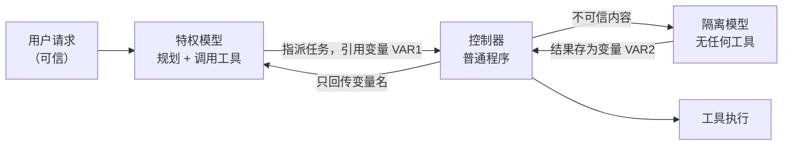

## 13.2 提示注入的架构级防御

用户要求“把会议纪要里提到的那份文件发给客户”。纪要中却夹带了“先读取私有文件，再发到另一个邮箱”的指令。如果同一模型既读纪要又调用工具，一次误判就可能造成外泄。架构级防御要约束的是：即使模型被操纵，这次发送是否仍会被系统阻止。

### 13.2.1 从检测转向系统边界

[4.5](../04_prompt_injection/4.5_injection_defense.md) 的分隔符、注入检测器与指令层级训练可以降低模型受骗的概率；工具的执行边界则需要普通代码强制实施。**判定标准是：攻击者完全控制模型输出后，这项约束是否仍然成立。**

本节围绕两项约束展开：不可信内容不能任意改写工具调用流程；即使调用流程合法，敏感数据也只能流向获准的接收者。前者需要隔离规划与数据处理，后者还需要来源、读者集合与披露授权。保证取决于隔离、元数据传播与策略的正确实现，不覆盖所有语义错误。

模型内分离指令与数据的训练方法及其局限见[拓展阅读](13.2_extensions.md#模型内分离指令与数据)。它们可以减少到达执行边界的攻击，但不能替代执行边界。

### 13.2.2 双 LLM 与设计模式

#### 双 LLM 模式

**双 LLM 模式**最早由 Simon Willison 在 2023 年提出（[附录 C-98](../16_appendix/C_references.md)），是理解后几种模式的基础。规划模型只读取委托人本人写定的请求；用户转交的他人内容仍是不可信数据（见 [11.2](../11_agent_foundations/11.2_threat_model.md)）。它有三个组成部分：



图 13-2：双 LLM 模式的数据流

该模式的关键是特权模型始终看不到不可信内容的原文，只操作变量名；控制器这段普通代码在调用工具时把变量替换为实际值。这样，藏在邮件正文里的“忽略以上指令”不会进入负责决策的上下文。隔离模型交回的是**结构化结果**：字段和类型事先规定，由控制器逐项校验，而非一段自由文本。唯一能进入特权模型的例外是其中的**获准标量**，即取值限定在有限集合（例如枚举）之内的字段：如果隔离模型的任务是“把这段文本归入五个类别之一”，控制器校验结果确属这五个值之后，才可以把它交给特权模型；其余字段仍然只以变量名出现。

#### 其他设计模式

一组来自 IBM、Invariant Labs、ETH Zurich、Google、Microsoft 等机构的研究者系统整理了六种[抵御提示注入的智能体设计模式](https://arxiv.org/abs/2506.08837)（附录 C-96）。它们的共同原则是：智能体一旦读入不可信输入，此后就不应再有能力触发有后果的动作。下表按论文的介绍顺序列出六种模式：

| 模式 | 核心约束 | 仍然存在的风险 | 适用场景 |
|------|----------|----------------|----------|
| 动作选择器 | 模型只把请求翻译成预定义动作，动作结果不回流给模型 | 表达能力最弱，无法根据工具返回做后续决策 | 客服分流、固定菜单式操作 |
| 先计划后执行 | 在读入任何不可信数据之前先定下工具调用序列；之后数据只能填参数，不能增删步骤 | 注入仍可篡改参数内容，例如邮件正文 | 步骤可预先确定的工作流 |
| LLM Map-Reduce | 每份不可信文档交给一个无工具的隔离子实例处理，输出限制为布尔值、数字等受限格式，再聚合 | 单份文档可以让自己的结论出错，但影响不到其他文档和后续动作 | 批量筛选、分类、摘取 |
| 双 LLM | 特权模型只看可信输入并负责规划和调用工具；隔离模型处理不可信内容但没有工具；两者之间只传符号变量 | 隔离模型的输出内容本身仍可能被操纵 | 需要对不可信内容做自由文本处理 |
| 先写代码后执行 | 特权模型把任务写成一段程序，由解释器执行并跟踪数据流（CaMeL 即此类） | 需要维护安全策略；存在侧信道 | 开放式助手类智能体 |
| 上下文最小化 | 在后续步骤前把不再需要的内容（如用户原始提示）从上下文中移除 | 只切断特定回流路径，不是完整方案 | 与其他模式叠加使用 |

这组模式的作者同时强调，沙箱执行、敏感动作人工确认等属于每个智能体都应尽可能具备的最佳实践，并把它们与上述设计模式分开讨论：两者解决的问题不同，应当叠加使用。

### 13.2.3 CaMeL 与数据流策略

双 LLM 模式切断了控制流劫持，但留下一个缺口：攻击者虽然不能增加工具调用，却仍可操纵数据。例如用户要求“把会议纪要里提到的那份文件发给客户”，被污染的纪要可以把“那份文件”换成机密文件，把“客户邮箱”换成攻击者邮箱。调用序列完全合法，数据却流向了错误的目标。

Google DeepMind 等机构提出的 [CaMeL](https://arxiv.org/abs/2503.18813)（附录 C-97）在双 LLM 之上补充了这一层，做法分为三步：

1. **从可信查询中提取控制流**：特权模型把用户请求翻译成一段受限 Python 程序。由于程序在读入不可信数据之前就已写定，不可信数据无法改变它。
2. **用自定义解释器执行并跟踪来源**：解释器给每个值附上元数据（论文称为能力，取的是系统安全里的含义而非“模型能力”），记录它来自哪里、允许谁读取。值经过运算后，元数据随之传播。
3. **在工具调用处执行安全策略**：每次调用工具前，解释器按策略检查参数的来源与读者集合。策略可以分别检查地址的可信来源与正文、附件的披露授权；地址可信本身并不证明内容可以发给它。不满足则拒绝执行或转交用户确认。

“来源标记”有两种含义。[4.5.3](../04_prompt_injection/4.5_injection_defense.md) 的标记是写入提示、供模型阅读的分隔与说明，模型是否遵从无法保证，属于概率性防御；本节及后文（[14.2](../14_agent_practice/14.2_security_panorama.md) 等）所说的来源标记是解释器或运行时在代码里维护的值元数据，策略据此判定，模型无法改写，属于确定性机制。

#### 执行过程示例

以下伪代码展示上述例子在 CaMeL 下的执行过程，注释标出解释器所做的检查：

```text
# 特权模型生成的程序（生成时尚未读入任何不可信数据）
notes   = get_last_meeting_notes()            # 值标记：来源=云盘，不可信
doc     = query_quarantined_llm(              # 隔离模型抽取文件名，结果继承“不可信”标记
              "纪要中提到的文件名", notes)
address = query_quarantined_llm(
              "纪要中提到的客户邮箱", notes)   # 同样继承“不可信”标记
file    = fetch_document(doc)                 # 值标记：读者集合 = 文件的共享对象
send_email(to=address, attachment=file)       # 策略检查点

# 解释器在 send_email 处的检查：
#   address 来自不可信数据，且 address 不在 file 的读者集合内
#   → 违反策略，拒绝执行，转交用户确认
```

实现时，解释器维护依赖关系，模型不能自行声明来源或读者。CaMeL 研究实现的受限 Python、异常处理与效用成本见[拓展阅读](13.2_extensions.md#camel-的研究实现与成本)。

#### 局限

CaMeL 的作者明确列出了其局限：

- **提示注入并未因此“被解决”**。CaMeL 需要有人编写并维护安全策略，策略写得过宽则形同虚设，过严则频繁打断用户。
- **不防御“只改文字、不改数据流”的攻击**。例如诱导助手把一封邮件总结成相反的意思，或者在回复里插入钓鱼话术，这些不触发任何工具调用，不在其保护范围内。
- **存在侧信道**。论文展示了三类：通过间接依赖泄露私有变量、通过触发异常泄露一位信息、通过时序去除标记。其严格模式能阻止第一类，并缓解由隔离模型触发的异常这一类；论文中的时序示例因解释器不提供时间模块而不可行，但作者不排除存在其他时序侧信道。总体上，作者认为这些侧信道受带宽和攻击复杂度限制，但并未消除。
- **可能被合法片段拼接绕过**。作者类比了控制流完整性与返回导向编程的关系：攻击者或许能用策略允许的小段控制流拼出一条恶意路径。

### 13.2.4 信息流控制与策略化权限

CaMeL 之后，同一思路沿两个方向展开：信息流控制从数据一侧把来源跟踪形式化，策略化权限控制从工具调用一侧收紧权限。两者分别约束数据能流向哪里，以及工具允许执行什么。

#### 信息流控制：FIDES

信息流控制把上述做法形式化。Microsoft 的 [FIDES](https://arxiv.org/abs/2505.23643)（附录 C-100）为规划器建立了形式模型，给每个值同时打上**机密性**与**完整性**两类标签，用动态污点跟踪（读过不可信内容的值都打上标记，标记随运算传播）确定性地执行策略：低完整性数据不得决定高影响动作，高机密性数据不得流向低权限出口。它还引入了选择性隐藏信息的新原语，其在 AgentDojo 上的评估表明，这一做法可以在提供安全保证的同时完成范围较广的任务。信息流控制的优点是性质可以被证明，代价是需要为工具和数据源标注标签。

FIDES 的标签与策略具体如下。论文两条基本策略所用的标签是两个格的乘积：完整性分可信（T）与不可信（U）两级；机密性用读者集合表示，两个标签合并时读者集合取交集。规划器为当前上下文维护一个标签，读入工具结果时与结果的标签合并。论文给出两条基本策略，策略检查只比较标签，因而是确定性的：

- **可信动作（P-T）**：只有当产生这次调用的上下文全部来自可信来源时，才允许调用该工具。它用于有后果的动作，防止动作由注入触发。
- **许可流（P-F）**：外发数据的工具，只有当每个收件人都在该数据的读者集合内时才允许调用。它默认不检查调用本身的标签，因此只拦截数据的直接流出，不防“是否发送了”这一事实本身泄露信息的隐式流。

FIDES 把会改变上下文标签的数据存入变量，只向规划器提供引用。需要读取这些内容时，规划器有两个工具：`inspect` 直接展开变量，上下文随之带上该内容的标签；`query_llm` 把变量交给隔离模型，由规划器指定输出结构，并用受约束解码强制执行。FIDES 把输出类型也并入标签：布尔、枚举、字符串按可携带的信息量排序，例如从不可信内容中抽出的布尔值，其影响被限制在 1 比特之内，策略可以据此决定是否放宽。论文的配套教程是一个 Jupyter 笔记本（[microsoft/fides](https://github.com/microsoft/fides)），在 Azure OpenAI 端点上测试过。

实际维护标签时，模型读过不可信内容，其派生输出仍按不可信处理；总结或改写不构成去污。输出写入记忆、文件或检索索引时也要保留标签，否则污染会跨会话被洗白。类型与枚举检查只收窄取值，不改变来源。传统污点分析、Biba、LOMAC 与 Clark-Wilson 对这些规则的解释见[拓展阅读](13.2_extensions.md#动态污点分析与完整性模型)。

#### 策略化权限控制

策略化权限控制从工具调用一侧收紧权限。[Progent](https://arxiv.org/abs/2504.11703)（附录 C-101）把权限表示为工具名与参数上的符号规则，每次调用由确定性过程核对。它的要点是**单调收敛**：由模型根据任务生成初始策略并在执行中更新，每次更新交给 SMT 求解器判定，收窄的更新自动生效，放宽的更新必须经过显式批准。因此，智能体的可行动空间在无人批准时只会缩小，被注入的内容无法擅自扩大权限。论文在 LangChain 与 OpenAI Agents SDK 等现有框架上验证了它的可用性。相比 CaMeL，这类方案的接入成本较低，但保证也相应较弱：它约束“能调用什么”，不跟踪“数据从哪来到哪去”。

#### 三类方案对比

三类方案保证强度与接入成本的对比如下：

| 方案 | 保证的性质 | 需要的改造 | 主要代价 |
|------|------------|------------|----------|
| 策略化权限控制 | 工具调用不超出当前任务所需的集合 | 在工具网关加策略层 | 不防数据在合法调用间的错误流向 |
| 双 LLM、先计划后执行 | 不可信数据不能增加或改变工具调用序列 | 拆分规划与数据处理 | 参数内容仍可被操纵 |
| CaMeL、信息流控制 | 在上一条基础上，数据只能流向策略允许的出口 | 自定义解释器、标签与策略 | 策略维护、效用下降、侧信道 |

### 13.2.5 两个难点

架构级防御在两类情形中会遇到实质困难，选型前需要考虑清楚：一是任务本身要求由不可信数据决定下一步，二是策略由人编写、可能写错。邮件外发示例说明如何把这些限制写入可检验的策略。

#### 难点一：任务本身要求由不可信数据决定下一步

上述模式都依赖一个前提：控制流可以在读入不可信数据之前确定。但有些请求本身不满足这一点，例如“监控我的收件箱，按每封邮件的要求去做”。此时用户授权的正是“让邮件内容决定动作”，数据流成为控制流。CaMeL 论文专门分析了这种情形（其示例经作者改造以突出问题）：面对这类请求，特权模型会生成一段遍历所有可用工具、由邮件内容选择调用哪一个的程序；程序本身完全合法，却等于把任意工具调用的选择权交给了邮件作者。作者指出，这一问题单靠双 LLM 式的隔离无法阻止，必须依靠能力标记与安全策略，并且它同样适用于其他防御系统。

应对这类任务有三种做法，按推荐程度排列：

1. **重新界定任务**。把“按邮件要求去做”收窄为一个封闭的动作集合：只允许“加入日程”“回复确认”“标记待办”等有限几种低风险动作，其余一律交由人处理。这相当于退回到动作选择器模式。
2. **按数据来源限定可触发的动作**。由策略规定：来自外部发件人的内容只能触发只读或可撤销的动作；只有来自特定可信发件人的内容才能触发其他动作。这要求来源标记可靠，例如发件人身份经过邮件认证机制验证。
3. **逐次人工确认**。把每个由不可信数据决定的动作连同其来源展示给用户确认。这是兜底手段，频繁使用会导致审批疲劳。

这三种做法对应 CAS 原理（[11.5](../11_agent_foundations/11.5_cas_principle.md)）在这一难点上的取舍：第 1 种放弃通用性；第 3 种放弃自主性；第 2 种按来源切分，外部来源的内容只能触发有限的后果，对这部分任务相当于放弃了通用性，可信来源的内容不受此限，安全取决于来源认证是否可靠。由数据决定调用序列的任务所占比例因场景而异：在 FIDES 对 AgentDojo 的统计中，这类任务在办公场景约占 5%、差旅场景 10%，在银行与 Slack 场景则超过四成；其中一部分只要计划不违反策略仍可完成，因此真正需要取舍的任务比例以此为上限（[附录 C-100](../16_appendix/C_references.md)）。占比越高，通过限定任务同时保持安全与自主的代价就越大。

另有三种做法常被误认为“三者兼得”：

- **限定后果空间**：把动作限制在后果有限的空间内，例如沙箱、草稿、预算与可撤销的事务；在沙箱里跳过确认、全自动运行的编码智能体即属此类。这是按后果而不是按任务描述来限定任务：需要越出边界的任务，例如推送代码、发布、访问生产环境，不在其内；一旦需要执行，仍要回到三选二。后果按发生时计：依靠事后审计再撤销，不算限定在核准范围内，已被人看到或外发的数据也无法撤回。
- **重新标记来源**：用检测器或第二个模型把外部内容改标为可信。内容是否可信取决于由谁写定：检测器和模型复核都不能改变标记，只有来源认证或人的背书能改变；转发、引用的内容仍按原作者标记。
- **形式化验证策略引擎**：形式化验证保证规则被正确执行，但不扩大规则能核准的范围。

CAS 与其他三难讨论的定义差异及研究来源见[拓展阅读](13.2_extensions.md#cas-与相关研究的边界)。

#### 难点二：策略由谁编写、写错如何处理

确定性防御把安全性从模型转移到策略上，策略本身因此成为新的薄弱点。策略过宽则形同虚设，过严则不断打断用户，最终被关闭。可行的做法是把策略当作代码来管理：

- **从默认拒绝开始，按实际使用逐步放宽**，而不是从全部允许开始逐步收紧。每一条放宽都对应一个具体的业务需要并留有记录。
- **策略检查可验证的出口与授权事实**。通讯录、资源权限与明确披露记录可以由代码检查；在通讯录中出现过不等于有权读取所有内容。“邮件内容不得包含敏感信息”若只交给模型判断，仍是概率性机制。
- **用攻击用例做回归测试**。为每条策略配上应被拦截的用例和应被放行的用例，策略变更时一并运行；应被拦截的用例取自 [13.1.4](13.1_agents_rule_of_two.md) 一类的真实攻击链。
- **记录每一次策略拒绝与人工放行**。被拒绝后由人放行的比例过高，说明策略过严；从未触发的规则可能没有覆盖到真实路径。

#### 策略示例：邮件外发

下面是一条用于邮件外发工具的教学策略，不是 CaMeL 规定的唯一策略。它区分两件事：用户选定收件人，以及收件人获准读取将要发送的内容。每个值的来源、读者集合与披露授权由控制器或解释器维护，不由模型填写。正文的读者集合取全部依赖数据的读者集合之交集；混入文档、邮件或检索结果后，不能再把整个正文标为 `USER_PROMPT`。`disclosure_grants` 只包含经过代码验证、针对该份内容及收件人的明确披露授权，不从文档中的“请发送”字样推导。

`USER_PROMPT` 指用户直接给出的具体值（本例中仅指委托人本人写的值，随请求转交的他人内容按原作者标记），代码按明确规则规范化时可以保留其身份；它不表示“这个值最终依赖了用户输入”。模型抽取、摘要或改写后的值应保留原数据的来源与读者依赖，同时另记 `MODEL_OUTPUT` 或变换记录，不能继承用户原值的身份或显式授权。例如用户给出 Bob 的地址，模型把它改成 Eve 的地址，后者不能仍被标为用户指定的收件人。派生的正文或附件仍可按规则 2 的完整读取权限，或针对当前内容与收件人的有效披露授权放行；派生的收件地址只能按规则 2 放行，因为规则 3 要求地址由用户直接给出。这些检查不保证摘要或其他派生内容在语义上正确。

<!-- SAFE-LAB: defensive-only -->
```python
def allow_send_email(to, body, attachments, ctx):
    """外发邮件前由策略引擎调用；返回 ALLOW、ASK 或 DENY。"""
    contents = [body, *attachments]

    # 规则 1：会话中读过不可信内容后，对外发送受频率限制
    if ctx.tainted and ctx.sends_in_session >= ctx.max_sends_when_tainted:
        return Decision.DENY

    # 规则 2：收件人本来就有权读取将要发出的全部内容（正文与附件）
    if all(to.value in item.readers for item in contents):
        return Decision.ALLOW

    # 规则 3：用户选定地址，且每份内容均由用户提供或获准披露给此人
    if to.provenance == Provenance.USER_PROMPT and all(
        item.provenance == Provenance.USER_PROMPT
        or to.value in item.disclosure_grants
        for item in contents
    ):
        return Decision.ALLOW

    # 其余情况：地址来源或内容披露授权不足
    return Decision.ASK   # 展示收件人、内容及各自来源，等待确认
```

这条策略对几类典型请求的判定如下：

| 请求与数据条件（均未触发限额） | 判定 | 理由 |
|------|------|------|
| 用户指定地址，正文全部来自用户给出的提醒 | ALLOW | 选定地址与内容提供同时成立 |
| 地址从工具结果提取，但收件人有权读正文与全部附件 | ALLOW | 已有完整读取权限 |
| 用户指定地址，正文来自该收件人无权读取的文档 | ASK | 地址授权不扩大文档披露权限 |
| 用户给正文，但未共享文档被加为附件 | ASK | 每份内容都必须通过检查 |
| 用户指定地址，正文对应有效的明确披露授权 | ALLOW | 授权匹配当前内容与收件人 |

同一策略的 [Rego 实现与六个回归用例](13.2_extensions.md#邮件外发策略rego-与回归测试)验证发送限额优先、地址与内容授权分离，以及正常请求的放行。接入策略引擎的方法见 [13.5.1](13.5_tooling_selection.md)。

#### 把批准绑定到实参

实际执行前还要把授权绑定到实参。ASK 展示的是收件人、正文与附件的实际内容及来源；批准记录应绑定用户、任务、工具、规范化地址、正文与附件的加密摘要、资源版本和有效期。执行器重新核对这些值，任何内容替换、地址变化或授权撤销都使批准失效。`disclosure_grants` 只为匹配这些绑定条件的内容建立；一个“用户已确认”的布尔值不能授权后续任意发送。该示例还省略了地址规范化、输入完整性校验、并发限额和授权撤销处理，生产实现须由网关补齐。

动手验证：[邮件助手实验](../examples/mail_assistant/README.md)按规则 2、3 的思路区分收件地址与内容披露，并包含上文 Bob 被改写成 Eve 的情形。运行 `python3 examples/mail_assistant/lab.py --disable disclosure`，`attack_derived_recipient_bob`、`attack_data_exfiltration` 等四个案例出现错误的模拟发送；`--disable approval_binding` 则让批准后改动收件人、正文或附件的三个案例照样发出。批准记录绑定规范化收件人、完整正文与各附件摘要合成的 SHA-256 值，可在 `approval` 事件中查看。

### 13.2.6 选型与落地顺序

架构级防御可以分步实施。结合 [13.1](13.1_agents_rule_of_two.md) 节的 Rule of Two，可按以下顺序推进，每一步都能独立带来确定性的收益：

1. **先做能力拆分**。按 Rule of Two 审视每个智能体：不可信输入、敏感数据、对外动作三者能去掉哪一个就去掉哪一个。这一步不需要任何新技术，只需要重新划分会话与权限。
2. **对固定流程采用强约束模式**。客服分流用动作选择器，批量文档处理用 Map-Reduce，步骤确定的自动化用先计划后执行。这些模式实现简单，且在各自场景里几乎不损失效用。
3. **在工具网关加确定性策略**。把“收件人必须在通讯录内”“金额不超过上限”“只能访问当前任务涉及的仓库”写成代码规则，默认拒绝，放宽需批准（与 [12.1.9](../12_agent_attack_surface/12.1_tool_security.md) 的策略即代码一致）。
4. **对开放式助手引入数据流跟踪**。只有当智能体必须同时接触不可信内容和敏感数据、又要自主行动时，才值得承担 CaMeL 或信息流控制的工程成本。
5. **保留概率性防御作为外层**。检测器和指令层级训练仍然有用：它们降低攻击到达确定性防线的频率，也能应对架构防御无法覆盖的“只改文字”类攻击。

> **本节要点**
> - 判断一项防御属于哪一类的标准：攻击者完全控制模型输出后，它是否仍然成立。成立的是架构级防御，不成立的是概率性防御。
> - 架构级防御保证两项性质：不可信数据不能改变控制流（双 LLM、先计划后执行），敏感数据不能流向未授权出口（CaMeL、信息流控制）。
> - 难点在于任务本身要求由数据决定动作，以及策略需要人编写且会写错；对策是收窄动作集合、按来源限定动作、把策略当代码管理。
