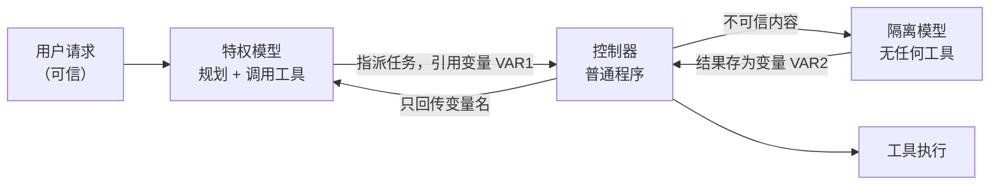

## 13.2 提示注入的架构级防御

前面各章的防御大多针对“怎样让模型更不容易被骗”。本节讨论另一个问题：假设模型一定会被骗，系统还能保证什么。这是 2025 年以来智能体安全最重要的方向转变：把安全性质从模型的行为中移出，交给模型之外的确定性代码保证。

核心结论有两条：架构级防御保证不可信数据不能改变控制流、敏感数据不能流向未授权出口；判断一项防御是否属于此类，看攻击者完全控制模型输出后它是否仍然成立。各小节依次回答：为什么要从检测转向架构（13.2.1）；有哪些可用的设计模式（13.2.2）；如何进一步约束数据的流向，即 CaMeL（13.2.3）与信息流控制、策略化权限（13.2.4）；这些机制在什么情形下遇到困难（13.2.5）；按什么顺序落地（13.2.6）。

### 13.2.1 为什么要从检测转向架构

第 [4.5](../04_prompt_injection/4.5_injection_defense.md) 节的分隔符、来源标记、注入检测器和指令层级训练有一个共同点：它们降低注入成功的概率，但都不提供保证。在自适应攻击者面前，这类防御的实测结果并不乐观（见 [4.5.11](../04_prompt_injection/4.5_injection_defense.md)）。智能体场景又放大了这个差距，原因有三：

- **一次成功即可造成后果**：聊天场景里注入成功意味着一段错误输出；智能体场景里意味着一次真实的转账、外发或删除。1% 的成功率乘以每天上万次工具调用，不是可接受的残余风险。
- **攻击者可以反复尝试**：攻击载荷放在网页、邮件、Issue 里，智能体每次读到都是一次免费尝试，攻击者还能针对同款模型离线调优。
- **检测器与被保护模型同源**：用 LLM 判断“这段文本是不是注入”，判断者本身也会被同一段文本注入（[4.5.4](../04_prompt_injection/4.5_injection_defense.md)）。

2026 年，越来越多的研究者与厂商明确表达了这一判断，尽管提升模型鲁棒性仍是社区的主流做法。一份由十余位系统安全与对抗机器学习研究者联合署名的立场文件（[附录 C-147](../16_appendix/C_references.md)）把它表述为：智能体安全必须作为系统问题来对待，驱动智能体的模型应被视为不可信组件，安全不变量要在系统层面强制执行；提升模型鲁棒性的努力本身是不够的。文件分析了十一起有代表性的真实攻击，逐一说明系统安全原则若得到落实本可如何阻止它们。微软在披露自家智能体框架的远程代码执行漏洞时给出了同样的结论（附录 C-142）：模型不是安全边界，暴露给模型的工具决定了攻击者的影响范围。前沿模型论坛在 2026 年 6 月的议题简报（附录 C-148）同样把智能体安全定位为模型开发者、部署者与用户的共同责任，并指出记忆管理、工具授权和多智能体委托层级等架构选择，对这些风险是被遏制还是被放大起着重要作用。

架构级防御的思路借自传统系统安全：SQL 注入最终不是靠“更聪明地识别恶意字符串”解决的，而是靠参数化查询把代码通道与数据通道分开。对应到智能体，就是使不可信数据无法影响控制流，并使敏感数据无法流向未授权的出口。这两条性质由解释器、策略引擎这类普通软件执行，模型是否被说服不再决定结果。

**判断一项防御属于哪一类的标准是：攻击者完全控制模型的输出后，这项防御是否仍然成立。** 成立的是架构级防御，不成立的是概率性防御。两者都需要，但只有前者可以作为保证写入威胁模型。这也是 [11.3](../11_agent_foundations/11.3_unreliable_executor.md) 主线的另一种表述：确定的部分可以写明其行为并逐条检验，概率的部分只能测出“多半不会”，安全承诺只能建立在前者之上。

**模型内部分离指令与数据的局限。** 对话模型经后训练学会按人的请求执行任务；对话模板虽用特殊 token 区分系统、用户、工具等消息，训练却没有让模型按来源区分优先级，自然语言本身也没有强制区分指令与数据的语法。进入智能体场景后，网页、邮件、工具返回与用户请求拼接在同一段上下文中，注入由此成功。OpenAI [提出指令层级](https://arxiv.org/abs/2404.13208)时，把这类攻击的根源归结为指令没有权限之分：模型往往把开发者的系统提示与来自不可信用户、第三方的文本当作同一优先级（附录 C-351）。

最直接的思路是在模型内部分开两者，[4.5](../04_prompt_injection/4.5_injection_defense.md) 的分隔符、聚光标记、指令层级与结构化查询训练都属于这一方向。一项专门度量模型能否区分指令与数据的研究（[SEP](https://arxiv.org/abs/2403.06833)，附录 C-339）发现，所测模型的区分能力普遍不高，同一家族里更大的模型也不更强；用微调把区分能力推到九成以上，SEP 的效用指标会下降约两成。作者推测，解决这一问题可能需要从模型架构这类根本改动入手。随后的工作直接改动模型：给系统指令、用户输入和数据各加一种身份嵌入（[ISE](https://arxiv.org/abs/2410.09102)，附录 C-340），或把数据 token 的嵌入整体旋转，让模型在表示空间里就能区分两者（[ASIDE](https://arxiv.org/abs/2503.10566)，附录 C-341）。ASIDE 报告区分能力明显提高而效用不降，但只在单轮、指令与数据角色明确的设定下评估，没有做自适应攻击测试；ISE 的作者则承认它对越狱一类自适应攻击的鲁棒性有限。

面向智能体的训练也在继续：[Meta-SecAlign](https://arxiv.org/abs/2507.02735) 为不可信数据新增了一个专门的输入角色，[IH-Challenge](https://arxiv.org/abs/2603.10521) 用对抗式强化学习训练指令层级（[附录 C-106](../16_appendix/C_references.md)、C-12）；训练类防御在自适应攻击下的落差见 [4.5.11](../04_prompt_injection/4.5_injection_defense.md)。

模型层的分离很难成为边界，原因在于：

- **没有“不可执行位”**。CPU 禁止执行数据区的 NX 位由硬件强制；模型里的分隔符、身份嵌入再精巧，也只是输入的一种特征，模型服从它是训练出来的倾向，攻击者可以针对它优化。这是用概率的部分去管概率的部分。
- **分开的前提是知道哪段是数据**。这类方法都假定部署方已标明哪部分是数据。外部内容由代码取回，可以由代码标注；难点在于模型读过不可信内容之后自己写出的计划、摘要和中间结论：它们属于指令还是数据，标签应由谁标注。若由代码标注，就回到了系统层的来源标记。
- **有些任务本来就要求按数据行事**。“执行这封邮件里的待办”、编码智能体按仓库里的 AGENTS.md 工作，都要求把数据当作指令。对这类任务，任何一层的“分开”都不能解决问题，此时需要回答的是哪些来源有权下达指令，即授权问题（13.2.5 的难点一）。

英国国家网络安全中心的文章[提示注入不是 SQL 注入](https://www.ncsc.gov.uk/blog-post/prompt-injection-is-not-sql-injection)（附录 C-342）认为，现有几类研究方向都是在一项本来不区分指令和数据的技术上强加这对概念；该文主张把大模型看作“天生容易被混淆的代理”（inherently confusable deputy），转而从设计上约束系统能执行的动作，并把 CaMeL 列为这一方向的早期代表。可见，参数化查询的类比只在系统层成立，在模型内部不成立。

因此，本节把分离从模型内部移到模型之间：控制流只来自委托人本人写的任务请求（这一前提见 [11.2](../11_agent_foundations/11.2_threat_model.md) 的来源总表后的说明），不可信内容只交给没有工具的隔离模型，两者之间只传递变量名和枚举值。这相当于电话网从带内信令改为带外信令，控制信号经由另一张网络传输。聚光标记的作者也把自己的方法比作带内多频信令：能防御无意的干扰，不能防御有意的伪造（[附录 C-103](../16_appendix/C_references.md)）。

两层的分工是：模型层分离减少到达闸的攻击，系统层分离为闸之后的后果设上界。面向智能体训练的模型值得采用，但不能替代闸。它降低出错频率，也减少被闸拦下、等待确认的动作，却不改变 CAS 原理（[11.5](../11_agent_foundations/11.5_cas_principle.md)）的取舍：既通用又自主的系统仍只有概率性的防护。

### 13.2.2 六种设计模式

一组来自 IBM、Invariant Labs、ETH Zurich、Google、Microsoft 等机构的研究者系统整理了六种[抵御提示注入的智能体设计模式](https://arxiv.org/abs/2506.08837)（附录 C-96）。它们的共同原则是：智能体一旦读入不可信输入，此后就不应再有能力触发有后果的动作。下表按论文的介绍顺序列出六种模式：

| 模式 | 核心约束 | 仍然存在的风险 | 适用场景 |
|------|----------|----------------|----------|
| 动作选择器 | 模型只把请求翻译成预定义动作，动作结果不回流给模型 | 表达能力最弱，无法根据工具返回做后续决策 | 客服分流、固定菜单式操作 |
| 先计划后执行 | 在读入任何不可信数据之前先定下工具调用序列；之后数据只能填参数，不能增删步骤 | 注入仍可篡改参数内容，例如邮件正文 | 步骤可预先确定的工作流 |
| LLM Map-Reduce | 每份不可信文档交给一个无工具的隔离子实例处理，输出限制为布尔值、数字等受限格式，再聚合 | 单份文档可以让自己的结论出错，但影响不到其他文档和后续动作 | 批量筛选、分类、摘取 |
| 双 LLM | 特权模型只看可信输入并负责规划和调用工具；隔离模型处理不可信内容但没有工具；两者之间只传符号变量 | 隔离模型的输出内容本身仍可能被操纵 | 需要对不可信内容做自由文本处理 |
| 先写代码后执行 | 特权模型把任务写成一段程序，由解释器执行并跟踪数据流（CaMeL 即此类） | 需要维护安全策略；存在侧信道 | 开放式助手类智能体 |
| 上下文最小化 | 在后续步骤前把不再需要的内容（如用户原始提示）从上下文中移除 | 只切断特定回流路径，不是完整方案 | 与其他模式叠加使用 |

其中**双 LLM 模式**最早由 Simon Willison 在 2023 年提出（[附录 C-98](../16_appendix/C_references.md)），是理解后几种模式的基础。它有三个组成部分：



图 13-2：双 LLM 模式的数据流

该模式的关键是特权模型始终看不到不可信内容的原文，只操作变量名；控制器这段普通代码在调用工具时把变量替换为实际值。这样，藏在邮件正文里的“忽略以上指令”不会进入负责决策的上下文。隔离模型交回的是**结构化结果**：字段和类型事先规定，由控制器逐项校验，而非一段自由文本。唯一能进入特权模型的例外是其中的**获准标量**，即取值限定在有限集合（例如枚举）之内的字段：如果隔离模型的任务是“把这段文本归入五个类别之一”，控制器校验结果确属这五个值之后，才可以把它交给特权模型；其余字段仍然只以变量名出现。

这组模式的作者同时强调，沙箱执行、敏感动作人工确认等属于每个智能体都应尽可能具备的最佳实践，并把它们与上述设计模式分开讨论：两者解决的问题不同，应当叠加使用。

### 13.2.3 CaMeL 与数据流策略

双 LLM 模式切断了控制流劫持，但留下一个缺口：攻击者虽然不能增加工具调用，却仍可操纵数据。例如用户要求“把会议纪要里提到的那份文件发给客户”，被污染的纪要可以把“那份文件”换成机密文件，把“客户邮箱”换成攻击者邮箱。调用序列完全合法，数据却流向了错误的目标。

Google DeepMind 等机构提出的 [CaMeL](https://arxiv.org/abs/2503.18813)（附录 C-97）在双 LLM 之上补充了这一层，做法分为三步：

1. **从可信查询中提取控制流**：特权模型把用户请求翻译成一段受限 Python 程序。由于程序在读入不可信数据之前就已写定，不可信数据无法改变它。
2. **用自定义解释器执行并跟踪来源**：解释器给每个值附上元数据（论文称为能力，取的是系统安全里的含义而非“模型能力”），记录它来自哪里、允许谁读取。值经过运算后，元数据随之传播。
3. **在工具调用处执行安全策略**：每次调用工具前，解释器按策略检查参数的来源与读者集合。策略可以分别检查地址的可信来源与正文、附件的披露授权；地址可信本身并不证明内容可以发给它。不满足则拒绝执行或转交用户确认。

“来源标记”有两种含义。[4.5.3](../04_prompt_injection/4.5_injection_defense.md) 的标记是写入提示、供模型阅读的分隔与说明，模型是否遵从无法保证，属于概率性防御；本节及后文（[14.5](../14_agent_practice/14.5_security_panorama.md) 等）所说的来源标记是解释器或运行时在代码里维护的值元数据，策略据此判定，模型无法改写，属于确定性机制。

以下伪代码展示上述例子在 CaMeL 下的执行过程，注释标出解释器所做的检查：

```text
# 特权模型生成的程序（生成时尚未读入任何不可信数据）
notes   = get_last_meeting_notes()            # 值标记：来源=云盘，不可信
doc     = query_quarantined_llm(              # 隔离模型抽取文件名，结果继承“不可信”标记
              "纪要中提到的文件名", notes)
address = query_quarantined_llm(
              "纪要中提到的客户邮箱", notes)   # 同样继承“不可信”标记
file    = fetch_document(doc)                 # 值标记：读者集合 = 文件的共享对象
send_email(to=address, attachment=file)       # 策略检查点

# 解释器在 send_email 处的检查：
#   address 来自不可信数据，且 address 不在 file 的读者集合内
#   → 违反策略，拒绝执行，转交用户确认
```

上例只展示了检查点。论文对各部件的实现如下：

- **隔离模型的输出**。隔离模型没有任何工具，借助模型厂商提供的结构化输出功能，把非结构化数据解析成事先规定结构的数据。结构由特权模型在程序中以 Pydantic 的 `BaseModel` 写明。解释器还会额外注入一个布尔字段 `have_enough_information`，隔离模型用它表示所给信息不足以完成任务；该字段为假时，解释器抛出 `NotEnoughInformationError`，由特权模型改写程序。隔离模型不能告诉特权模型缺少什么信息，因为这段说明本身就可能夹带注入。
- **能力标签的内容**。论文的实现为每个值记录来源和读者集合。来源分三类：用户，指特权模型所写程序中的全部字面量；CaMeL，指执行过程中各种变换的结果；某个工具，以唯一标识区分。工具还可以标出数据在工具内部的来源，例如读邮件的工具把发件人标为内部来源，云盘工具把文档的编辑者写入来源。读者集合或者是 `Public`（所有人可读），或者是一组用户，例如以邮箱地址标识。
- **解释器**。解释器用 Python 的 `ast` 库解析程序并逐个节点解释，只接受 Python 的一个受限子集。执行时它记录每个变量的依赖，例如 `c = a + b` 中 `c` 依赖 `a` 与 `b`；检查策略时，递归展开该变量的整张依赖图。程序出错时，解释器把异常位置和类型交给特权模型修正，最多提示 10 次；如果异常依赖不可信数据，异常内容会被隐去，特权模型只知道发生了隐去。
- **策略**。策略写成 Python 函数，输入工具名和参数，返回 `Allowed` 或 `Denied` 以及理由。作者没有另设策略语言，是为了能在策略中写任意逻辑。论文给出的日历策略即是一例：日程的标题、描述等数据必须能被所有参与者读取；如果参与者全部来自可信来源，例如由用户直接给出，即使这些内容此前未与他们共享，也允许创建。

代码已随论文公开（[google-research/camel-prompt-injection](https://github.com/google-research/camel-prompt-injection)），评测所用的全部策略也在其中。仓库声明它是用于复现论文结果的研究制品，解释器可能有缺陷，实现未必完全安全，作者不打算维护。因此它适合作为设计参考，不能直接当作生产组件。

在 AgentDojo 基准上，CaMeL 在提供可证明安全性的前提下完成了 77% 的任务，而无防御系统为 84%。这组数字表明，架构级防御的效用代价真实存在，但已小到可以接受。按 CAS 原理（[11.5](../11_agent_foundations/11.5_cas_principle.md)）分析，在论文对 Claude 3.5 Sonnet 失败任务的分类中，由数据决定动作的 5 例是 CaMeL 为安全放弃的通用性；更多失败来自工程原因，仅接口文档不全一类就有 13 例。评测中违反策略的调用被直接拦截，论文说明实际部署时改为请求用户确认，此时放弃的是自主性。成本方面，跟踪数据来源本身几乎不增加计算，代价在于 token：受攻击条件下（以 Claude 3.5 Sonnet 为底座），中位任务的输入与输出 token 约为原生工具调用的 2.82 倍与 2.73 倍，其中包括描述其编程语言的系统提示，以及规划模型修正代码错误时的重复调用。

CaMeL 的作者明确列出了其局限：

- **提示注入并未因此“被解决”**。CaMeL 需要有人编写并维护安全策略，策略写得过宽则形同虚设，过严则频繁打断用户。
- **不防御“只改文字、不改数据流”的攻击**。例如诱导助手把一封邮件总结成相反的意思，或者在回复里插入钓鱼话术，这些不触发任何工具调用，不在其保护范围内。
- **存在侧信道**。论文展示了三类：通过间接依赖泄露私有变量、通过触发异常泄露一位信息、通过时序去除标记。其严格模式能阻止第一类，并缓解由隔离模型触发的异常这一类；论文中的时序示例因解释器不提供时间模块而不可行，但作者不排除存在其他时序侧信道。总体上，作者认为这些侧信道受带宽和攻击复杂度限制，但并未消除。
- **可能被合法片段拼接绕过**。作者类比了控制流完整性与返回导向编程的关系：攻击者或许能用策略允许的小段控制流拼出一条恶意路径。

### 13.2.4 信息流控制与策略化权限

CaMeL 之后，同一思路沿两个方向展开：信息流控制从数据一侧把来源跟踪形式化，策略化权限控制从工具调用一侧收紧权限。下面先讲信息流控制，并说明它与传统系统安全中污点分析、完整性模型的对应关系；再讲策略化权限控制；最后对比三类方案的保证强度与接入成本。

**信息流控制**把上述做法形式化。Microsoft 的 [FIDES](https://arxiv.org/abs/2505.23643)（附录 C-100）为规划器建立了形式模型，给每个值同时打上**机密性**与**完整性**两类标签，用动态污点跟踪（读过不可信内容的值都打上标记，标记随运算传播）确定性地执行策略：低完整性数据不得决定高影响动作，高机密性数据不得流向低权限出口。它还引入了选择性隐藏信息的新原语，其在 AgentDojo 上的评估表明，这一做法可以在提供安全保证的同时完成范围较广的任务。信息流控制的优点是性质可以被证明，代价是需要为工具和数据源标注标签。

FIDES 的标签与策略具体如下。论文两条基本策略所用的标签是两个格的乘积：完整性分可信（T）与不可信（U）两级；机密性用读者集合表示，两个标签合并时读者集合取交集。规划器为当前上下文维护一个标签，读入工具结果时与结果的标签合并。论文给出两条基本策略，策略检查只比较标签，因而是确定性的：

- **可信动作（P-T）**：只有当产生这次调用的上下文全部来自可信来源时，才允许调用该工具。它用于有后果的动作，防止动作由注入触发。
- **许可流（P-F）**：外发数据的工具，只有当每个收件人都在该数据的读者集合内时才允许调用。它默认不检查调用本身的标签，因此只拦截数据的直接流出，不防“是否发送了”这一事实本身泄露信息的隐式流。

需要读取被隐藏的内容时（隐藏的做法见下文），规划器有两个工具：`inspect` 直接展开变量，上下文随之带上该内容的标签；`query_llm` 把变量交给隔离模型，由规划器指定输出结构，并用受约束解码强制执行。FIDES 把输出类型也并入标签：布尔、枚举、字符串按可携带的信息量排序，例如从不可信内容中抽出的布尔值，其影响被限制在 1 比特之内，策略可以据此决定是否放宽。论文的配套教程是一个 Jupyter 笔记本（[microsoft/fides](https://github.com/microsoft/fides)），在 Azure OpenAI 端点上测试过。

这一思路的源头是二进制程序的**动态污点分析**。2005 年的 [TaintCheck](https://valgrind.org/docs/newsome2005.pdf)（附录 C-338）把来自网络等不可信来源的数据标为污点，跟踪它在程序运行中的传播，一旦带污点的数据被用作跳转目标或格式化字符串，就判定为攻击。迁移到智能体上，三个部件一一对应：污点源是 [A]（[11.2](../11_agent_foundations/11.2_threat_model.md) 的来源总表中他人编写的各类内容，含用户转交的他人内容），汇点是工具调用（[14.5](../14_agent_practice/14.5_security_panorama.md) 的第 4 步），传播由代码跟踪。差别主要在两处：

- **一次模型调用整体染色**。模型只要读过带污点的输入，它的输出就整体带污点。改写、总结之后恶意意图还剩多少，既无法判断也不需要判断，因此不能用另一个模型“追踪语义”，否则又回到了概率性检测。
- **去污更保守**。TaintCheck 允许数据经过合法性检查后直接去掉污点；在智能体里，校验只是把输出收窄为取值有限的获准标量（13.2.2）再交给规划，来源标记照旧保留，放行与否仍由第 4 步判定。FIDES 的作者也指出，放宽为接受这类值的策略等于为不可信数据背书，应慎用。由模型改写一遍更不构成去污。

还有一处取舍无法在智能体中沿用。二进制上的污点分析通常不跟踪控制依赖，TaintCheck 即不跟踪条件标志位，理由是不可信数据影响分支本属正常。而规划模型的上下文就是控制流：它一旦读入带污点的内容，此后的高影响动作都会被策略拦截。FIDES 的选择性隐藏针对的正是这一点：只把会改变上下文标签（机密性或完整性）的数据存入变量、不放入上下文，上下文因此保持干净，数据仍可按变量名引用。

**模块级染色**。把“一次模型调用整体染色”推广到整个系统，就是完整性模型中的一条经典规则：读过不可信数据的模块，此后的全部输出都不可信。Biba 的完整性模型称之为主体低水位策略：主体读入低完整性数据后，自身等级降为两者中较低的一个（[附录 C-343](../16_appendix/C_references.md)）。LOMAC 把它实现为 Linux 内核模块，高等级进程一旦读入低等级文件，就被降为低等级，此后不能再修改高等级文件（附录 C-345）。对智能体而言，按这条规则不必判断语义；模块内由污点决定的分支也随之被覆盖，前文所说的控制依赖不必单独跟踪（时序、异常一类侧信道除外）。应用这条规则时需补充三点：

- **标签跟着副作用落盘**。模块的输出不只是它发出的消息，还有它写入的记忆、文件、缓存、检索索引和代码提交，这些都要带上标签，否则污染会跨会话被洗白（[12.3](../12_agent_attack_surface/12.3_memory_poisoning.md)）。编码智能体读过一个不可信的 Issue 之后写出的提交，也应按不可信对待。
- **机密度的方向相反**。可信度取所有输入中最低的，机密度取最高的：读过机密数据的模块，输出也按机密处理，否则数据会经它流出。
- **标签只是闸的输入**。染色本身不拦截，是否拦截由第 4 步的策略按来源与可逆性判定。委托人本人写的任务请求不染色：它规定任务本身，是策略要保护的意图。经上传、转发等通道进入的他人内容照常染色；直接粘贴进输入框的文字无法与本人所写区分，只能由权限与确认限制后果。智能体权限超出用户本人时，用户输入整体染色，策略只放行不超出该用户本人权限的动作。

这条规则的代价是污染随使用不断累积：标签只降不升，低水位模型从一开始就有这个问题。CaMeL 的严格模式把分支条件记为块内所有赋值的依赖；在没有攻击时，它的总体策略触发率从普通模式的 33.87% 升到 53.23%（[附录 C-97](../16_appendix/C_references.md)）。经典模型给出的应对办法，大多在本节有对应：Biba 的严格完整性策略禁止高完整性主体读取低完整性数据，即双 LLM 模式中规划模型不读外部内容；只持有引用、不读内容，即前文 FIDES 的选择性隐藏与 [14.5](../14_agent_practice/14.5_security_panorama.md) 的不透明值；换一个干净的主体，即开新会话，被染色的上下文只能丢弃，无法清洗，新会话读入的记忆仍按原标签处理。

唯一不能照搬的是 Biba 的环策略和 LOMAC 的“可信程序”：它们认定某些主体能正确处理低完整性输入，因而不被降级；模型不能享受这种豁免。对于什么有资格把不可信数据转为可信数据，Clark-Wilson 模型的回答是：凡接收未受约束数据的转换过程，都必须经过认证，保证对该数据的任何可能取值要么只做合法转换、要么不做转换，结果要么是受约束数据，要么被拒绝（[附录 C-344](../16_appendix/C_references.md)）。模型无法获得这种认证，校验枚举、类型与范围的代码可以获得；本书的做法更保守一步：校验只收窄取值，来源标记照旧保留（见前文“去污更保守”）。

**策略化权限控制**则从工具调用一侧收紧。[Progent](https://arxiv.org/abs/2504.11703)（附录 C-101）把权限表示为工具名与参数上的符号规则，每次调用由确定性过程核对。它的要点是**单调收敛**：由模型根据任务生成初始策略并在执行中更新，每次更新交给 SMT 求解器判定，收窄的更新自动生效，放宽的更新必须经过显式批准。因此，智能体的可行动空间在无人批准时只会缩小，被注入的内容无法擅自扩大权限。论文在 LangChain 与 OpenAI Agents SDK 等现有框架上验证了它的可用性。相比 CaMeL，这类方案的接入成本较低，但保证也相应较弱：它约束“能调用什么”，不跟踪“数据从哪来到哪去”。

三类方案保证强度与接入成本的对比如下：

| 方案 | 保证的性质 | 需要的改造 | 主要代价 |
|------|------------|------------|----------|
| 策略化权限控制 | 工具调用不超出当前任务所需的集合 | 在工具网关加策略层 | 不防数据在合法调用间的错误流向 |
| 双 LLM、先计划后执行 | 不可信数据不能增加或改变工具调用序列 | 拆分规划与数据处理 | 参数内容仍可被操纵 |
| CaMeL、信息流控制 | 在上一条基础上，数据只能流向策略允许的出口 | 自定义解释器、标签与策略 | 策略维护、效用下降、侧信道 |

### 13.2.5 两个难点

架构级防御在两类情形中会遇到实质困难，选型前需要考虑清楚：一是任务本身要求由不可信数据决定下一步，二是策略由人编写、可能写错。下面分别讨论；难点二以一条邮件外发策略为例，给出 Python 与 Rego 两种写法及回归用例。

**难点一：任务本身要求由不可信数据决定下一步。** 上述模式都依赖一个前提：控制流可以在读入不可信数据之前确定。但有些请求本身不满足这一点，例如“监控我的收件箱，按每封邮件的要求去做”。此时用户授权的正是“让邮件内容决定动作”，数据流成为控制流。CaMeL 论文专门分析了这种情形（其示例经作者改造以突出问题）：面对这类请求，特权模型会生成一段遍历所有可用工具、由邮件内容选择调用哪一个的程序；程序本身完全合法，却等于把任意工具调用的选择权交给了邮件作者。作者指出，这一问题单靠双 LLM 式的隔离无法阻止，必须依靠能力标记与安全策略，并且它同样适用于其他防御系统。

应对这类任务有三种做法，按推荐程度排列：

1. **重新界定任务**。把“按邮件要求去做”收窄为一个封闭的动作集合：只允许“加入日程”“回复确认”“标记待办”等有限几种低风险动作，其余一律交由人处理。这相当于退回到动作选择器模式。
2. **按数据来源限定可触发的动作**。由策略规定：来自外部发件人的内容只能触发只读或可撤销的动作；只有来自特定可信发件人的内容才能触发其他动作。这要求来源标记可靠，例如发件人身份经过邮件认证机制验证。
3. **逐次人工确认**。把每个由不可信数据决定的动作连同其来源展示给用户确认。这是兜底手段，频繁使用会导致审批疲劳。

这三种做法对应 CAS 原理（[11.5](../11_agent_foundations/11.5_cas_principle.md)）在这一难点上的取舍：第 1 种放弃通用性；第 3 种放弃自主性；第 2 种按来源切分，外部来源的内容只能触发有限的后果，对这部分任务相当于放弃了通用性，可信来源的内容不受此限，安全取决于来源认证是否可靠。由数据决定调用序列的任务所占比例因场景而异：在 FIDES 对 AgentDojo 的统计中，这类任务在办公场景约占 5%、差旅场景 10%，在银行与 Slack 场景则超过四成；其中一部分只要计划不违反策略仍可完成，因此真正需要取舍的任务比例以此为上限（[附录 C-100](../16_appendix/C_references.md)）。占比越高，通过限定任务同时保持安全与自主的代价就越大。

另有几种做法常被误认为“三者兼得”。一是把动作限制在后果有限的空间内，例如沙箱、草稿、预算与可撤销的事务；在沙箱里跳过确认、全自动运行的编码智能体即属此类。这是按后果而不是按任务描述来限定任务：需要越出边界的任务，例如推送代码、发布、访问生产环境，不在其内；一旦需要执行，仍要回到三选二。后果按发生时计：依靠事后审计再撤销，不算限定在核准范围内，已被人看到或外发的数据也无法撤回。二是用检测器或第二个模型把外部内容改标为可信。内容是否可信取决于由谁写定：检测器和模型复核都不能改变标记，只有来源认证或人的背书能改变；转发、引用的内容仍按原作者标记。三是对策略引擎做形式化验证，它保证规则被正确执行，但不扩大规则能核准的范围。

对这类取舍已有一些非形式化的讨论。Willison 的致命三要素指出三种能力不应同时具备（[附录 C-99](../16_appendix/C_references.md)）；设计模式论文认为，在当前模型下通用智能体难以给出有意义且可靠的安全保证（附录 C-96）；Raghavan 与 Schneier 提出“快、聪明、安全只能取其二”，其中“安全又快就只能用能力受限的模型”一句最接近本原理（附录 C-346）；Abdelnabi 与 Bagdasarian 非形式地论证，没有哪条固定策略能挡住所有基于语境的攻击而不误拦正常的信息流（附录 C-349）；一篇 2025 年的网络文章还提出过“通用性、能动性、对齐只能取其二”的猜想，讨论的是一般意义上的对齐（附录 C-350）。Oso 提出“接入能力、自主、权限只能取其二”，并认为可以靠自动收窄权限打破这一取舍（附录 C-347）；按 CAS 原理分析，按会话收窄权限正是按任务限定后果。形式化的结果则只覆盖某一类机制，例如只针对输入预处理包装器的防御三难（附录 C-348）。CAS 原理与这些工作的不同在于：以任务范围定义通用性，以强制执行的后果范围定义安全性，并把每种取舍落实到上述具体机制。

**难点二：策略由谁编写、写错如何处理。** 确定性防御把安全性从模型转移到策略上，策略本身因此成为新的薄弱点。策略过宽则形同虚设，过严则不断打断用户，最终被关闭。可行的做法是把策略当作代码来管理：

- **从默认拒绝开始，按实际使用逐步放宽**，而不是从全部允许开始逐步收紧。每一条放宽都对应一个具体的业务需要并留有记录。
- **策略检查可验证的出口与授权事实**。通讯录、资源权限与明确披露记录可以由代码检查；在通讯录中出现过不等于有权读取所有内容。“邮件内容不得包含敏感信息”若只交给模型判断，仍是概率性机制。
- **用攻击用例做回归测试**。为每条策略配上应被拦截的用例和应被放行的用例，策略变更时一并运行；应被拦截的用例取自 [13.1.4](13.1_agents_rule_of_two.md) 一类的真实攻击链。
- **记录每一次策略拒绝与人工放行**。被拒绝后由人放行的比例过高，说明策略过严；从未触发的规则可能没有覆盖到真实路径。

下面是一条用于邮件外发工具的教学策略，不是 CaMeL 规定的唯一策略。它区分两件事：用户选定收件人，以及收件人获准读取将要发送的内容。每个值的来源、读者集合与披露授权由控制器或解释器维护，不由模型填写。正文的读者集合取全部依赖数据的读者集合之交集；混入文档、邮件或检索结果后，不能再把整个正文标为 `USER_PROMPT`。`disclosure_grants` 只包含经过代码验证、针对该份内容及收件人的明确披露授权，不从文档中的“请发送”字样推导。

`USER_PROMPT` 指用户直接给出的具体值（本例中仅指委托人本人写的值，随请求转交的他人内容按原作者标记），代码按明确规则规范化时可以保留其身份；它不表示“这个值最终依赖了用户输入”。模型抽取、摘要或改写后的值应保留原数据的来源与读者依赖，同时另记 `MODEL_OUTPUT` 或变换记录，不能继承用户原值的身份或显式授权。例如用户给出 Bob 的地址，模型把它改成 Eve 的地址，后者不能仍被标为用户指定的收件人。派生的正文或附件仍可按规则 2 的完整读取权限，或针对当前内容与收件人的有效披露授权放行；派生的收件地址只能按规则 2 放行，因为规则 3 要求地址由用户直接给出。这些检查不保证摘要或其他派生内容在语义上正确。

<!-- SAFE-LAB: defensive-only -->
```python
def allow_send_email(to, body, attachments, ctx):
    """外发邮件前由策略引擎调用；返回 ALLOW、ASK 或 DENY。"""
    contents = [body, *attachments]

    # 规则 1：会话中读过不可信内容后，对外发送受频率限制
    if ctx.tainted and ctx.sends_in_session >= ctx.max_sends_when_tainted:
        return Decision.DENY

    # 规则 2：收件人本来就有权读取将要发出的全部内容（正文与附件）
    if all(to.value in item.readers for item in contents):
        return Decision.ALLOW

    # 规则 3：用户选定地址，且每份内容均由用户提供或获准披露给此人
    if to.provenance == Provenance.USER_PROMPT and all(
        item.provenance == Provenance.USER_PROMPT
        or to.value in item.disclosure_grants
        for item in contents
    ):
        return Decision.ALLOW

    # 其余情况：地址来源或内容披露授权不足
    return Decision.ASK   # 展示收件人、内容及各自来源，等待确认
```

这条策略对几类典型请求的判定如下：

| 请求与数据条件（均未触发限额） | 判定 | 理由 |
|------|------|------|
| 用户指定地址，正文全部来自用户给出的提醒 | ALLOW | 选定地址与内容提供同时成立 |
| 地址从工具结果提取，但收件人有权读正文与全部附件 | ALLOW | 已有完整读取权限 |
| 用户指定地址，正文来自该收件人无权读取的文档 | ASK | 地址授权不扩大文档披露权限 |
| 用户给正文，但未共享文档被加为附件 | ASK | 每份内容都必须通过检查 |
| 用户指定地址，正文对应有效的明确披露授权 | ALLOW | 授权匹配当前内容与收件人 |

同一条策略用 Rego（OPA 1.0 的 v1 语法）表示如下。两者的差别只在载体：Python 版由 Harness 直接调用，Rego 版由 Harness 把事实整理成 `input` 交给 OPA 求值，再按返回的 `decision` 执行。两种写法里，`to`、`contents`、`ctx` 都由代码填写，模型只能提出请求（[13.5.1](13.5_tooling_selection.md)）：

```rego
package agent.tools.send_email

default decision := "ASK"

# 规则 1：会话中读过不可信内容后，对外发送受频率限制
decision := "DENY" if rate_limited

# 规则 2：收件人本来就有权读取将要发出的全部内容（正文与附件）
decision := "ALLOW" if {
    not rate_limited
    every item in input.contents {
        input.to.value in item.readers
    }
}

# 规则 3：用户选定地址，且每份内容均由用户提供或获准披露给此人
decision := "ALLOW" if {
    not rate_limited
    input.to.provenance == "USER_PROMPT"
    every item in input.contents {
        user_disclosure_authorized(item)
    }
}

user_disclosure_authorized(item) if item.provenance == "USER_PROMPT"

user_disclosure_authorized(item) if input.to.value in item.disclosure_grants

rate_limited if {
    input.ctx.tainted
    input.ctx.sends_in_session >= input.ctx.max_sends_when_tainted
}
```

上文所述“为每条策略配上应被拦截的用例和应被放行的用例”，在 OPA 中即同一目录下的测试文件，`opa test` 会在每次策略变更时运行。下面前三条依次是：一条攻击链的形态（地址出自工具结果、会话已被污染并达到发送上限）；一个正常请求（收件人本来就有权读取全部内容）；以及两条规则的交界（收件人有权读取，但会话已达上限，频率限制必须优先）。后三条验证地址与内容授权的区别：用户指定地址仍不能外发未共享文档；用户自己提供的提醒可以自动发送；明确获准披露的内容也可以自动发送：

```rego
package agent.tools.send_email_test

import data.agent.tools.send_email

test_deny_tainted_over_limit if {
    send_email.decision == "DENY" with input as {
        "to": {"value": "outside@unknown.example", "provenance": "TOOL_RESULT"},
        "contents": [{"readers": ["alice@corp.example"]}],
        "ctx": {"tainted": true, "sends_in_session": 3, "max_sends_when_tainted": 3},
    }
}

test_allow_recipient_can_read_all if {
    send_email.decision == "ALLOW" with input as {
        "to": {"value": "alice@corp.example", "provenance": "TOOL_RESULT"},
        "contents": [{"readers": ["alice@corp.example", "bob@corp.example"]}],
        "ctx": {"tainted": true, "sends_in_session": 0, "max_sends_when_tainted": 3},
    }
}

test_rate_limit_wins_over_readers if {
    send_email.decision == "DENY" with input as {
        "to": {"value": "alice@corp.example", "provenance": "TOOL_RESULT"},
        "contents": [{"readers": ["alice@corp.example"]}],
        "ctx": {"tainted": true, "sends_in_session": 3, "max_sends_when_tainted": 3},
    }
}

test_user_address_does_not_authorize_document if {
    send_email.decision == "ASK" with input as {
        "to": {"value": "bob@outside.example", "provenance": "USER_PROMPT"},
        "contents": [{"readers": ["alice@corp.example"], "provenance": "TOOL_RESULT", "disclosure_grants": []}],
        "ctx": {"tainted": false, "sends_in_session": 0, "max_sends_when_tainted": 3},
    }
}

test_allow_user_supplied_reminder if {
    send_email.decision == "ALLOW" with input as {
        "to": {"value": "bob@outside.example", "provenance": "USER_PROMPT"},
        "contents": [{"readers": [], "provenance": "USER_PROMPT", "disclosure_grants": []}],
        "ctx": {"tainted": false, "sends_in_session": 0, "max_sends_when_tainted": 3},
    }
}

test_allow_explicit_content_disclosure if {
    send_email.decision == "ALLOW" with input as {
        "to": {"value": "bob@outside.example", "provenance": "USER_PROMPT"},
        "contents": [{"readers": ["alice@corp.example"], "provenance": "TOOL_RESULT", "disclosure_grants": ["bob@outside.example"]}],
        "ctx": {"tainted": false, "sends_in_session": 0, "max_sends_when_tainted": 3},
    }
}
```

这组用例还能验证策略本身是否正确：把规则 1 的 `>=` 误写成 `>`，第一条和第三条用例失败；把规则 3 改回只检查用户地址，第四条用例失败；把规则 2 的 `not rate_limited` 删掉，第三条用例会让 DENY 与 ALLOW 同时成立，OPA 报出“complete rules must not produce multiple outputs”的冲突错误，而不会静默地选择其一。第三条用例不可省略：只有前两条时，这个错误不会被任何用例触发。Cedar 的 `permit` 与 `forbid` 只有两种结果，表达同一策略时可把“未被任何 `permit` 覆盖”映射为 ASK，由 Harness 转人工（[13.5.1](13.5_tooling_selection.md)）。

实际执行前还要把授权绑定到实参。ASK 展示的是收件人、正文与附件的实际内容及来源；批准记录应绑定用户、任务、工具、规范化地址、正文与附件的加密摘要、资源版本和有效期。执行器重新核对这些值，任何内容替换、地址变化或授权撤销都使批准失效。`disclosure_grants` 只为匹配这些绑定条件的内容建立；一个“用户已确认”的布尔值不能授权后续任意发送。该示例还省略了地址规范化、输入完整性校验、并发限额和授权撤销处理，生产实现须由网关补齐。

### 13.2.6 选型与落地顺序

架构级防御可以分步实施。结合 [13.1](13.1_agents_rule_of_two.md) 节的 Rule of Two，可按以下顺序推进，每一步都能独立带来确定性的收益：

1. **先做能力拆分**。按 Rule of Two 审视每个智能体：不可信输入、敏感数据、对外动作三者能去掉哪一个就去掉哪一个。这一步不需要任何新技术，只需要重新划分会话与权限。
2. **对固定流程采用强约束模式**。客服分流用动作选择器，批量文档处理用 Map-Reduce，步骤确定的自动化用先计划后执行。这些模式实现简单，且在各自场景里几乎不损失效用。
3. **在工具网关加确定性策略**。把“收件人必须在通讯录内”“金额不超过上限”“只能访问当前任务涉及的仓库”写成代码规则，默认拒绝，放宽需批准（与 [12.1.9](../12_agent_attack_surface/12.1_tool_security.md) 的策略即代码一致）。
4. **对开放式助手引入数据流跟踪**。只有当智能体必须同时接触不可信内容和敏感数据、又要自主行动时，才值得承担 CaMeL 或信息流控制的工程成本。
5. **保留概率性防御作为外层**。检测器和指令层级训练仍然有用：它们降低攻击到达确定性防线的频率，也能应对架构防御无法覆盖的“只改文字”类攻击。

> **本节要点**
> - 判断一项防御属于哪一类的标准：攻击者完全控制模型输出后，它是否仍然成立。成立的是架构级防御，不成立的是概率性防御。
> - 架构级防御保证两项性质：不可信数据不能改变控制流（双 LLM、先计划后执行），敏感数据不能流向未授权出口（CaMeL、信息流控制）。
> - 难点在于任务本身要求由数据决定动作，以及策略需要人编写且会写错；对策是收窄动作集合、按来源限定动作、把策略当代码管理。
