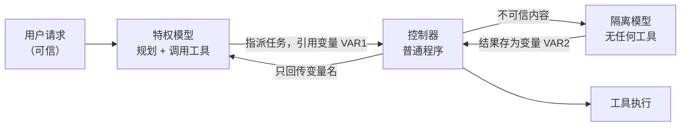

## 13.2 提示注入的架构级防御

前面各章的防御大多回答“怎样让模型更不容易被骗”。本节换一个问题：**假设模型一定会被骗，系统还能保证什么？** 这是 2025 年以来智能体安全最重要的方向转变——把安全性质从模型的行为里拿出来，交给模型之外的确定性代码去保证。本节依次介绍这一转变的理由、六种设计模式、CaMeL 与信息流控制，以及如何据此选型。

### 13.2.1 为什么要从检测转向架构

第 4.5 节的分隔符、来源标记、注入检测器和指令层级训练有一个共同点：它们降低注入成功的**概率**，但都不给出**保证**。在自适应攻击者面前，这类防御的实测结果并不乐观（见 4.5.11）。智能体场景又放大了这个差距，原因有三：

- **一次成功即可造成后果**：聊天场景里注入成功意味着一段错误输出；智能体场景里意味着一次真实的转账、外发或删除。1% 的成功率乘以每天上万次工具调用，不是可接受的残余风险。
- **攻击者可以反复尝试**：攻击载荷放在网页、邮件、Issue 里，智能体每次读到都是一次免费尝试，攻击者还能离线对着同款模型调优。
- **检测器与被保护模型同源**：用 LLM 判断“这段文本是不是注入”，判断者本身也会被同一段文本注入（4.5.4）。

这一判断在 2026 年得到了越来越多研究者与厂商的明确表态，尽管提升模型鲁棒性仍是社区的主流做法。一份由十余位系统安全与对抗机器学习研究者联合署名的立场文件（附录 C-147）把它表述为：智能体安全必须作为**系统问题**来对待，驱动智能体的模型应被视为不可信组件，安全不变量要在系统层面强制执行；提升模型鲁棒性的努力本身是不够的。文件分析了十一起有代表性的真实攻击，逐一说明系统安全原则若得到落实本可如何阻止它们。微软在披露自家智能体框架的远程代码执行漏洞时给出了同样的结论（附录 C-142）：模型不是安全边界，暴露给模型的工具决定了攻击者的影响范围。前沿模型论坛在 2026 年 6 月的议题简报（附录 C-148）同样把智能体安全定位为模型开发者、部署者与用户的共同责任，并指出记忆管理、工具授权和多智能体委托层级等架构选择，对这些风险是被遏制还是被放大起着重要作用。

架构级防御的思路借自传统系统安全：SQL 注入最终不是靠“更聪明地识别恶意字符串”解决的，而是靠参数化查询把代码通道与数据通道分开。对应到智能体，就是让**不可信数据无法影响控制流**，并让**敏感数据无法流向未授权的出口**。这两条性质由解释器、策略引擎这类普通软件来执行，模型是否被说服不再决定结果。

### 13.2.2 六种设计模式

一组来自 IBM、Invariant Labs、ETH Zurich、Google、Microsoft 等机构的研究者系统整理了六种[抵御提示注入的智能体设计模式](https://arxiv.org/abs/2506.08837)（附录 C-96）。它们的共同原则是：**智能体一旦读入不可信输入，此后就不应再有能力触发有后果的动作**。六种模式按论文的介绍顺序列出如下：

| 模式 | 核心约束 | 仍然存在的风险 | 适用场景 |
|------|----------|----------------|----------|
| 动作选择器 | 模型只把请求翻译成预定义动作，动作结果**不回流**给模型 | 表达能力最弱，无法根据工具返回做后续决策 | 客服分流、固定菜单式操作 |
| 先计划后执行 | 在读入任何不可信数据之前先定下工具调用序列；之后数据只能填参数，不能增删步骤 | 注入仍可篡改参数内容，例如邮件正文 | 步骤可预先确定的工作流 |
| LLM Map-Reduce | 每份不可信文档交给一个无工具的隔离子实例处理，输出限制为布尔值、数字等受限格式，再聚合 | 单份文档可以让自己的结论出错，但影响不到其他文档和后续动作 | 批量筛选、分类、摘取 |
| 双 LLM | 特权模型只看可信输入并负责规划和调用工具；隔离模型处理不可信内容但没有工具；两者之间只传符号变量 | 隔离模型的输出内容本身仍可能被操纵 | 需要对不可信内容做自由文本处理 |
| 先写代码后执行 | 特权模型把任务写成一段程序，由解释器执行并跟踪数据流（CaMeL 即此类） | 需要维护安全策略；存在侧信道 | 通用助手类智能体 |
| 上下文最小化 | 在后续步骤前把不再需要的内容（如用户原始提示）从上下文中移除 | 只切断特定回流路径，不是完整方案 | 与其他模式叠加使用 |

其中**双 LLM 模式**最早由 Simon Willison 在 2023 年提出（附录 C-98），是理解后几种模式的钥匙。它有三个组成部分：



图 13-2：双 LLM 模式的数据流

关键在于**特权模型自始至终看不到不可信内容的原文**，它只操作变量名；由控制器这段普通代码在真正调用工具时把变量替换成实际值。这样，藏在邮件正文里的“忽略以上指令”永远进不了负责决策的那个上下文。唯一的例外是可验证的受限输出：如果隔离模型的任务是“把这段文本归入五个类别之一”，控制器校验结果确属这五个值之后，才可以把它交给特权模型。

这组模式的作者同时强调，沙箱执行、敏感动作人工确认等属于**每个智能体都应尽可能具备的最佳实践**，并把它们与上述设计模式分开讨论：两者解决的问题不同，应当叠加使用。

### 13.2.3 CaMeL 与数据流策略

这里先区分两种“来源标记”。4.5.3 的标记是写进提示里给模型看的分隔与说明，模型是否理会无法保证，属于概率性防御；本节及后文（14.5 等）所说的来源标记是解释器或运行时在代码里维护的值元数据，策略据此判定，模型无法改写，属于确定性机制。

双 LLM 模式切断了控制流劫持，但留下一个缺口：攻击者虽然不能增加工具调用，却仍可操纵**数据**。例如用户说“把会议纪要里提到的那份文件发给客户”，被污染的纪要可以把“那份文件”换成机密文件，把“客户邮箱”换成攻击者邮箱——调用序列完全合法，数据却流向了错误的地方。

Google DeepMind 等机构提出的 [CaMeL](https://arxiv.org/abs/2503.18813)（附录 C-97）在双 LLM 之上补了这一层，做法是三件事：

1. **从可信查询中提取控制流**：特权模型把用户请求翻译成一段受限 Python 程序。由于程序在读入不可信数据之前就已写定，不可信数据无法改变它。
2. **用自定义解释器执行并跟踪来源**：解释器给每个值附上元数据（论文称为能力，取的是系统安全里的含义而非“模型能力”），记录它来自哪里、允许谁读取。值经过运算后，元数据随之传播。
3. **在工具调用处执行安全策略**：每次调用工具前，解释器按策略检查参数的来源与读者集合。例如“发送邮件的收件人必须出自可信来源，或者本来就有权读取附件内容”。不满足则拒绝执行或转交用户确认。

以下伪代码展示上述例子在 CaMeL 下的执行过程，注释标出解释器所做的检查：

```text
# 特权模型生成的程序（生成时尚未读入任何不可信数据）
notes   = get_last_meeting_notes()            # 值标记：来源=云盘，不可信
doc     = query_quarantined_llm(              # 隔离模型抽取文件名，结果继承“不可信”标记
              "纪要中提到的文件名", notes)
address = query_quarantined_llm(
              "纪要中提到的客户邮箱", notes)   # 同样继承“不可信”标记
file    = fetch_document(doc)                 # 值标记：读者集合 = 文件的共享对象
send_email(to=address, attachment=file)       # 策略检查点

# 解释器在 send_email 处的检查：
#   address 来自不可信数据，且 address 不在 file 的读者集合内
#   → 违反策略，拒绝执行，转交用户确认
```

在 AgentDojo 基准上，CaMeL 在提供可证明安全性的前提下完成了 77% 的任务，而无防御系统为 84%。这组数字说明两点：架构级防御的效用代价是真实存在的，但已经小到可以接受。

CaMeL 的作者对其局限写得很直白，引用或落地时应一并说明：

- **提示注入并未因此“被解决”**。CaMeL 需要有人编写并维护安全策略，策略写得过宽则形同虚设，过严则频繁打断用户。
- **不防御“只改文字、不改数据流”的攻击**。例如诱导助手把一封邮件总结成相反的意思，或者在回复里插入钓鱼话术，这些不触发任何工具调用，不在其保护范围内。
- **存在侧信道**。论文展示了三类：通过间接依赖泄露私有变量、通过触发异常泄露一位信息、通过时序去除标记。其严格模式能阻止第一类，并缓解由隔离模型触发的异常这一类；论文中的时序示例因解释器不提供时间模块而不可行，但作者不排除存在其他时序侧信道。总体上，作者认为这些侧信道受带宽和攻击复杂度限制，但并未消除。
- **可能被合法片段拼接绕过**。作者类比了控制流完整性与返回导向编程的关系：攻击者或许能用策略允许的小段控制流拼出一条恶意路径。

### 13.2.4 信息流控制与策略化权限

CaMeL 之后，同一思路沿两个方向展开。

**信息流控制**把上述做法形式化。Microsoft 的 [FIDES](https://arxiv.org/abs/2505.23643)（附录 C-100）为规划器建立了形式模型，给每个值同时打上**机密性**与**完整性**两类标签，用动态污点跟踪（读过不可信内容的值都打上标记，标记随运算传播）确定性地执行策略：低完整性数据不得决定高影响动作，高机密性数据不得流向低权限出口。它还引入了选择性隐藏信息的新原语，其在 AgentDojo 上的评估表明，这一做法可以在提供安全保证的同时完成范围较广的任务。信息流控制的优点是性质可以被证明，代价是需要为工具和数据源标注标签。

**策略化权限控制**则从工具调用一侧收紧。[Progent](https://arxiv.org/abs/2504.11703)（附录 C-101）把权限表示为工具名与参数上的符号规则，每次调用由确定性过程核对。它的要点是**单调收敛**：由模型根据任务生成初始策略并在执行中更新，每次更新交给 SMT 求解器判定——收窄的更新自动生效，放宽的更新必须经过显式批准。于是智能体的可行动空间在无人批准时只会缩小，被注入的内容无法悄悄扩大权限。论文在 LangChain 与 OpenAI Agents SDK 等现有框架上验证了它的可用性。相比 CaMeL，这类方案的接入成本较低，但保证也相应较弱：它约束“能调用什么”，不跟踪“数据从哪来到哪去”。

三类方案保证强度与接入成本的对比如下：

| 方案 | 保证的性质 | 需要的改造 | 主要代价 |
|------|------------|------------|----------|
| 策略化权限控制 | 工具调用不超出当前任务所需的集合 | 在工具网关加策略层 | 不防数据在合法调用间的错误流向 |
| 双 LLM、先计划后执行 | 不可信数据不能增加或改变工具调用序列 | 拆分规划与数据处理 | 参数内容仍可被操纵 |
| CaMeL、信息流控制 | 在上一条基础上，数据只能流向策略允许的出口 | 自定义解释器、标签与策略 | 策略维护、效用下降、侧信道 |

### 13.2.5 两个难点

架构级防御在两类情形下会遇到真正的困难，选型前需要想清楚。

**难点一：任务本身要求由不可信数据决定下一步。** 上述模式都依赖一个前提——控制流可以在读入不可信数据之前确定。但有些请求天然不满足这一点，例如“监控我的收件箱，按每封邮件的要求去做”。此时用户授权的恰恰是“让邮件内容决定动作”，数据流变成了控制流。CaMeL 论文专门分析了这种情形（其示例经作者改造以突出问题）：面对这类请求，特权模型会生成一段遍历所有可用工具、由邮件内容选择调用哪一个的程序；程序本身完全合法，却等于把任意工具调用的选择权交给了邮件作者。作者指出，这一问题单靠双 LLM 式的隔离无法阻止，必须依靠能力标记与安全策略，并且它同样适用于其他防御系统。

应对这类任务有三种做法，按推荐程度排列：

1. **重新界定任务**。把“按邮件要求去做”收窄为一个封闭的动作集合：只允许“加入日程”“回复确认”“标记待办”等有限几种低风险动作，其余一律转人工。这实质上是退回到动作选择器模式。
2. **按数据来源限定可触发的动作**。由策略规定：来自外部发件人的内容只能触发只读或可撤销的动作；只有来自特定可信发件人的内容才能触发其他动作。这要求来源标记可靠，例如发件人身份经过邮件认证机制验证。
3. **逐次人工确认**。把每个由不可信数据决定的动作连同其来源展示给用户确认。这是兜底手段，频繁使用会导致审批疲劳。

**难点二：策略由谁来写、写错了怎么办。** 确定性防御把安全性从模型转移到了策略上，于是策略本身成了新的薄弱点。策略过宽则形同虚设，过严则不断打断用户，最终被关闭。可行的做法是把策略当作代码来管理：

- **从默认拒绝开始，按实际使用逐步放宽**，而不是从全部允许开始逐步收紧。每一条放宽都对应一个具体的业务需要并留有记录。
- **策略面向出口而不是面向内容**。“收件人必须在组织通讯录内或已出现在用户此前发出的邮件中”这类规则可以被确定性地检查；“邮件内容不得包含敏感信息”则又回到了需要模型判断的概率性问题。
- **用攻击用例做回归测试**。为每条策略配上应被拦截的用例和应被放行的用例，策略变更时一并运行；应被拦截的用例取自 13.1.4 一类的真实攻击链。
- **记录每一次策略拒绝与人工放行**。被拒绝后由人放行的比例过高，说明策略过严；从未触发的规则可能没有覆盖到真实路径。

下面是一条用于邮件外发工具的策略示意，展示“面向出口、可确定性检查”的写法，它对应 13.2.3 中“收件人出自可信来源，或者本来就有权读取所发内容”这条规则。其中每个值的来源标记与读者集合由 13.2.3 所述的解释器维护，不由模型填写；正文的读者集合取其所依据的全部数据的读者集合之交集：

<!-- SAFE-LAB: defensive-only -->
```python
def allow_send_email(to, body, attachments, ctx):
    """外发邮件前由策略引擎调用；返回 ALLOW、ASK 或 DENY。"""
    contents = [body, *attachments]

    # 规则 1：会话中读过不可信内容后，对外发送受频率限制
    if ctx.tainted and ctx.sends_in_session >= ctx.max_sends_when_tainted:
        return Decision.DENY

    # 规则 2：收件人本来就有权读取将要发出的全部内容（正文与附件）
    if all(to.value in item.readers for item in contents):
        return Decision.ALLOW

    # 规则 3：收件人由用户在请求中直接给出
    if to.provenance == Provenance.USER_PROMPT:
        return Decision.ALLOW

    # 其余情况：地址出自不可信内容，或内容超出收件人的读取权限
    return Decision.ASK   # 展示收件人、内容及各自来源，等待确认
```

同一条策略用 Rego（OPA 1.0 的 v1 语法）写出来是下面这样。差别只在载体：Python 版由 Harness 直接调用，Rego 版由 Harness 把事实整理成 `input` 交给 OPA 求值，再按返回的 `decision` 执行。两种写法里，`to`、`contents`、`ctx` 都由代码填写，模型只能提出请求（13.5.1）：

```rego
package agent.tools.send_email

default decision := "ASK"

# 规则 1：会话中读过不可信内容后，对外发送受频率限制
decision := "DENY" if rate_limited

# 规则 2：收件人本来就有权读取将要发出的全部内容（正文与附件）
decision := "ALLOW" if {
    not rate_limited
    every item in input.contents {
        input.to.value in item.readers
    }
}

# 规则 3：收件人由用户在请求中直接给出
decision := "ALLOW" if {
    not rate_limited
    input.to.provenance == "USER_PROMPT"
}

rate_limited if {
    input.ctx.tainted
    input.ctx.sends_in_session >= input.ctx.max_sends_when_tainted
}
```

上文说的“为每条策略配上应被拦截的用例和应被放行的用例”，在 OPA 里就是同一目录下的测试文件，`opa test` 会在每次策略变更时运行。下面三条依次是：一条攻击链的形态（地址出自工具结果、会话已被污染并达到发送上限）；一个正常请求（收件人本来就有权读取全部内容）；以及两条规则的交界（收件人有权读取，但会话已达上限，频率限制必须优先）：

```rego
package agent.tools.send_email_test

import data.agent.tools.send_email

test_deny_tainted_over_limit if {
    send_email.decision == "DENY" with input as {
        "to": {"value": "outside@unknown.example", "provenance": "TOOL_RESULT"},
        "contents": [{"readers": ["alice@corp.example"]}],
        "ctx": {"tainted": true, "sends_in_session": 3, "max_sends_when_tainted": 3},
    }
}

test_allow_recipient_can_read_all if {
    send_email.decision == "ALLOW" with input as {
        "to": {"value": "alice@corp.example", "provenance": "TOOL_RESULT"},
        "contents": [{"readers": ["alice@corp.example", "bob@corp.example"]}],
        "ctx": {"tainted": true, "sends_in_session": 0, "max_sends_when_tainted": 3},
    }
}

test_rate_limit_wins_over_readers if {
    send_email.decision == "DENY" with input as {
        "to": {"value": "alice@corp.example", "provenance": "TOOL_RESULT"},
        "contents": [{"readers": ["alice@corp.example"]}],
        "ctx": {"tainted": true, "sends_in_session": 3, "max_sends_when_tainted": 3},
    }
}
```

这组用例还能验证策略本身写对了没有：把规则 1 的 `>=` 误写成 `>`，第一条和第三条用例失败；把规则 2 的 `not rate_limited` 删掉，第三条用例会让 DENY 与 ALLOW 同时成立，OPA 报出“complete rules must not produce multiple outputs”的冲突错误，而不是悄悄选一个。第三条用例不能省：只有前两条时，这个错误不会被任何用例触发。Cedar 的 `permit` 与 `forbid` 只有两种结果，表达同一策略时可把“未被任何 `permit` 覆盖”映射为 ASK，由 Harness 转人工（13.5.1）。

### 13.2.6 选型与落地顺序

架构级防御不要求一步到位。结合 13.1 节的 Rule of Two，可以按下面的顺序推进，每一步都能独立带来确定性的收益：

1. **先做能力拆分**。按 Rule of Two 审视每个智能体：不可信输入、敏感数据、对外动作三者能去掉哪一个就去掉哪一个。这一步不需要任何新技术，只需要重新划分会话与权限。
2. **对固定流程采用强约束模式**。客服分流用动作选择器，批量文档处理用 Map-Reduce，步骤确定的自动化用先计划后执行。这些模式实现简单，且在各自场景里几乎不损失效用。
3. **在工具网关加确定性策略**。把“收件人必须在通讯录内”“金额不超过上限”“只能访问当前任务涉及的仓库”写成代码规则，默认拒绝，放宽需批准（与 12.1.9 的策略即代码一致）。
4. **对通用助手引入数据流跟踪**。只有当智能体必须同时接触不可信内容和敏感数据、又要自主行动时，才值得承担 CaMeL 或信息流控制的工程成本。
5. **保留概率性防御作为外层**。检测器和指令层级训练继续有用——它们降低攻击到达确定性防线的频率，也覆盖架构防御管不到的“只改文字”类攻击。

判断一项防御属于哪一类，可以问一个问题：**如果攻击者完全控制了模型的输出，这项防御还成立吗？** 成立的是架构级防御，不成立的是概率性防御。两者都需要，但只有前者可以写进威胁模型里当作保证。这也是第十一章主线的另一种说法：确定的部分可以写清它会做什么并逐条检验，概率的部分只能测出“多半不会”，安全承诺只能建立在前者之上。

> **本节要点**
> - 判断一项防御属于哪一类只问一句：攻击者完全控制了模型输出，它还成立吗？成立的是架构级防御，不成立的是概率性防御。
> - 架构级防御做两件事：不可信数据不能改变控制流（双 LLM、先计划后执行），敏感数据不能流向未授权出口（CaMeL、信息流控制）。
> - 难点在于任务本身要求由数据决定动作，以及策略要有人写、会写错；对策是收窄动作集合、按来源限定动作、把策略当代码管理。
