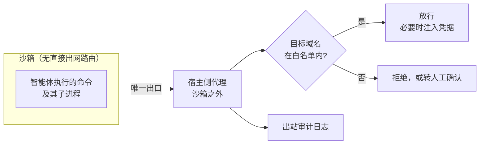
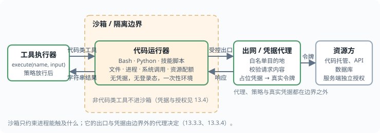

## 13.3 执行沙箱与出站控制

能执行代码或命令的智能体，其最终的安全边界位于操作系统和网络，而不在模型或权限提示中。[13.1](13.1_agents_rule_of_two.md) 节的三种合规配置中，“去掉敏感访问”和“去掉对外通信”都依靠本节的机制实现。

本节的结论是：沙箱在进程运行期间由操作系统检查系统调用，因此在模型被说服、命令被批准之后仍然成立；它必须同时隔离文件系统与网络，并让凭据留在沙箱之外。各小节依次说明沙箱与权限规则的分工（13.3.1）、隔离技术的选型（13.3.2）、文件系统与网络两条边界（13.3.3）、凭据的处理（13.3.4），最后列出常见的失效方式（13.3.5）。

### 13.3.1 沙箱在防御体系中的位置

权限规则与沙箱工作在不同的层次，回答不同的问题：

| | 权限规则 | 沙箱 |
|---|----------|------|
| 判断时机 | 工具调用之前 | 进程运行期间 |
| 判断依据 | 命令字符串、工具名与参数 | 进程实际发起的系统调用 |
| 执行者 | 智能体运行时，可能借助分类模型 | 操作系统内核 |
| 能否被注入影响 | 能：命令可以写得看似无害 | 不能：与模型选择执行什么无关 |
| 典型失效 | 允许的命令做了名字之外的事 | 配置过宽，或存在未纳入沙箱的旁路 |

权限规则看到的是 `npm test`，沙箱看到的是这条命令启动的所有子进程实际打开了哪些文件、连接了哪些主机。被允许的命令完全可以执行超出其名称含义的操作：测试脚本可以读取 SSH 私钥，构建脚本可以发起网络请求。只有在进程层面执行的约束，才能在模型已被说服、命令已被批准的情况下继续成立。

沙箱还能减少审批疲劳。Anthropic 在为 Claude Code 引入沙箱时报告，内部使用中沙箱使权限提示减少了 84%（[附录 C-119](../16_appendix/C_references.md)）。边界由操作系统保证时，边界之内的操作可以自动放行，人的注意力可以集中于少数越界请求（[12.6](../12_agent_attack_surface/12.6_human_layer.md)）。

### 13.3.2 隔离技术的选型

隔离强度与兼容性、启动开销大致成反比。下表按隔离强度由弱到强排列常见方案：

| 方案 | 隔离边界 | 优点 | 局限 | 适用场景 |
|------|----------|------|------|----------|
| 操作系统原生沙箱（macOS Seatbelt；Linux 的命名空间与 seccomp，常以 bubblewrap 封装；或用 Landlock 限制文件访问） | 进程级，与宿主共享内核 | 启动快，无需镜像，适合本机开发 | 依赖策略写得正确；内核漏洞可导致逃逸 | 开发者本机上的编码智能体 |
| 容器 | 命名空间与控制组，共享内核 | 生态成熟，环境可复现 | 默认配置下不是强安全边界；挂载宿主目录或容器运行时套接字等于放弃隔离 | 受信代码的环境封装 |
| 用户态内核（如 gVisor） | 拦截系统调用，由用户态内核实现 | 显著缩小宿主内核的暴露面 | 部分系统调用不兼容，有性能开销 | 多租户运行不可信代码 |
| 微型虚拟机（如 Firecracker） | 硬件虚拟化，每个沙箱独立内核 | 隔离强，启动可达亚秒级 | 需要虚拟化支持，运维较复杂 | 云端代码执行、托管智能体 |
| 远程一次性环境 | 独立主机或云端工作区 | 与用户设备和内网完全分离 | 延迟与成本较高，需同步代码 | 无人值守的长时程任务 |

表中“容器在默认配置下不是强安全边界”有实际漏洞为证。runc 的 CVE-2024-21626（CVSS 8.6，[附录 C-151](../16_appendix/C_references.md)）即是一例：由于内部文件描述符泄漏，新启动的容器进程可以使工作目录位于宿主的文件系统命名空间中，从而访问宿主文件系统，实现容器逃逸。容器是智能体沙箱常用的基础之一，这类漏洞直接决定了沙箱的实际强度。共享内核的隔离方案必须及时跟进内核与运行时的安全更新。

选型时首先考虑两个问题：

1. **代码的不可信程度**。智能体自己写的代码与从公网拉取的依赖包都应视为不可信，但前者的攻击者需要先注入成功，后者不需要。
2. **逃逸后可触及的资源**。开发者的笔记本电脑上有浏览器会话、云凭据和整个内网的访问权，其价值远高于一台一次性的云端虚拟机。

据此，运行不可信代码的多租户服务，至少应使用用户态内核或微型虚拟机这一级别的隔离。

### 13.3.3 文件系统与网络必须同时隔离

有效的沙箱需要同时约束文件系统和网络，缺一不可。Anthropic 对此的说明是：没有网络隔离，被攻陷的智能体可以把 SSH 密钥之类的敏感文件发送出去；没有文件系统隔离，被攻陷的智能体可以轻易逃出沙箱并获得网络访问。

**文件系统边界**应当区分读与写，并对一类特殊文件单独设防：

- **写入**默认只限于工作目录和临时目录。
- **读取**应显式排除凭据位置。以 Claude Code 为例，其文档写明沙箱内的命令默认可以读取机器上的大部分位置，包括 `~/.ssh` 和 `~/.aws/credentials` 这样的凭据文件，需要通过拒绝读取规则或专门的凭据配置阻止（[附录 C-120](../16_appendix/C_references.md)）。“只能写工作目录”不意味着“只能读工作目录”。
- **会被智能体运行时自动加载的文件必须禁止写入**，即使它们位于工作目录内。这包括智能体自身的设置文件、技能与钩子目录、MCP 配置、Shell 启动文件、`.git` 目录下的 `hooks` 与 `config`、编辑器配置目录等。如果沙箱内的命令能改写这些文件，就可以给自己授予权限，或者添加一个在沙箱之外运行的钩子或 MCP 服务，从而实现持久化和逃逸。

**网络边界**的标准做法是默认拒绝加代理放行：



图 13-3：沙箱网络出口的代理模型

沙箱内的进程没有直接的网络路由（在 Linux 上是一个与宿主网络不相连的独立网络命名空间，在 macOS 上由沙箱策略阻断代理之外的连接），所有流量只能经由运行在沙箱之外的代理出站，由代理按域名白名单决定是否放行。白名单应当从空开始，按需添加。

代理模型有以下弱点：

- **宽泛的域名等于数据出口**。把代码托管平台、云存储或任何允许用户上传内容的站点整体加入白名单，就为数据外泄留下了出口：攻击者只需让智能体把数据提交到自己在该站点上的账号下。
- **仅按主机名判断可以被绕过**。如果代理不解密 TLS，只根据客户端声明的主机名放行，沙箱内的代码可能利用域名前置等技术访问白名单之外的主机。需要更强保证时，应使用终止 TLS 并检查流量的代理。
- **DNS 是独立的通道**。即使 TCP 出站被阻断，如果沙箱内仍可向任意域名发起解析，数据就能编码进查询的子域名中外传。解析应由代理代为完成，或限定到受控的解析器。
- **不经代理的协议要么无法连通，要么是漏洞**。不读取代理环境变量的工具（普通的 SSH、多数数据库驱动）在正确配置的沙箱里应当无法连接；如果能够连接，说明存在未受控的出口。
- **本地套接字是侧门**。向沙箱开放 Unix 套接字（例如容器运行时套接字）可能直接授予宿主上的高权限。

下面是一个基于 bubblewrap 的最小示意，说明上述两条边界的各项约束分别对应哪个参数；实际产品还会叠加系统调用过滤，并处理更多特殊情况：

<!-- SAFE-LAB: defensive-only -->
```bash
# 在沙箱中运行智能体要执行的命令（示意）
bwrap \
  --ro-bind / / \
  --tmpfs /run \
  --tmpfs /tmp \
  --bind "$PWD" "$PWD" \
  --ro-bind-try "$PWD/.git/hooks" "$PWD/.git/hooks" \
  --ro-bind-try "$PWD/.git/config" "$PWD/.git/config" \
  --tmpfs "$HOME/.ssh" \
  --tmpfs "$HOME/.aws" \
  --dev /dev --proc /proc \
  --unshare-net --unshare-pid --unshare-ipc \
  --clearenv \
  --setenv PATH /usr/bin:/bin \
  --setenv HTTPS_PROXY "http://localhost:3128" \
  --die-with-parent --new-session \
  -- "$@"
```

各参数与本节讨论的约束一一对应：

| 参数 | 作用 |
|------|------|
| `--ro-bind / /` 与 `--bind "$PWD" "$PWD"` | 整个文件系统只读，只有工作目录可写 |
| 对 `.git/hooks` 与 `.git/config` 的只读绑定 | 工作目录内“会被自动执行”的位置重新设为只读；路径不存在时跳过 |
| `--tmpfs /run` | 遮住宿主的运行时目录，其中通常有容器运行时等服务的本地套接字 |
| `--tmpfs "$HOME/.ssh"` 等 | 用空的内存文件系统遮住凭据目录，使其不可读 |
| `--unshare-net` | 独立的网络命名空间，没有任何对外路由 |
| `--clearenv` | 清空环境变量，令牌不会被子进程继承 |
| `HTTPS_PROXY` | 指向出口代理。网络命名空间隔离后，沙箱内的这个端口本身无人监听，需要在沙箱内部运行一个转发进程，把它桥接到绑定进沙箱的 Unix 套接字，再由宿主侧的代理接收 |
| `--die-with-parent`、`--new-session` | 父进程退出时一并终止；脱离控制终端，防止向终端注入输入 |

该示意为求简短留有缺口，这也说明不应自行从零拼装沙箱：只读挂载并不阻止连接宿主文件系统上的其他 Unix 套接字，成熟的实现会用系统调用过滤阻断；`.git` 目录本身仍可写，沙箱内的进程可以把它整体改名后另建一个带钩子的同名目录；凭据目录若不存在，在只读根上创建挂载点会失败。生产环境应使用经过审计的沙箱运行时，并用 13.3.5 的清单逐项核对。

### 13.3.4 凭据不进沙箱

最稳妥的凭据保护方式是让凭据完全不出现在沙箱里。**由沙箱外的代理代为认证**是实现这一点的通用模式：沙箱内的客户端只持有一个范围受限的内部凭据，请求到达代理后，由代理校验请求内容，再换上真实的令牌发往上游。

以代码托管为例，这一模式的流程是：沙箱内的 git 客户端用专门签发的受限凭据向代理认证；代理校验凭据以及本次操作的内容（例如只允许向配置好的分支推送），通过后才附上真实的访问令牌转发给代码托管平台。这样，即使沙箱内的代码被完全控制，也无法获得可带走的令牌，能执行的操作仅限于代理允许的几种。

下图以“把沙箱当作一只手”的形态表示这一模式（“手”是 Anthropic 对执行环境的称呼，见 [14.5.1](../14_agent_practice/14.5_security_panorama.md)），只有代码类工具交给沙箱执行。



图 13-4：把沙箱当作一只手：代码运行器在隔离边界内，出网与凭据代理在边界外

无法经代理处理的凭据，可按以下顺序降级处理：

1. **不提供**：在启动沙箱内命令前清除相关环境变量，拒绝读取凭据文件。
2. **提供范围最小、时效最短的凭据**：只读、限定到单个仓库或单个资源、分钟级过期。
3. **提供占位值，由代理在出站时替换**：沙箱内只见到占位符，真实值只存在于代理中。

环境变量会被所有子进程继承，也会出现在崩溃转储和调试输出中，是智能体场景下最常见的凭据泄露途径。

### 13.3.5 常见的失效方式

沙箱失效很少源于隔离技术本身被攻破，更多源于配置和旁路。排查时应重点检查以下几类：

- **不在沙箱内的执行路径**。沙箱通常只包裹智能体执行的 Shell 命令。内置的文件读写与网页抓取工具、钩子、本地 MCP 服务、语言服务器等可能以用户的完整权限运行，受权限规则约束而不受沙箱约束。使用者必须明确所用产品中哪些路径在沙箱内、哪些不在。
- **逃生通道**。许多实现为不兼容沙箱的命令提供“在沙箱外重试”的机制。它在交互场景下由人确认，但在跳过确认的模式下会自动执行。无人值守环境应当关闭这一通道。
- **为简便而放宽配置**。把整个主目录设为可写、把通配域名加入白名单、为某个工具关闭沙箱后忘记恢复，都是常见的配置漂移。组织应通过集中下发的策略锁定下限，不允许仓库内的配置文件放宽它。
- **仓库自带的配置**。克隆下来的仓库可以携带智能体配置文件。如果这些文件能够放宽沙箱或权限，打开一个恶意仓库就等于接受了攻击者的策略（[14.1.3](../14_agent_practice/14.1_coding_agents.md)）。
- **沙箱内的持久化**。工作目录本身会保留到下一次会话。被注入的智能体可以在其中留下构建脚本、依赖声明或测试夹具里的恶意内容，等待之后在沙箱外被执行，例如在持续集成环境或另一位开发者的机器上。

沙箱限制智能体能触及的范围，不限制它在允许范围内的行为。一个只能写工作目录、只能访问包管理源的智能体，仍然可以在代码里写入后门。沙箱是必要的底层边界，上层仍需要代码评审、依赖审计和 [13.1.5](13.1_agents_rule_of_two.md) 的不可逆操作网关。

> **本节要点**
> - 权限规则在命令运行前检查字符串，沙箱在运行中检查系统调用；只有后者在模型被说服、命令被批准之后仍然成立。
> - 文件系统与网络必须同时隔离：能读凭据加上能出网等于外泄，能写配置加上会被自动执行等于逃逸。
> - 凭据不进沙箱，由沙箱外的代理代为认证；失效多半来自配置过宽和未纳入沙箱的旁路，而不是隔离技术被攻破。
