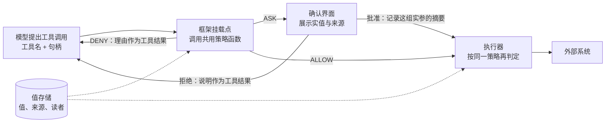

## 13.6 在主流智能体框架中实现闸

前几节与 [14.5](../14_agent_practice/14.5_security_panorama.md) 讲清了闸应设在哪里：工具调用前按参数来源做确定性判定（第 4 步），高风险动作由人确认并把批准绑定到具体参数（第 5 步），答复交给用户前做出口检查（第 12 步），每次判定都写入追踪。本节回答接下来的问题：在常用的智能体框架里，这道闸写在哪里、怎么写。

核心结论有三条。第一，框架提供的是挂载点，闸的判定逻辑仍须是应用自己的确定性代码，挂载点只负责把它接入调用路径。第二，框架自带的模型型护栏，即用另一个模型判断输入、输出或动作是否安全的机制，属于概率性防御（[13.2.1](13.2_architectural_defenses.md)），它的结论只能作为第 4 步的一个输入，不能当作闸。第三，每个挂载点都有覆盖范围，某些工具类型、某些智能体位置或某些权限模式不经过它，因此执行器在产生副作用之前还要再判定一次。

本节先对照四个框架在五个控制点上的挂载点（13.6.1），再给出一个各框架共用的策略模块（13.6.2），然后依次说明 OpenAI Agents SDK（13.6.3）、Claude Agent SDK（13.6.4）、LangGraph（13.6.5）与 Google ADK（13.6.6）的接法，最后归纳共性陷阱（13.6.7）。这些框架的接口变化很快，本节代码以 openai-agents 0.23.1、claude-agent-sdk 0.2.164（内置 Claude Code 2.1.292）、langgraph 1.2.14、google-adk 2.11.0 为准；每段代码都在对应版本下用假模型跑通了“模型请求调用工具、闸拒绝或要求确认、结果回到模型”的完整路径，没有调用任何真实模型服务。

### 13.6.1 挂载点对照

挂载点是指框架在一次工具调用或一次答复的处理过程中，允许应用代码读取调用内容并改变其去向的位置。一个挂载点能否承载闸，取决于三点：它是否在副作用发生之前触发；它能否拿到工具名和完整参数；它能否阻止执行，并把拒绝理由作为工具结果交还模型。下表按 14.5 的控制点列出四个框架的对应位置，名称均取自各框架的官方文档：

| 控制点 | OpenAI Agents SDK | Claude Agent SDK | LangGraph | Google ADK |
|------|------|------|------|------|
| 工具调用前的策略判定（第 4 步） | 工具输入护栏 `@tool_input_guardrail`，挂在函数工具上 | `PreToolUse` 钩子，先于权限规则与权限模式执行 | `ToolNode` 的 `wrap_tool_call`，或工具节点之前的自定义节点 | `before_tool_callback`；对所有智能体统一生效时用插件的同名回调 |
| 参数来源校验 | 框架不提供，在上一行的挂载点内查值存储 | 同左 | 同左 | 同左 |
| 人工确认并绑定参数（第 5 步） | `needs_approval` 触发中断，`RunState.approve()` 或 `reject()` 后续跑 | 钩子返回 `ask`，转入 `can_use_tool` 回调 | `interrupt()` 暂停，`Command(resume=...)` 续跑，须配检查点 | 工具确认（实验功能）：`require_confirmation` 或 `tool_context.request_confirmation()` |
| 输出检查（第 12 步） | 输出护栏，只对产生最终输出的智能体运行；工具输出护栏 | Python SDK 没有改写最终答复的钩子，由应用在展示前检查；`PostToolUse` 可替换工具结果 | 在通往结束的边上加检查节点 | `after_model_callback`；`after_agent_callback` 不能整体改写输出 |
| 追踪（[10.1.3](../10_operations/10.1_monitoring.md)） | 内置追踪，默认开启，工具调用与护栏各有跨度 | 由 CLI 导出 OpenTelemetry 数据，须显式开启 | 接入 LangSmith，或自行插桩 | 按 OpenTelemetry 生成式 AI 约定产生 `execute_tool` 等跨度 |

“参数来源校验”一行四个框架都没有对应机制，这不是遗漏。框架只知道模型给出了什么参数，不知道参数从哪里来；来源标记必须在值进入系统时由代码写下（14.5 第 9 步），框架无从代劳。这正是本节把策略写成独立模块、再分别接入各框架的原因。

Semantic Kernel 的函数调用过滤器（`FilterTypes.FUNCTION_INVOCATION`）也属于这类挂载点（[过滤器文档](https://learn.microsoft.com/en-us/semantic-kernel/concepts/enterprise-readiness/filters)），其[仓库首页](https://github.com/microsoft/semantic-kernel)已说明 Microsoft Agent Framework 是它的后继。

无论接在哪个框架上，一次工具调用都经过两次判定：挂载点先判定，决定拒绝、请求确认还是放行；执行器在产生副作用之前再判定一次。两次判定调用同一个策略函数，读同一个值存储：



图 13-5：框架挂载点与执行器的两次判定

### 13.6.2 共用的策略模块

策略沿用 [13.2.5](13.2_architectural_defenses.md) 的邮件外发规则，只增加一条前置要求：模型给出的参数必须是值存储中的句柄。值存储是指由代码保管任务数据的地方，每个值写入时连同来源、读者集合与披露授权一起保存（14.5 第 9 步）。句柄是指值存储中某个值的名字，例如 `v3`。模型在规划时只看到句柄与类型（14.5 第 3 步），调用工具时也只能写句柄；代码在第 4 步把句柄换成实际的值，再按值的来源判定。模型若直接写出一个邮箱地址，或者编造一个附件编号，换值失败，判定为拒绝。句柄只是引用，不是授权凭据：模型即使猜中另一个句柄，拿到的值仍带着它真实的来源，策略照样按来源判定。

模块对外提供四个函数，后文各框架的接法只调用这四个函数：

- `decide_send_email`：第 4 步的判定，返回 ALLOW、ASK 或 DENY 及理由。出现约定之外的参数（例如多出一个 `cc`）或句柄不存在时判为 DENY；其后的规则 1 至规则 3 与 13.2.5 相同。
- `describe`：生成确认界面的内容，即每个参数的实值与来源，而不是模型对动作的描述（[12.6.1](../12_agent_attack_surface/12.6_human_layer.md)），另附按这些值算出的参数摘要；参数无法换值时返回 `None`。
- `approve`：用户批准后调用，传入确认界面展示过的摘要。它与按当前实参重算的摘要一致时，才记下这个摘要和过期时刻；记录的不是“已批准”这个布尔值，参数一变，摘要对不上，判定回到 ASK。
- `execute_send_email`：执行器。无论挂载点是否检查过，执行前都再判定一次；一次批准只用一次；同一操作标识只执行一次（14.5 第 6 步）。

<!-- SAFE-LAB: defensive-only -->
```python
import hashlib
import json
import time
from dataclasses import dataclass, field
from enum import Enum


class Decision(Enum):
    ALLOW = "ALLOW"
    ASK = "ASK"
    DENY = "DENY"


@dataclass(frozen=True)
class Value:  # 值存储中的一项：来源、读者与披露授权都由代码写入
    value: str
    provenance: str  # "USER_PROMPT"、"TOOL_RESULT" 等
    readers: frozenset = frozenset()
    disclosure_grants: frozenset = frozenset()


@dataclass
class TaskContext:  # 一个任务的运行时状态，模型既看不到也改不了
    store: dict = field(default_factory=dict)  # 句柄 -> Value
    approvals: dict = field(default_factory=dict)  # 参数摘要 -> 过期时刻
    pending: dict = field(default_factory=dict)  # 调用标识 -> 已展示的参数摘要
    done: dict = field(default_factory=dict)  # 操作标识 -> 执行结果
    tainted: bool = False
    sends_in_session: int = 0
    max_sends_when_tainted: int = 3

    def put(self, value: Value) -> str:  # 只追加：句柄分配后不再改指
        handle = f"v{len(self.store) + 1}"
        self.store[handle] = value
        return handle


def bind(args: dict, ctx: TaskContext) -> dict | None:
    """把模型给出的句柄换成值存储中的值；有未知参数或句柄不存在即返回 None。"""
    if not set(args) <= {"to", "body", "attachments"}:
        return None
    try:
        return {"to": ctx.store[args["to"]], "body": ctx.store[args["body"]],
                "attachments": [ctx.store[h] for h in args.get("attachments", [])]}
    except (KeyError, TypeError):
        return None


def digest(bound: dict) -> str:  # 批准绑定的对象：每个实参的值与来源
    items = [bound["to"], bound["body"], *bound["attachments"]]
    canon = json.dumps(["send_email"] + [[v.value, v.provenance] for v in items])
    return hashlib.sha256(canon.encode()).hexdigest()


def describe(args: dict, ctx: TaskContext) -> dict:
    """确认界面的内容：每个实参的值与来源，以及界面据此显示的参数摘要。"""
    bound = bind(args, ctx)
    if bound is None:
        return None
    shown = {k: [(v.value, v.provenance) for v in (x if isinstance(x, list) else [x])]
             for k, x in bound.items()}
    return {"args": shown, "digest": digest(bound)}


def decide_send_email(args: dict, ctx: TaskContext) -> tuple[Decision, str]:
    bound = bind(args, ctx)
    if bound is None:
        return Decision.DENY, "参数必须是本任务值存储中的句柄"
    to, contents = bound["to"], [bound["body"], *bound["attachments"]]
    if ctx.tainted and ctx.sends_in_session >= ctx.max_sends_when_tainted:
        return Decision.DENY, "规则 1：已读入不可信内容，外发次数已达上限"
    if all(to.value in c.readers for c in contents):
        return Decision.ALLOW, "规则 2：收件人有权读取全部内容"
    if to.provenance == "USER_PROMPT" and all(
            c.provenance == "USER_PROMPT" or to.value in c.disclosure_grants
            for c in contents):
        return Decision.ALLOW, "规则 3：用户选定地址，且内容获准披露"
    if ctx.approvals.get(digest(bound), 0) > time.time():
        return Decision.ALLOW, "用户已批准这组实参"
    return Decision.ASK, "收件地址或内容的授权不足，需要确认"


def approve(args: dict, ctx: TaskContext, shown: str | None, ttl: int = 300) -> bool:
    """用户批准后调用；shown 是确认界面展示过的摘要，与当前实参不符即不批准。"""
    bound = bind(args, ctx)
    if bound is None or shown != digest(bound):
        return False
    ctx.approvals[shown] = time.time() + ttl  # 限时、限这组实参
    return True


def execute_send_email(args: dict, ctx: TaskContext, op_id: str | None = None) -> str:
    """执行器：不管挂载点是否检查过，执行前都再判定一次。"""
    if op_id in ctx.done:  # 同一操作标识只执行一次
        return ctx.done[op_id]
    decision, reason = decide_send_email(args, ctx)
    if decision is not Decision.ALLOW:
        return f"未发送：{reason}"
    ctx.approvals.pop(digest(bind(args, ctx)), None)  # 批准只用一次
    ctx.sends_in_session += 1
    result = f"已发送给 {ctx.store[args['to']].value}"  # 真实系统在此经凭据网关发出
    if op_id is not None:
        ctx.done[op_id] = result
    return result
```

批准摘要按值与来源计算，而不是按句柄计算，因为确认界面向用户展示的是值与来源。值存储只追加，句柄一经分配不再改指：`put` 只追加新值，`Value` 也不可变。即便如此，各框架的接法仍把展示时算出的摘要保留下来，批准时与重算的摘要比对，不一致即不批准，使“展示的是 X、执行的是 Y”在值存储被误改时也不会发生。示例省略了地址规范化、用户与任务的绑定以及授权撤销，这些要求见 13.2.5 末尾；示例把操作标识与批准记录放在内存里，生产实现须把它们持久化，并在执行前先写入意图（14.5 第 6 步）。任务状态 `TaskContext` 放在模型看不到的地方：各框架都提供运行上下文一类的对象，下文把它放在其中，或由应用按会话标识保管，始终不写进模型可见的消息。

各框架接法的写法不同，要回答的问题相同：从哪里拿到工具名与参数；DENY 时如何阻止执行、把理由交还模型；ASK 时如何暂停并展示实值与来源；批准如何绑定到这组参数。下面四小节逐一回答。

### 13.6.3 OpenAI Agents SDK

Agents SDK 的接法用两处挂载点配合：工具输入护栏处理 DENY，工具的 `needs_approval` 处理 ASK。批准后由应用的确认循环调用 `approve`，再让 SDK 续跑：

<!-- SAFE-LAB: defensive-only -->
```python
import json

from agents import (Agent, RunContextWrapper, Runner, ToolGuardrailFunctionOutput,
                    function_tool, tool_input_guardrail)

from approval_ui import ask_user  # 应用自己的确认界面，返回 True 或 False
from gate import (Decision, TaskContext, approve, decide_send_email, describe,
                  execute_send_email)


@tool_input_guardrail
def policy_gate(data):  # DENY：不执行，理由作为工具结果交还模型
    args = json.loads(data.context.tool_arguments or "{}")
    decision, reason = decide_send_email(args, data.context.context)
    if decision is Decision.DENY:
        return ToolGuardrailFunctionOutput.reject_content(f"已拒绝：{reason}")
    return ToolGuardrailFunctionOutput.allow()


async def needs_review(ctx: RunContextWrapper[TaskContext], params, call_id) -> bool:
    return decide_send_email(params, ctx.context)[0] is Decision.ASK  # 只有 ASK 暂停


@function_tool(needs_approval=needs_review, tool_input_guardrails=[policy_gate])
def send_email(ctx: RunContextWrapper[TaskContext], to: str, body: str,
               attachments: list[str]) -> str:
    """发送邮件。to、body、attachments 均为值存储中的句柄。"""
    return execute_send_email(
        {"to": to, "body": body, "attachments": attachments}, ctx.context)


async def run_task(agent: Agent, prompt: str, task: TaskContext):
    result = await Runner.run(agent, prompt, context=task)
    while result.interruptions:
        state = result.to_state()
        for item in result.interruptions:
            args = json.loads(item.arguments)
            decision, reason = decide_send_email(args, task)  # 中断不一定来自 ASK
            shown = describe(args, task)
            if (decision is Decision.ASK and ask_user(item.name, shown["args"], reason)
                    and approve(args, task, shown["digest"])):  # 批准绑定这组实参
                state.approve(item)  # 不用 always_approve：它对后续同名调用一律放行
            else:
                state.reject(item, rejection_message=f"未批准：{reason}")
        result = await Runner.run(agent, state)
    return result
```

**触发时机与能拿到的内容。** 工具护栏挂在工具上，该工具每被调用一次就运行一次。护栏函数从 `data.context` 取得工具名、调用标识、JSON 字符串形式的参数 `tool_arguments`，以及应用传入的上下文 `data.context.context`。工具需要批准时，输入护栏默认在批准之后、执行之前运行；设置 `pre_approval_tool_input_guardrails=True` 后，它在发出待批准中断之前先运行一次，批准后、执行前再运行一次（[护栏文档](https://openai.github.io/openai-agents-python/guardrails/)）。本例不需要这个开关：`needs_review` 只对 ASK 返回真，DENY 的调用本来就不会触发中断，验证时开关取真取假，DENY 用例的中断数都是 0。这个开关是兜底手段，适用于 `needs_approval` 写死为 `True`，或审批函数与护栏的判定可能不一致的情形。`needs_approval` 函数收到运行上下文、解析后的参数与调用标识；参数缺失、不是 JSON 对象或含有 `NaN` 一类非标准常量时，SDK 不调用该函数，直接要求人工批准（[人工确认文档](https://openai.github.io/openai-agents-python/human_in_the_loop/)），属于失败即关闭。验证时让模型多传一个 `cc` 参数，SDK 同样没有调用 `needs_review`，直接产生了中断。可见中断不一定来自 ASK，所以确认循环先对中断中的原始参数重新判定，不是 ASK 就直接拒绝。

**拒绝如何回到模型。** `reject_content` 用给定的文字代替工具结果交给模型，运行继续；`raise_exception` 则抛出异常、终止运行。用户在确认界面拒绝时，`state.reject` 的 `rejection_message` 同样作为工具结果回到模型。

**覆盖范围。** 工具护栏只作用于函数工具，以及在 SDK 中的本地 MCP 服务器对象上设置了 `tool_input_guardrails` 的工具（SDK 把这组护栏挂到该服务器暴露的每个工具上）。托管工具（`WebSearchTool`、`FileSearchTool`、`HostedMCPTool`、`CodeInterpreterTool`、`ImageGenerationTool`）和内置执行工具（`ComputerTool`、`ShellTool`、`ApplyPatchTool`、`LocalShellTool`）不经过这条管线，交接（handoff）也不经过；`Agent.as_tool()` 目前不直接提供工具护栏选项。智能体级的输入护栏只对链上第一个智能体运行，输出护栏只对产生最终输出的智能体运行。工作流中有交接或子智能体时，工具调用前的检查只能放在工具护栏上。

**批准与参数的绑定。** SDK 按调用标识记录批准；`always_approve=True` 会把这个决定保留给本次运行中对同一工具的后续调用，等于把批准从“这组参数”放宽到“这个工具”，因此代码不用它。暂停的运行可以序列化为 `RunState`，文档明确指出反序列化时不验证快照的完整性与提交者身份，应把快照留在服务器端，只把待决项的标识发给审批界面。

验证时，用 SDK 自带的脚本化模型 `agents.testing.ScriptedModel` 依次发出三次调用。第一次把外部邮箱地址直接写进参数，护栏拒绝，模型在下一轮看到“已拒绝：参数必须是本任务值存储中的句柄”；第二次带一份收件人无权读取的附件，运行在中断处暂停，批准后发出；第三次只带用户自己写的提醒，按规则 3 自动发出。另做一次对照：只调用 `state.approve` 而不调用 `approve`，SDK 照常执行工具，但执行器复核后返回“未发送”。可见框架的批准记录不能代替参数绑定。

### 13.6.4 Claude Agent SDK

Claude Agent SDK 以子进程方式运行 Claude Code CLI，应用定义的工具通过进程内 MCP 服务器提供。接法是：`PreToolUse` 钩子调用策略函数，把 ALLOW、ASK、DENY 映射为钩子的许可决定；返回 `ask` 的调用转入 `can_use_tool` 回调，由它展示实值与来源并记录批准。进程内工具的处理函数只收到参数（SDK 源码以 `handler(arguments)` 调用它），拿不到会话标识或 `tool_use_id`，因此代码用工厂函数为每个任务生成自己的工具、MCP 服务器与 `ClaudeAgentOptions`，钩子、回调与工具通过闭包共享同一个任务状态：

<!-- SAFE-LAB: defensive-only -->
```python
from claude_agent_sdk import (ClaudeAgentOptions, HookMatcher, PermissionResultAllow,
                              PermissionResultDeny, create_sdk_mcp_server, tool)

from approval_ui import ask_user  # 应用自己的确认界面，返回 True 或 False
from gate import (Decision, TaskContext, approve, decide_send_email, describe,
                  execute_send_email)

TOOL = "mcp__mail__send_email"  # 进程内 MCP 工具的全名：mcp__服务名__工具名
VERDICT = {Decision.ALLOW: "allow", Decision.ASK: "ask", Decision.DENY: "deny"}


def make_options(task: TaskContext) -> ClaudeAgentOptions:
    """每个任务调用一次；工具、钩子与回调通过闭包共享同一个任务状态。"""
    @tool("send_email", "发送邮件。to、body、attachments 均为值存储中的句柄。",
          {"to": str, "body": str, "attachments": list[str]})
    async def send_email(args):  # 处理函数只收到参数
        return {"content": [{"type": "text", "text": execute_send_email(args, task)}]}

    async def policy_gate(input_data, tool_use_id, context):  # PreToolUse 钩子
        decision, reason = decide_send_email(input_data["tool_input"], task)
        return {"hookSpecificOutput": {
            "hookEventName": "PreToolUse",
            "permissionDecision": VERDICT[decision],  # deny 的理由会交给模型
            "permissionDecisionReason": reason}}

    async def confirm(tool_name, tool_input, context):  # 钩子返回 ask 后才会到这里
        shown = describe(tool_input, task)
        if (tool_name == TOOL and shown is not None
                and ask_user(tool_name, shown["args"], context.decision_reason)
                and approve(tool_input, task, shown["digest"])):  # 批准绑定这组实参
            return PermissionResultAllow(updated_input=tool_input)
        return PermissionResultDeny(message="未获批准，未发送")

    return ClaudeAgentOptions(
        mcp_servers={"mail": create_sdk_mcp_server("mail", tools=[send_email])},
        hooks={"PreToolUse": [HookMatcher(matcher=TOOL, hooks=[policy_gate])]},
        can_use_tool=confirm,
        permission_mode="default")  # 显式指定，不依赖默认模式
```

**为什么闸放在钩子里。** SDK 按固定顺序评估一次工具请求：钩子、deny 规则、ask 规则、权限模式、allow 规则，最后才是 `can_use_tool` 回调（[权限文档](https://code.claude.com/docs/en/agent-sdk/permissions)）。文档特别警告，在前面任何一步被自动批准的调用（例如命中 `allowed_tools`，或处于 `bypassPermissions`、`acceptEdits` 模式）都不会到达 `can_use_tool`，写在回调里的检查对这些调用不起作用；需要对每次调用生效的检查应写成 `PreToolUse` 钩子。钩子返回的 `deny` 在 `bypassPermissions` 模式下同样生效；而钩子返回的 `allow` 不会跳过后面的 deny 与 ask 规则。验证时去掉钩子、把工具列入 `allowed_tools`，确认回调一次也没有被调用，两次调用都由执行器的复核挡下；保留钩子时，即使工具列在 `allowed_tools` 中，返回 `ask` 的调用仍然转入了确认回调。此时 SDK 在连接时给出 `CanUseToolShadowedWarning` 警告，但这个警告只按 `allowed_tools` 与权限模式做静态判断，不知道钩子会返回 `ask`，看到它不必惊慌。

**能拿到什么、能做什么。** 钩子的输入包含 `tool_name`、`tool_input` 与 `tool_use_id`，在子智能体内触发时还有 `agent_id` 与 `agent_type`；`matcher` 按工具名匹配，进程内 MCP 工具的名字是 `mcp__<服务名>__<工具名>`（[钩子文档](https://code.claude.com/docs/en/agent-sdk/hooks)）。许可决定可取 `allow`、`deny`、`ask` 或 `defer`；多个钩子同时匹配时并行运行，结果按 deny、defer、ask、allow 的优先级合并，任一钩子返回 `deny` 即阻止调用。`deny` 的理由交给模型，验证中模型看到的工具结果是“PreToolUse:mcp__mail__send_email hook error: 参数必须是本任务值存储中的句柄”，并标记为错误。返回 `ask` 时，理由随请求转到确认回调的 `context.decision_reason`。钩子还能用 `updatedInput` 改写参数；改写后的参数才是要展示和批准的对象，策略应对改写结果重新判定。

**超时与长时间等待。** 钩子有超时，默认 600 秒；`PreToolUse` 回调超时后工具不会运行，这一行为自 Claude Code 2.1.210 起生效，此前超时被当作用户拒绝报告给模型。这个超时只约束策略钩子，本例的人工等待发生在 `can_use_tool` 回调里，文档写明该回调可以一直挂起，执行随之暂停，前提是进程一直存活。需要让进程退出时，文档建议钩子返回 `defer`：本轮以 `stop_reason` 为 `tool_deferred` 的结果结束，进程可以退出，之后从持久化的会话恢复（[审批与用户输入文档](https://code.claude.com/docs/en/agent-sdk/user-input)）。

**权限模式要显式指定。** 不设置权限模式时，会话按设置文件选择起始模式，否则使用内置默认值，后者可能是 `auto` 模式；`auto` 模式由一个模型分类器审查动作并决定放行或阻止，是模型型护栏。代码因此显式传入 `permission_mode="default"`。

**覆盖范围与输出检查。** 由于处理函数拿不到 `tool_use_id`，示例没有传操作标识。Python SDK 的钩子覆盖工具调用前后（`PreToolUse`、`PostToolUse`、`PostToolUseFailure`）与停止、子智能体等事件；`PostToolUse` 可以用 `updatedToolOutput` 在模型看到之前替换工具结果。改写展示文本的 `MessageDisplay` 钩子只有 TypeScript SDK 提供，Python 应用须在把答复交给用户之前自行检查。

### 13.6.5 LangGraph

LangGraph 把智能体写成图，工具调用由工具节点 `ToolNode` 执行。`ToolNode` 的 `wrap_tool_call` 参数接受一个包装函数，它在每次工具调用前拿到请求，可以直接返回结果代替执行，也可以调用 `execute` 放行；需要确认时，在包装函数里调用 `interrupt` 暂停整张图：

<!-- SAFE-LAB: defensive-only -->
```python
from langchain_core.messages import ToolMessage
from langchain_core.tools import tool
from langgraph.prebuilt import ToolNode, ToolRuntime
from langgraph.types import interrupt

from gate import (Decision, TaskContext, approve, decide_send_email, describe,
                  execute_send_email)


@tool
def send_email(to: str, body: str, attachments: list[str],
               runtime: ToolRuntime[TaskContext]) -> str:
    """发送邮件。to、body、attachments 均为值存储中的句柄。"""
    return execute_send_email(
        {"to": to, "body": body, "attachments": attachments}, runtime.context,
        op_id=runtime.tool_call_id)  # 恢复时整个节点重跑，执行必须幂等


def policy_gate(request, execute):
    call, task = request.tool_call, request.runtime.context
    decision, reason = decide_send_email(call["args"], task)  # 重跑时重新判定，以新结果为准
    if decision is Decision.DENY:
        return ToolMessage(f"已拒绝：{reason}", tool_call_id=call["id"],
                           status="error")
    if decision is Decision.ASK:  # interrupt 之前不得有副作用
        answer = interrupt({"tool": call["name"], "reason": reason,
                            **describe(call["args"], task)})
        # 续跑值须带回界面展示过的摘要；与当前实参不符即视为未批准
        if not (answer.get("decision") == "approve"
                and approve(call["args"], task, answer.get("digest"))):
            return ToolMessage("未获批准，未发送", tool_call_id=call["id"],
                               status="error")
    return execute(request)


tools_node = ToolNode([send_email], wrap_tool_call=policy_gate)
```

使用时，把 `tools_node` 作为工具节点加入 `StateGraph`（声明 `context_schema=TaskContext`），编译时传入检查点，调用时传入 `context=task` 与线程标识 `thread_id`。返回值中出现中断时，应用把中断载荷（工具名、理由以及 `describe` 给出的实值、来源与摘要）展示给用户，再以 `Command(resume={"decision": "approve", "digest": ...})` 续跑，续跑值带回界面展示过的摘要。拒绝以状态为 `error` 的 `ToolMessage` 回到模型。

续跑时节点从头重跑，判定按当时的值重新进行；若批准时只按当前值重算摘要，展示与执行之间值存储被改动就会造成“批准的是 X、执行的是 Y”。验证时在中断与续跑之间把附件句柄改指另一份文件：带回摘要的写法判为未获批准，没有发出；改为续跑时重算摘要的写法，则把改动后的文件发了出去。

**包装函数能拿到什么。** 请求对象 `ToolCallRequest` 包含模型给出的工具调用（名字、参数与调用标识）、对应的工具对象、图状态与运行时；运行时的 `context` 即调用时传入的任务状态。`execute` 可以多次调用，修改参数要用 `request.override` 生成新请求，而不是直接改原对象。

**中断的两条规则决定了写法。** `interrupt` 要求图在编译时配有检查点，续跑时传给 `Command(resume=...)` 的值成为 `interrupt` 的返回值。更重要的是，续跑时运行时从头重新执行发生中断的整个节点，而不是从 `interrupt` 那一行继续，因此在 `interrupt` 之前执行的副作用必须幂等；`interrupt` 也不能包在捕获所有异常的 `try/except` 中，否则用于暂停的异常会被吞掉（[中断文档](https://docs.langchain.com/oss/python/langgraph/interrupts)）。作为普通节点使用时，`ToolNode` 在同一个节点里执行一条模型消息中的全部工具调用，这使第一条规则很容易被违反。验证时让模型在一条消息里同时发出两次调用，一次按规则 3 放行，一次需要确认：去掉 `op_id` 时，续跑后放行的那封邮件又发了一次，共发出 3 封；以调用标识作为操作标识后，恢复时直接返回已有结果，共 2 封。

**由审核人修改参数。** 官方文档在工具内使用 `interrupt` 的示例允许续跑值覆盖收件人等参数；LangChain 的 `HumanInTheLoopMiddleware` 也提供 `edit` 决定，允许审核人在执行前修改工具参数（[人工审核中间件文档](https://docs.langchain.com/oss/python/langchain/human-in-the-loop)）。修改后的参数是一组新参数，必须重新经过第 4 步的判定，不能沿用对原参数的批准；不需要修改功能时，可把 `allowed_decisions` 限定为 `["approve", "reject"]`。

**输出检查与追踪。** 出口检查放在通往结束的边上：答复先进入一个检查节点，通过后才结束。追踪可设置 `LANGSMITH_TRACING=true` 接入 LangSmith，并在调用时附加标签与元数据（[可观测性文档](https://docs.langchain.com/oss/python/langgraph/observability)）。

### 13.6.6 Google ADK

ADK 的接法是在智能体上设置 `before_tool_callback`。回调返回 `None` 时工具照常执行；返回一个字典时工具被跳过，这个字典直接作为工具结果交给模型。ASK 时用工具上下文的 `request_confirmation` 发起确认，确认回来后 ADK 重新执行原调用，回调再次运行并读到确认结果：

<!-- SAFE-LAB: defensive-only -->
```python
from google.adk.tools import FunctionTool, ToolContext

from gate import (Decision, TaskContext, approve, decide_send_email, describe,
                  execute_send_email)

TASKS: dict[str, TaskContext] = {}  # 会话标识 -> 任务状态，由应用保管


def send_email(to: str, body: str, attachments: list[str],
               tool_context: ToolContext) -> dict:
    """发送邮件。to、body、attachments 均为值存储中的句柄。"""
    args = {"to": to, "body": body, "attachments": attachments}
    return {"result": execute_send_email(args, TASKS[tool_context.session.id],
                                         op_id=tool_context.function_call_id)}


def policy_gate(tool, args, tool_context: ToolContext):
    if tool.name != "send_email":
        return None
    task, call_id = TASKS[tool_context.session.id], tool_context.function_call_id
    decision, reason = decide_send_email(args, task)
    if decision is Decision.DENY:  # 返回字典即跳过工具，字典成为交给模型的结果
        return {"error": f"已拒绝：{reason}"}
    if decision is Decision.ASK:
        confirmation = tool_context.tool_confirmation
        if confirmation is None:  # 第一次到达：请求确认，并在服务端记下展示的摘要
            shown = describe(args, task)
            task.pending[call_id] = shown["digest"]
            tool_context.request_confirmation(hint=reason, payload=shown)
            tool_context.actions.skip_summarization = True  # 不让模型就此先行作答
            return {"status": "等待用户确认"}
        if not (confirmation.confirmed  # 不读回复中的 payload
                and approve(args, task, task.pending.pop(call_id, None))):
            return {"error": "未获批准，未发送"}
    return None  # 返回 None 才会继续调用工具


SEND_EMAIL = FunctionTool(send_email)
```

使用时以 `LlmAgent(..., tools=[SEND_EMAIL], before_tool_callback=policy_gate)` 创建智能体。应用在事件流中收到名为 `adk_request_confirmation` 的函数调用，其参数含有原调用 `originalFunctionCall` 与确认请求（提示与载荷）；用户决定后，应用回送一个同名、同标识的函数响应，内容为 `{"confirmed": true}` 或 `false`（[工具确认文档](https://adk.dev/tools-custom/confirmation/)）。原调用的参数取自会话中保存的事件，不取自这条回复。确认回复中的 `payload` 在官方定义里是期望用户回填的数据结构，代码借用它向界面传递实值、来源与摘要，但不读取回复里的 `payload`：展示过的摘要在发起确认时以调用标识为键存进任务状态的 `pending`，确认回来后取出比对。验证时在发起确认与回复之间把附件句柄改指另一份文件，确认后判为未获批准，没有发出。`skip_summarization = True` 表示这次的工具结果不交给模型总结；ADK 源码对内置确认门的注释说明，若不设置，流程会再次调用模型，模型可能再次调用同一工具。

**执行顺序。** ADK 2.11 的源码按以下顺序处理一次工具调用：插件的 `before_tool_callback`、智能体的 `before_tool_callback`、工具自身的确认要求（`require_confirmation`），最后才是工具。插件注册在 Runner 上，对它管理的所有智能体和工具生效，并且先于智能体级回调运行；插件回调返回非 `None` 时，智能体级回调不再执行（[插件文档](https://adk.dev/plugins/)）。多智能体应用的统一安全策略因此宜写成插件，单个智能体的特殊规则再写在智能体回调上。

**返回值的陷阱。** Python 中只有 `None` 能让工具执行：返回空字典 `{}` 也算覆盖，工具被跳过，`{}` 成为工具结果（[回调类型文档](https://adk.dev/callbacks/types-of-callbacks/)）。回调可以就地修改 `args` 后返回 `None`，此时工具按修改后的参数执行；与其他框架一样，改写后的参数须重新判定。

**确认功能的限制。** 工具确认目前标为实验功能，不支持 `DatabaseSessionService` 与 `VertexAiSessionService` 两种会话服务；启用了恢复（Resume）功能时，确认回复还须带上发起确认的那次调用的 `invocation_id`。确认回复只携带是否确认及可选的载荷，不携带原调用的参数，因此“确认的是哪组参数”要由应用记录，即上文的 `pending`，执行器再核对一次。

**输出检查与追踪。** 需要修改模型答复时用 `after_model_callback`；`after_agent_callback` 只能追加内容，不能整体改写输出，因为智能体可能已多次调用模型、产生了多个事件。ADK 按 OpenTelemetry 生成式 AI 语义约定产生 `invoke_agent`、`execute_tool` 等跨度，`execute_tool` 跨度带有 `gen_ai.tool.name` 与 `gen_ai.tool.call.id`（[追踪文档](https://adk.dev/observability/traces/)），策略判定可作为自定义属性附在该跨度上。

### 13.6.7 共性陷阱

四个框架的接法各不相同，容易出错的地方却大体一致：

1. **把模型型护栏当作闸。** 各框架都提供用模型做检查的现成方案：Agents SDK 护栏文档的示例在护栏函数里运行另一个智能体做判断；ADK 安全文档列举的 Gemini as a Judge 插件用 Gemini Flash Lite 判断输入、工具输入输出与答复是否安全（[ADK 安全文档](https://adk.dev/safety/)）；Claude Agent SDK 的 `auto` 模式由模型分类器决定放行或阻止。它们都能降低攻击到达确定性关卡的频率，但攻击者控制了模型输出之后不再成立，结论只能作为第 4 步的输入（[14.5](../14_agent_practice/14.5_security_panorama.md)）。
2. **在钩子里再调模型做决定。** 挂载点里的代码之所以可信，是因为它不读不可信内容、行为可以测试。若钩子把参数或上下文交给模型来判断“这次发送是否合理”，判断者会被同一段内容注入（[13.2.1](13.2_architectural_defenses.md)），闸随之退化为概率性防御。钩子里只做查表、比对与规则计算。
3. **让模型声明参数来源。** 在工具参数里加一个 `source` 字段、让模型填写“该地址来自用户”，并不能提供来源信息，因为模型可以填写任何值。来源只能由代码在值进入系统时写入值存储，派生值继承其输入的来源（14.5 第 2、9 步）；无法抽取为字段的自由文本作为不透明值保存，由代码代填进参数（14.5.1）。
4. **确认界面展示模型的描述，批准不绑定参数。** 确认界面应展示每个参数的实值与来源（[12.6](../12_agent_attack_surface/12.6_human_layer.md)），批准记录的是这组参数的摘要。框架提供的按工具放行的持久决定（如 `always_approve`）、审核人修改参数的功能，都会使批准与参数脱钩；修改后的参数必须重新判定。审批状态与运行快照留在服务器端，客户端只提交决定。
5. **以为挂载点覆盖了全部调用。** 托管工具、内置执行工具、交接调用、被 allow 规则自动批准的调用，都可能绕过某个挂载点。执行器在产生副作用之前按同一策略再判定一次；挂载点出错或超时时，结果应当是不执行，而不是放行。
6. **恢复时重复执行。** 暂停与续跑会重放部分代码：LangGraph 重跑整个节点，ADK 重新执行原调用，Agents SDK 从序列化状态续跑。有副作用的执行必须以操作标识保证幂等，先记意图再执行（14.5 第 6 步）。
7. **追踪里没有判定。** OpenTelemetry 的生成式 AI 语义约定没有策略判定与人工确认的属性（[10.1.3](../10_operations/10.1_monitoring.md)），框架的内置追踪也不会自动记录应用的策略结论。`policy_decision`、`policy_rule`、`approval` 要由挂载点代码作为自定义属性写入工具调用的跨度。还要留意内容采集的默认值：Agents SDK 的追踪默认开启并发往 OpenAI 的追踪后台，`trace_include_sensitive_data` 默认为真，工具的输入与输出会进入追踪（[追踪文档](https://openai.github.io/openai-agents-python/tracing/)）；Claude Agent SDK 则默认关闭遥测，开启后也默认不记录内容（[可观测性文档](https://code.claude.com/docs/en/agent-sdk/observability)）。
8. **框架升级后不再验证。** 本节引用的行为里，有几项注明了自哪个版本起生效，例如 Claude Code 2.1.210 改变了钩子超时的处理方式。依赖版本应当固定，升级时重新运行闸的回归用例，并包括负向用例：去掉挂载点后，拦截类用例必须失败，否则说明测试没有经过挂载点。这类测试不需要真实模型：Agents SDK 提供 `agents.testing.ScriptedModel`；LangGraph 可以直接构造带工具调用的 `AIMessage`；ADK 可以继承 `BaseLlm` 写一个按脚本返回函数调用的模型；Claude Agent SDK 依赖 CLI 子进程，本节验证时把 `ANTHROPIC_BASE_URL` 指向本机的假 Messages API 服务，用一个不具备任何权限的占位密钥运行。

动手验证：配套的[邮件助手实验](../examples/mail_assistant/README.md)（`python3 examples/mail_assistant/lab.py`）用同样的值存储与批准绑定实现了这道闸，关闭 `approval_binding` 或 `disclosure` 后可观察到对应用例失败。

> **本节要点**
> - 框架提供的是挂载点，闸的判定逻辑是应用自己的确定性代码；四个框架对应的位置分别是 Agents SDK 的工具输入护栏与 `needs_approval`、Claude Agent SDK 的 `PreToolUse` 钩子与 `can_use_tool`、LangGraph 的 `wrap_tool_call` 与 `interrupt`、ADK 的 `before_tool_callback` 与工具确认。
> - 参数来源校验没有任何框架代劳：模型只传句柄，代码从值存储取值并按来源判定；批准绑定这组实参的摘要，参数一变即失效。
> - 挂载点有覆盖缺口，暂停续跑会重放代码，模型型护栏不提供保证；因此执行器要按同一策略复核并保证幂等，依赖版本要固定，升级后重跑包括负向用例在内的回归测试。

相关章节：闸的定义见 [11.3](../11_agent_foundations/11.3_unreliable_executor.md)，邮件外发策略及其 Rego 写法见 [13.2.5](13.2_architectural_defenses.md)，策略引擎与护栏框架的选型见 [13.5](13.5_tooling_selection.md)，十二个运行步骤见 [14.5](../14_agent_practice/14.5_security_panorama.md)，策略网关与 Claude Code 权限规则见 [12.1.9](../12_agent_attack_surface/12.1_tool_security.md) 与 [12.1.10](../12_agent_attack_surface/12.1_tool_security.md)，追踪字段见 [10.1.3](../10_operations/10.1_monitoring.md)。
