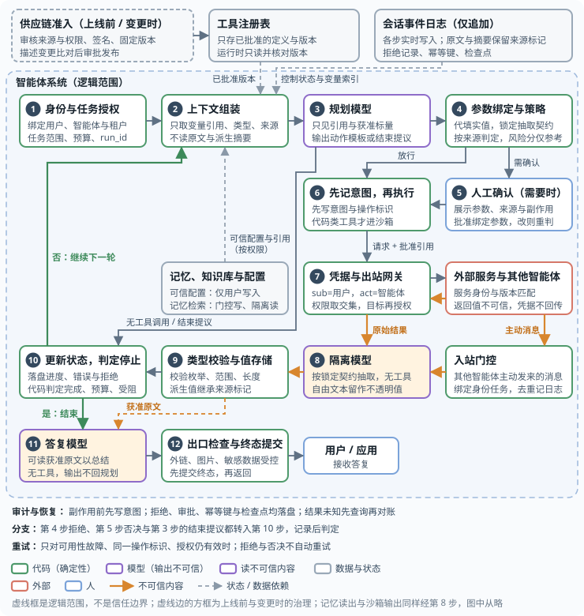
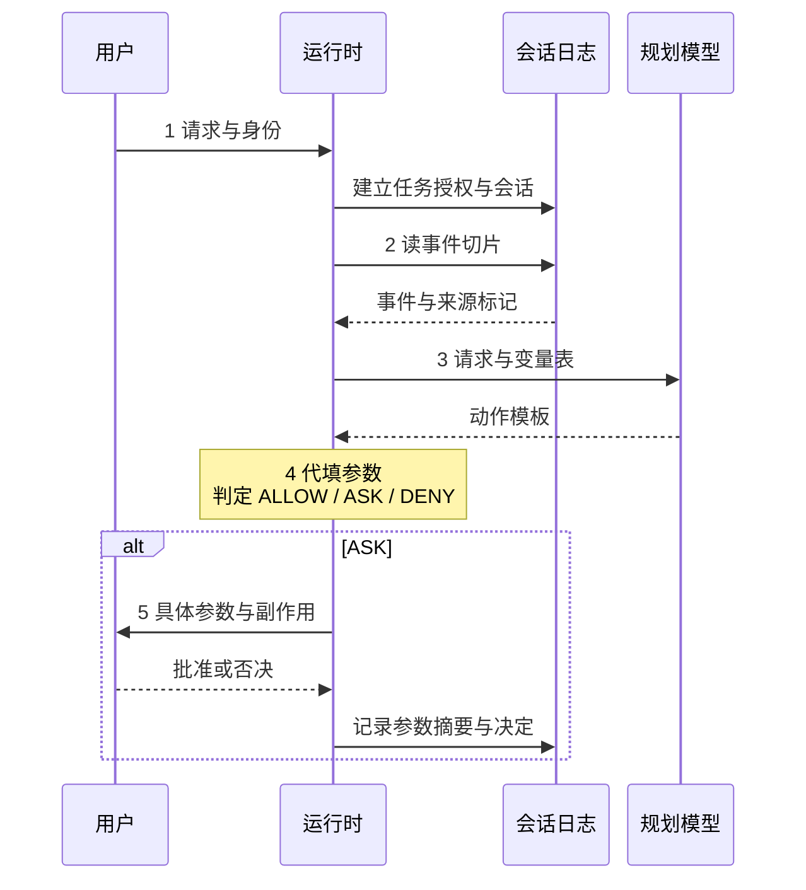
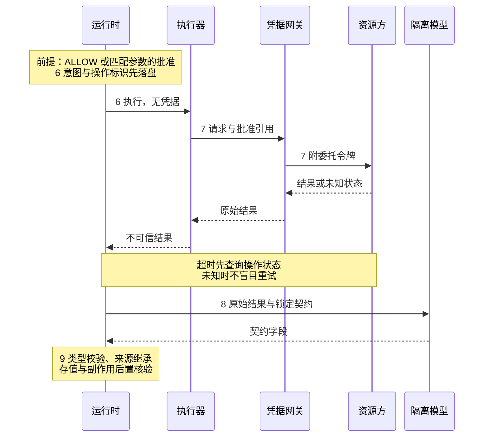
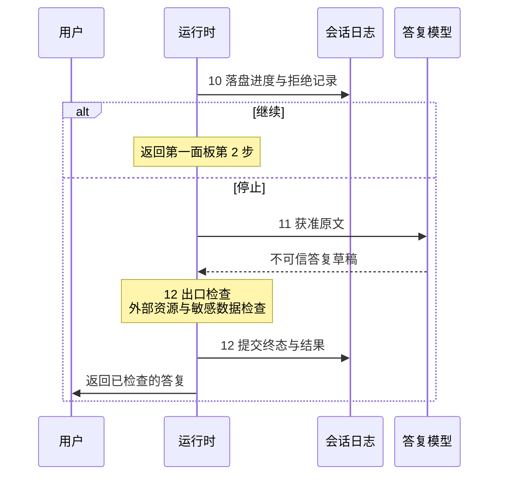

## 14.5 智能体安全全景

前面各章分别讨论了结构、入口、边界和机制。本节把它们拼成一张完整的图：一个安全的智能体系统由哪些组件构成、信任边界画在哪里、一次请求从进入到完成要经过哪些关卡，以及从设计到运营的整个生命周期里安全工作如何分布。读者可以把本节当作全篇的地图，也可以当作评审一个现有系统时的对照清单。

### 14.5.1 参考架构与控制点

先说清楚底图。本节沿用 11.1 已采用的 Anthropic 工程博客的划分，它有两层。第一层来自[《构建高效智能体》](https://www.anthropic.com/engineering/building-effective-agents)（附录 C-154）：智能体的基本构件是**增强型 LLM**——一个配上了检索、工具和记忆的模型；智能体本身“就是在循环里根据环境反馈使用工具的 LLM”，它从人的指令出发自主规划和行动，每一步从环境取得真实反馈，在检查点或遇到阻碍时回到人这里，并设有最大迭代次数之类的停止条件。[Agent SDK 的说明](https://claude.com/blog/building-agents-with-the-claude-agent-sdk)（附录 C-157）把这个循环概括为 gather context → take action → verify work → repeat。第二层来自 2026 年的[《扩展 Managed Agents：把大脑与手解耦》](https://www.anthropic.com/engineering/managed-agents)（附录 C-155），它把一个运行中的智能体虚拟成三个可独立替换的部分：

- **大脑（Brain）**：LLM 加上 Harness（Anthropic 的文中即 Claude）。Harness 是“调用 Claude 并把它的工具调用路由到相应基础设施的那个循环”，本身无状态，崩溃后可凭会话日志恢复。
- **会话（Session）**：仅追加的事件日志，记录发生过的一切——用户轮次、工具结果、状态更新。会话不等于上下文窗口：上下文由 Harness 从会话事件中取切片、经压缩与整理后推导出来，这正是[上下文工程](https://www.anthropic.com/engineering/effective-context-engineering-for-ai-agents)（附录 C-156）讨论的压缩、结构化笔记与子智能体等手段的落脚点。
- **手（Hands）**：执行动作的沙箱与工具。每只手都是一个统一接口 `execute(name, input) → string`，无论背后是容器、MCP Server 还是别的环境；大脑可以连接多只手，手也可以在多个大脑之间传递。

对应的产品文档（附录 C-158）把同一套东西归纳为四个概念：Agent（模型、系统提示、工具、MCP Server 与技能）、Environment（会话运行的沙箱，云端或自托管）、Session（在某个环境中执行具体任务的运行实例）和 Events（应用与智能体之间交换的消息：用户轮次、工具结果、状态更新）。读者在其他框架里看到的“会话、上下文、记忆、工具、MCP、沙箱”，都能对应到这几个位置上。

这一划分本身就带着安全含义。该文在“安全边界”一节写道：早期把会话、Harness 和沙箱放在同一个容器里时，Claude 生成的不可信代码与凭据同处一地，提示注入只需说服 Claude 读取自己的环境；结构性的修复是让令牌从沙箱中永远不可达——凭据要么在沙箱初始化时与资源捆绑（例如把仓库令牌接到本地 git 远端，推拉时智能体不经手令牌），要么存放在沙箱之外的凭据库，由专门的 MCP 代理持会话令牌取用；Harness 自始至终不知道任何凭据。本书 13.3 和 13.4 两节讲的，正是这条边界的通用做法。

下图把这一划分展开成十二个运行步骤，“动作过闸”就发生在其中（哪几步是闸见后文）。对应关系是：会话即顶部的“会话事件日志”；大脑是三个模型实例（紫色：规划、隔离、答复）加上编排它们的绿色组件（第 1、2、4、9、10、12 步）；手是第 6、7 步——执行器、沙箱与凭据网关——以及右侧的外部服务，每次调用都经由统一接口 `execute` 出去。凭据只在手里的第 7 步附加，大脑始终接触不到。编号只表示运行顺序；虚线框是逻辑范围，不是信任边界：



图 14-2：智能体参考架构：多轮闭环与安全边界

术语对照：第 4 步“参数绑定与策略”就是 12.1.9 所说的**策略网关**（13.2 节称策略引擎，图 11-2 称动作策略）；上下文组装与类型校验共同承担 13.2.2 中**控制器**的职责，即维护变量与来源标记、校验结构化结果；规划模型即 13.2.2 的特权模型、14.4 节的**规划者**，隔离模型即 13.2.2 的隔离模型、14.4 节的**阅读者**。图按通用形态画：用户请求先到第 1 步（图中省略了入口箭头），由运行时记入会话；托管形态下应用把事件直接投递到会话、再由运行时取走，两种画法在安全上等价。

与普通的智能体架构相比，这张图只多做了四件事：

- **模型按信任分开。** 规划模型只见变量引用、获准标量（13.2.2，例如一封邮件被归入哪一类）与经准入的工具定义，决定做什么；隔离模型读网页、邮件、文档与工具返回，但没有任何工具；答复模型可以读获准的原文来总结和解释，但它的输出只给用户，不回到规划的上下文。普通架构里“同一个模型实例既读内容又调工具”，正是攻击链得以走通的原因（13.2.2）。多数框架至今把这种拆分当作可选模块，所以它要由部署方自己加上。
- **自由文本不消失，只是不进规划。** 隔离模型按第 4 步锁定的抽取契约（事先规定要抽哪些字段、各字段的类型与取值范围）抽取字段，即 13.2.2 的结构化结果，本节称**契约字段**；契约先于原文锁定，内容无权修改。抽不成字段的文本作为不透明值（模型看不到内容、只能按名字引用）留在值存储（由代码保管这些值的地方）里，要么由第 4 步的代码代填进参数，要么交给答复模型阅读。派生值一律继承来源标记。
- **执行之前有代码关卡，凭据只在一处附加。** 策略按参数来源判定（第 4 步），确认绑定到具体参数（第 5 步），执行前先落盘意图（第 6 步）；凭据只在第 7 步附加，令牌同时代表用户与智能体，编排组件与沙箱都拿不到（13.2.5、13.4.3）。
- **循环的出口由代码把守。** 第 10 步判定继续还是停止，第 12 步先提交终态再返回。外部服务、其他智能体与第三方工具的描述、返回值和消息，一律按不可信内容回流（13.3、12.1.8、12.7.3）。

十二个步骤中，第 3、8、11 步是三个模型角色，其余九步属于模型之外的关卡：第 5 步由人工确认，另外八步由代码强制执行；其中直接决定动作或输出能否放行的第 4、5、7、12 步，就是第十一章主线所说的闸。另有四个旁路组件。评审一个现有系统时，可以逐项核对：

| 步骤与组件 | 正常职责 | 风险 | 控制（小节） |
|------|------|------|------|
| 1 身份与任务授权 | 认证发起者，签发任务级授权 | 权限随会话无限延续；后台任务无人监督 | 绑定用户、智能体与租户；按任务签发权限上限与预算；会话事件按用户与租户隔离；后台任务不授予对外动作（13.4.3、13.1.2） |
| 2 上下文组装 | 从会话事件推导本轮输入 | 不可信内容与指令混在同一上下文 | 只放可信配置、变量引用、类型与来源标记；压缩、摘要等派生内容继承其输入中最低的来源等级，不可信的不进规划上下文；发往模型（尤其第三方模型服务）的内容先经输入侧脱敏（13.2.3、4.5.3、9.3.2） |
| 3 规划模型 | 决定下一步动作 | 读到的内容改变了计划 | 只见引用、获准标量与经准入的工具定义，每轮计划先于本轮读入；输出只是动作模板或结束提议（13.2.2） |
| 4 参数绑定与策略 | 把动作模板变成真实调用 | 参数被操纵；调用超出任务范围 | 参数由代码从值存储代填，不由模型自由填写；按参数来源、范围、频率与可逆性做确定性判定：放行、转人工或拒绝；同时锁定第 8 步的抽取契约；风险分类器的分数只作输入（13.2.5、12.1.9） |
| 5 人工确认 | 批准高风险动作 | 审批疲劳；用户按模型的描述而非实际参数做决定 | 展示具体参数、来源与副作用；批准绑定这组参数，修改后重新经第 4 步；批准作为事件记入会话；控制确认数量（13.1.3、12.6） |
| 6 先记意图，再执行 | 分发调用 | 崩溃或超时后不知道哪些操作已执行；代码逃逸 | 执行前写入意图与操作标识；有副作用的调用幂等；代码类工具进一次性沙箱，沙箱无凭据、无登录态、有资源配额（13.3、12.5、12.7.5） |
| 7 凭据与出站网关 | 为调用附加凭据并出网 | 共享高权限账号；冒充用户；令牌泄露后被重放 | 令牌代表用户（sub）与智能体（act），有效权限取用户授权、任务、智能体与工具的交集，短时效、受众绑定；智能体实例之间以短期自动轮换的工作负载证书互认（mTLS）；其余组件与沙箱不接触凭据；出网只经此处；目标服务独立授权（13.4、13.3.4） |
| 8 隔离模型 | 读不可信原文、抽取字段 | 被注入后输出攻击者想要的内容 | 无任何工具；只按锁定的抽取契约输出字段；自由文本留作不透明值；不替数据提升信任（13.2.2） |
| 9 类型校验与值存储 | 校验并保存抽取结果 | 字段里夹带指令；派生数据被当作可信 | 枚举、范围与长度由代码校验，不合规即丢弃；每个值带写入方、来源与敏感级，派生值继承来源标记；后置校验副作用是否与批准一致（13.2.3） |
| 10 更新状态，判定停止 | 落盘进度，决定继续或结束 | 循环停不下来；被拒的动作被换个说法反复提出 | 停止由代码判定；拒绝记录落盘，同一任务内连续被拒即终止并告警（14.5.2） |
| 11 答复模型 | 生成交给用户的答复 | 读了原文后被注入 | 无工具、无凭据；可读获准原文，但输出不回规划上下文（13.2.2） |
| 12 出口检查与终态提交 | 把答复交给用户 | 渲染外链或图片造成外泄；崩溃后重复答复或丢失结果 | 外链、图片与 HTML 受控渲染；敏感数据检测；先提交终态与事件，再返回（12.4、9.3） |
| 旁路：会话事件日志 | 记录发生过的一切 | 事后无法回答“哪段输入引起了哪个动作” | 仅追加；模型调用、工具调用、策略判定与确认都是事件，并与来源标记一起保存（11.10、10.1） |
| 旁路：记忆、知识库与配置 | 跨会话保留信息 | 一次注入被持久化；知识库投毒；跨租户泄露 | 可信配置只由用户直接写入或精确确认；记忆与检索结果写入经门控、读出经隔离；检索前按用户权限过滤（12.3、7） |
| 旁路：供应链准入与工具注册表 | 扩展工具与技能 | 描述投毒、仿冒包、启动命令即代码执行 | 上线前审核来源与权限、签名、固定版本；描述变更比对后审批；运行时只读已批准版本；本地 Server 在沙箱中运行（12.1.8、12.2.4） |
| 旁路：入站门控 | 接收其他智能体主动发来的消息 | 冒充、重放、消息内容注入 | 绑定发送方身份与任务、去重、记日志；正文按预定抽取契约交第 8 步（12.7.4） |

安全分类器在图中没有单独画出：它的分数只是第 4 步的一个输入，是有用的概率性防御（4.5.11），只能降低攻击到达确定性关卡的频率，不能替代上述任何一项。出站方向同理：第 12 步对答复做敏感数据检测（9.3 节的 DLP 旁路探针）补的是内容维度，不替代第 4 步的来源规则。

**按信任区看同一张图。** 边框颜色把组件分成了五类：

| 边框 | 组件类型 | 组件 | 输出可信吗 | 持有工具或凭据 |
|------|----------|------|:---:|:---:|
| 红 | 攻击者可控 | 外部服务与其他智能体，以及它们的返回与消息 | 否，由攻击者决定 | — |
| 紫 | 模型实例 | 规划模型、隔离模型、答复模型 | 否：模型会幻觉、会错位，输出只是请求 | 否 |
| 绿 | 模型之外的强制点 | 第 1、2、4、6、7、9、10、12 步与入站门控 | 是，由代码决定 | 第 7 步持有凭据，其余按需调用 |
| 灰 | 数据与状态 | 会话事件日志、记忆知识库与配置、供应链准入与工具注册表 | 内容按来源标记对待 | 按身份与范围校验每次访问 |
| 蓝 | 人 | 人工确认与接收答复的用户 | 是任务与授权的来源，但不是可靠的把关者：会疲劳、会被操纵；面向公众时按不可信内容处理（12.6） | 持有最终的授权 |

此外，橙色底色标出**读不可信内容**的组件：隔离模型与答复模型；橙色箭头标出不可信内容的去向。三个模型实例的输出都不可信，区别只在于隔离模型和答复模型直接暴露在攻击者的内容之下，而规划模型只经由准入后的工具定义间接暴露。规划模型即使没有被攻击者操纵，也不等于它是对的——它仍然会幻觉和错位，所以它提出的每个动作都要经过绿色组件的判定。

跨区流动只有三条规则，记住它们就记住了这张图：

1. **不可信内容只沿橙色箭头走**：外部服务经第 7 步回到隔离模型，入站消息经门控同路进入；记忆的读出与沙箱内的代码输出同样经第 8 步处理（图中从略）；离开隔离模型时只能是契约规定的字段加来源标记。另一个能读原文的是答复模型，它的输出只交给用户。
2. **动作只能由规划模型提出、经绿色的代码执行**，每一次都经过第 4 步的策略与第 7 步的凭据网关；规划模型永远看不到不可信内容的原文（工具定义是唯一例外：它来自经供应链准入的注册表，仍按不可信文本对待），策略永远由模型之外的代码执行。
3. **出网只有一个口**，即第 7 步；所有跨区的流动都作为事件进入同一份会话日志。

用 11.3 的三个条件来看：橙底的组件接触不可信内容，但敏感访问只限交给它的那一份内容，也没有对外动作；绿色组件有敏感访问和对外动作，但不接触不可信内容的原文；三项在任何一个组件上都凑不齐。这就是 Rule of Two 在架构上的直接体现，前提是组件之间只传契约规定的字段；由不可信内容派生的标量仍能影响下一轮的控制流，这部分残余风险见 14.5.2。系统整体仍然三项齐全；按 CAS 原理，它的取舍落在两处：获准标量限定了任务，让出通用性；第 5 步的人工确认让出自主性。

### 14.5.2 一次请求的十二步调用

参考架构图（图 14-2）的编号就是下面这十二步。它与图 11-2 的八步对应如下：① = 1，② = 2，③④ = 3，⑤ 与 5a = 4、5，6A / 6B = 6、7，⑦ = 8、9、10，⑧ = 11、12。为了看清每一步发出的是什么、得到的是什么结构，这里用三张时序图按参与者展开；图后的表格逐步列出请求与返回的形状，以及该步由谁把关：

同一次调用按授权、执行和结束分为三个面板，步号与参考架构保持一致。一次会话先完成第 1 步；循环每轮从第 2 步开始，经第 10 步决定是否继续。第二面板只有第 4 步放行或第 5 步批准后才进入；拒绝和否决直接进入第 10 步，不执行工具。

#### 授权与规划（第 1–5 步）

<figure class="sequence-panel">



图 14-3：请求授权与动作规划

</figure>

#### 执行与隔离（第 6–9 步）

<figure class="sequence-panel">



图 14-4：获准调用的执行与隔离

</figure>

#### 循环与结束（第 10–12 步）

<figure class="sequence-panel">



图 14-5：循环判定、出口检查与终态提交

</figure>

逐步列出每一步发出的内容、得到的内容及其结构，以及由什么机制把关：

| 步骤：发起方 → 接收方 | 发出的内容 | 得到的内容（结构） | 把关机制（小节） |
|------|------|------|------|
| 1 用户 / 应用 → 运行时 | 任务描述与身份 | 任务级授权（允许的资源、动作、范围、预算与期限）；会话创建或续接 | 认证；后续所有令牌都是这次授权的子集；后台任务不含对外动作（13.4.3、13.1.2） |
| 2 运行时 → 会话 | `getEvents(since)` | 事件列表与变量索引，每条带来源类型、标识与可信度标记 | 会话仅追加，运行时无状态可重放；派生内容继承最低来源等级（11.10、10.1） |
| 3 运行时 → 规划模型 | 用户请求 + 变量表（变量名、类型、来源标记），不含不可信内容原文 | 动作模板：工具名与参数引用；或结束提议 | 计划先于读入内容；步数与费用上限（13.2.2） |
| 4 运行时内部（策略网关） | 动作模板 + 值存储中的实值与来源 | 规范化参数；锁定的抽取契约；判定：放行、转人工或拒绝，附命中的规则 | 参数由代码代填；按来源、范围、频率与可逆性做确定性判定；风险分只作输入（13.2.5、12.1.9） |
| 5 运行时 → 用户 | 确认请求：工具名、具体参数及其来源（例如“收件地址来自一封外部邮件”）、副作用 | 批准或拒绝；批准记录带参数摘要，作为事件入日志 | 只展示参数与来源，不展示模型的描述；修改后重新经第 4 步；执行前比对参数摘要；控制确认数量（13.1.3、12.6） |
| 6 运行时 → 会话、执行器 | 先写意图事件（操作标识、批准引用），再 `execute(name, input)`，不附凭据 | 调用受理；代码类工具在一次性沙箱中执行 | 沙箱无凭据、有资源配额；不可逆操作先演练（13.3、13.1.5） |
| 7 执行器 → 凭据与出站网关 → 资源方 | 请求 + 批准引用；网关换取委托令牌后出网 | 原始结果；资源方校验令牌的受众与范围后返回数据或执行副作用 | 令牌同时代表用户与智能体，权限取交集、短时效、受众绑定；出网只经此处；重试凭第 6 步写入的操作标识：被策略拒绝或确认否决的调用不自动重试；超时或连接中断时结果未知，副作用可能已发生，先按操作标识查询状态，确认未执行再重试（13.4.3、13.3.4、12.7.5、10.5） |
| 8 运行时 → 隔离模型 | 一份原始结果（邮件、网页、工具返回或入站消息）+ 锁定的抽取契约 | 契约规定的字段；自由文本留作不透明值 | 无工具；契约先于原文锁定，内容无权修改（13.2.2） |
| 9 运行时内部（值存储） | 抽取的字段 | 带写入方、来源与敏感级的类型化值 | 枚举、范围与长度由代码校验，不合规即丢弃；派生值继承来源标记；有副作用的动作做后置校验——实际发生的副作用是否与放行或批准的参数一致（例如邮件确实只发给了批准的收件人），不一致即告警（13.2.3） |
| 10 运行时 → 会话 | 进度、错误与拒绝记录 | 继续（回到第 2 步）或停止 | 停止由代码判定；连续被拒即终止（11.10） |
| 11 运行时 → 答复模型 | 获准原文、值引用与任务目标 | 答复草稿，仍不可信 | 无工具、无凭据；输出不回规划上下文（13.2.2） |
| 12 运行时 → 会话、用户 | 终态事件；答复与产物（代码、报告、文件） | 用户看到的输出 | 先提交终态再返回；不渲染外部资源，敏感数据检测；记忆写入经门控并带来源；产物按不可信内容标记、受访问控制与留存期约束（12.4、12.3、9.2） |

几步的要点值得单独说明：

- **第 1 步决定了权限的上限。** 任务级授权在这里签发；后续所有令牌都是它的子集。无人值守的后台任务在这一步就不应获得对外动作的范围。
- **每一轮的第 3 步先于本轮的第 8 步。** 计划在读入本轮内容之前定下，是“不可信数据不能改变控制流”的含义（13.2.2）。多轮之后，前几轮的内容会以引用和获准标量进入规划；其中由不可信内容派生的标量（例如一封邮件被归为哪一类）确实能影响下一轮的控制流，所以获准标量的取值集合要按 13.2.5 收窄，任务本身要求由内容决定动作时，用显式规则与用户确认来承接。
- **第 4 步的来源标记由代码维护，不由模型填写。** 策略据此判断；如果标记可以被模型改写，第 5、7 步就失去了依据。
- **第 5 步只处理策略不能自动判定的少数情况。** 确认界面展示的是将要执行的参数和它们的来源，不是模型对动作的描述（13.1.3）。
- **第 7 步的资源方独立校验。** 即使前面的关卡全部失守，资源方仍按令牌的受众与范围拒绝越权请求；这是最后一道确定性防线。
- **第 8、9 步决定了下一轮能看到什么。** 工具返回值是新的不可信内容，只有契约字段经代码校验后，才以引用的形式进入下一轮。

把第 4 到第 9 步合起来记就是三句话：**执行前检查**（策略、确认与先记意图）、**执行中隔离**（沙箱与凭据网关）、**执行后验证**（隔离抽取、类型校验与后置校验）。

**循环在什么时候停。** 第 2 到第 10 步是一个循环，是否进入下一轮也是一项控制，而且要由代码判定，不能交给模型：模型说“任务完成”只是请求之一。停止条件至少包括：规划模型提出结束且代码核对完成条件成立、达到轮次或时长上限、达到费用上限、遇到不可恢复的错误、用户取消。策略拒绝要单独处理：被拒绝的动作不允许模型换个说法重新提出，同一任务内连续被拒达到阈值就终止循环并告警——被反复试探的策略要能在日志里看出来（11.10）。

**会话里留下什么。** 十二步的关键结果都以事件写入会话日志，一次循环在日志里的样子大致如下（事件名仅为示意，字段对齐 10.1 与 11.10 的追踪字段）：

```text
user_message        任务描述、任务级授权                      来源：用户（第 1 步）
model_response      规划模型的动作模板，参数引用变量          来源：模型，只是请求（第 3 步）
tool_call_proposed  工具名、具体参数、每个参数的来源          第 4 步
policy_decision     放行 / 转人工 / 拒绝，命中的规则          第 4 步
approval            批准或否决，绑定的参数摘要                第 5 步
tool_started        执行之前写入：操作标识、令牌的受众与范围  第 6 步
tool_result         结果摘要与哈希                            来源：不可信（第 7 步）
reader_output       隔离模型抽出的契约字段                    来源：不可信，继承原始内容（第 8 步）
verification        类型校验与后置校验的结果                  第 9 步
loop_decision       继续或停止，及依据的条件                  第 10 步
state_update        记忆或产物的写入，经写入门控              第 12 步
final_response      交给用户的输出                            第 12 步
```

这份日志有两个用途。事后，它回答“哪段输入引起了哪个动作”：从一次可疑的 `tool_call_proposed` 沿参数来源回溯到某条 `tool_result`。运行中，它就是下一轮的输入——Harness 从这里取事件组装上下文，所以 `tool_result` 与 `reader_output` 上的“不可信”标记必须在写入时打上、由代码维护，而不是等到读出时再判断。顺序也是控制的一部分：`tool_started` 必须在副作用发生之前落盘，崩溃或超时后才查得到“哪个操作可能已经执行”；`final_response` 要在会话状态提交之后才交给用户，恢复时才不会重复答复或丢失结果。

### 14.5.3 安全工作的生命周期

运行时的关卡只是整个过程的一段。按设计、构建、验证、运行、运营五个阶段，智能体安全的工作分布如下：

| 阶段 | 要做的事 | 产出 | 对应小节 |
|------|----------|------|----------|
| 设计 | 按第十一章总表盘点来源，用三个条件定闸的硬度；按 Rule of Two 拆分能力；选择设计模式；划定信任区；确定身份与委托模型 | 威胁模型、信任区图、角色与权限表 | 11.3、13.1、13.2、13.4 |
| 构建 | 编写面向出口的策略并配回归用例；配置沙箱与出站代理；审查并固定技能、MCP 与依赖；锁定智能体配置文件；按控制点选型工具并核对其文档写明的边界 | 策略代码与用例、沙箱配置、供应链清单、工具选型记录 | 13.2.5、13.3、12.2.4、12.1.8、14.1、13.5 |
| 验证 | 用攻击链逐条检验；在 AgentDojo 一类基准上同时测效用与安全；做自适应红队，而不只跑静态用例 | 攻击成功率（分静态与自适应两个口径）、效用指标、剩余风险清单 | 14.4.7、4.5.11、10.6 |
| 运行 | 执行 14.5.2 的流程；每一步进入追踪 | 追踪记录、确认记录 | 14.5.2、11.10 |
| 运营 | 监控来源集中的策略拒绝、异常确认模式、拓扑偏离、用量与费用异常；事件响应能撤销令牌与隔离；定期重新红队；模型、工具或技能变更时重新验证，含网关自动降级或多模型路由切换到的备用模型 | 告警、处置记录、策略变更记录 | 11.10、12.7.6、10.1、10.3、14.2 |

两点经验值得强调。第一，**验证阶段的产出是一份剩余风险清单，而不是一句“已防护”**；14.4.7 展示了这份清单应当长什么样。第二，**变更即重验**：换一个模型版本、接入一个新工具、更新一个技能，都可能改变攻击成功率，验证不是一次性的。

### 14.5.4 责任分工

智能体安全由多个主体共同承担，混淆分工会导致每一方都以为别人管了。前沿模型论坛的议题简报（附录 C-148）把它表述为模型开发者、部署者与用户的共同责任。落到上述架构上，分工大致如下：

| 主体 | 负责的部分 | 对应小节 |
|------|------------|----------|
| 模型提供方 | 模型对注入的鲁棒性、滥用检测、推理过程的可监控性 | 4.5.10、14.1.7、14.2.5 |
| 智能体平台与框架 | 安全的默认配置、沙箱与权限机制、配置文件的信任流程、工具参数的处理 | 13.3、14.1.3、12.1.8 |
| 工具、MCP Server 与技能的提供方 | 自身的认证与范围限定、描述与版本的可验证性 | 12.1.8、12.2.4 |
| 部署方 | 信任区划分、策略、身份与委托、工具选型、供应链审查、验证与运营 | 13.1、13.2、13.4、13.5、14.5.3 |
| 用户 | 对确认请求的实质审查、不在不受信环境中启用自主模式 | 12.6、14.1.3 |

部署方的责任最重，因为只有它知道具体的数据、动作和业务约束；但它也最容易高估上游提供的保护——模型的鲁棒性和平台的默认配置都只是起点，14.5.1 的信任区和 14.5.2 的关卡必须由部署方自己画出来、守住。

### 14.5.5 用这张图评审一个现有系统

把 14.5.1 与 14.5.2 当作对照表，评审一个已有的智能体系统时依次核对以下问题。问题按关卡所在的位置分成八组——身份、上下文、模型、动作、服务、沙箱、外发、审计——这也是图 14-2 十二个步骤压缩后的记忆骨架。任何一个答案是“否”，就对应一条本章讨论过的攻击路径。动手之前先回答一个总问题：这个智能体放弃了 CAS 原理（第十一章）的哪一项？放弃通用性或自主性，由哪项机制落实；只接受概率性的防护，残余风险由谁签字？

```text
身份（第 1、5 步）
□ 每个会话是否绑定了认证用户与任务级权限上限？会话数据是否按租户隔离？后台任务是否不含对外动作？
□ 人工确认展示的是参数与来源，还是模型的描述？确认数量是否受控？
□ 批准是否绑定到具体参数，执行时参数变化即作废？

上下文（第 2 步；记忆、知识库与配置；供应链准入）
□ 不可信内容进入规划模型时，是否只以变量引用与获准标量（带来源标记）的形式？来源标记由谁填写？
□ 会话压缩与记忆摘要是否继承原内容的来源标记，而不是被当作可信内容？
□ 记忆写入是否有门控并记录来源？
□ 未授权的正文是否在到达上下文、重排器、缓存或日志之前就被拒绝？
□ 发往模型（尤其第三方模型服务）的内容是否先经输入侧脱敏？
□ 第三方工具描述与技能是否按不可信输入处理、固定版本并经准入审查？

模型（第 3、8、11 步）
□ 读不可信内容的组件，是否没有任何工具与凭据？
□ 发起动作的组件，是否看不到不可信内容的原文？
□ 计划是否在读入内容之前定下？是否设有步数、费用、超时与并发上限？
□ 工具返回值是否再次按不可信内容处理，只以契约字段进入下一轮？

动作（第 4、6、9 步）
□ 每次工具调用是否经过由普通代码执行的策略？参数是否来自变量而非模型自由填写？
□ 有副作用的调用是否幂等？被拒绝或否决的调用是否不会被自动重试？超时后是否先查询状态再决定重试？
□ 执行后是否核对实际副作用与放行或批准的参数一致？

服务（第 7 步）
□ 令牌是否受众绑定、范围取交集、分钟级时效？资源方是否独立校验？
□ 智能体之间是否各有身份并以短期自动轮换的凭据互认，而不是共用服务账号或长期密钥？
□ 出网是否只有一个受控的口？

沙箱（第 6 步）
□ 沙箱内是否不持有凭据与登录态？
□ 哪些执行路径不在沙箱里（钩子、本地 MCP Server、文件工具）？

外发（第 12 步）
□ 最终答复是否不渲染外部图片与链接，不把不可信内容原样外发？
□ 最终答复与出站请求是否经敏感数据检测？

审计与运营（第 10 步；会话事件日志）
□ 是否继续下一轮由代码判定？被拒绝的动作能否被模型换个说法重新提出？
□ 能否把一次任务里的模型调用、工具调用与确认串成一条链？
□ 能否在发现异常后撤销令牌并隔离智能体？
□ 有没有一份用攻击链逐条检验得到的剩余风险清单？攻击成功率是在静态用例还是自适应攻击下测得的？
□ 模型、工具、技能变更后是否重新验证？
```

> **本节要点**
> - 底图沿用 Anthropic 的划分——大脑（Harness + 模型）、会话（仅追加的事件日志）、手（工具与沙箱），展开成十二个运行步骤：模型按信任分为规划、隔离、答复三类，自由文本以不透明值留在值存储里不进规划，凭据只在出站网关附加，循环的继续与停止由代码判定。
> - 一次请求分十二步，每步发出什么、得到什么结构都是确定的：计划先于内容、来源标记由代码维护、确认绑定参数、先记意图再执行、令牌同时代表用户与智能体、资源方独立校验、返回值只以契约字段进入下一轮。
> - 安全工作分布在设计、构建、验证、运行、运营五个阶段；验证的产出是剩余风险清单，变更即重验。
