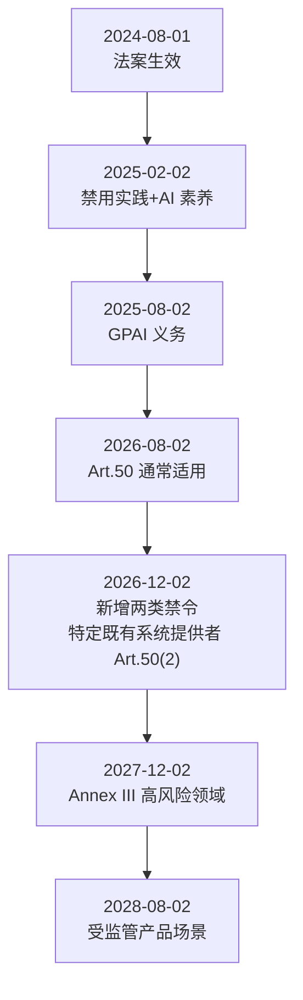

## 15.1 AI 法规与合规要求

本节回答三个问题：AI 为什么受监管，主要法域分别提出了哪些要求，组织怎样把这些要求变成可审计的工程控制。核心结论是：欧盟的义务按角色、系统风险等级和生效批次分层落地，美国由联邦、州和行业规则叠加，中国视服务类型和适用条件判断；合规的关键是把条文映射为可执行、可验证的控制点和证据，并建立持续跟踪法规变化的机制。下面先说明监管动因（15.1.1）和全球概览（15.1.2），再按地区展开欧盟（15.1.3）与美国、中国（15.1.4），最后讲借助国际标准落地（15.1.5）和常见挑战（15.1.6）。

### 15.1.1 AI 监管的动因与目标

AI 监管的目的是在科技创新与社会安全之间取得合理平衡，而非限制技术演进。人工智能（尤其是大语言模型）在推动各行业应用的同时，也带来了新的复杂风险，监管目标可归纳为以下五项：

- **防范系统性风险，守住安全底线**：大语言模型具备强大的生成和逻辑推理能力，若未加限制或被恶意利用，可能被用于自动生成网络攻击代码、批量制造具有迷惑性的虚假信息，甚至用于开发危险物质，从而对国家安全、公共安全和社会稳定构成系统性威胁。监管旨在通过分级分类评估，划定不可触碰的技术红线，阻断极其危险的滥用场景。
- **保护基本权利，确保公平正义**：AI 系统已开始深入参与甚至主导信贷评估、人员招聘、医疗诊断和司法辅助等关键领域的决策。如果模型训练数据包含历史偏差，系统将固化并以不可见的方式放大歧视。监管机构要求增强透明度和算法可解释性，旨在审查并纠正模型偏见，确保算法决策遵循公平、公正原则，保护公民的基本权利不受自动化系统侵害。
- **捍卫数据隐私，保护知识产权**：生成式 AI 的能力建立在对海量数据的学习与拟合之上，这一过程不可避免地涉及个人敏感信息与受版权保护的作品。监管框架致力于规范数据采集、清洗标注与模型训练的全生命周期处理规则，防止滥用个人隐私，并构建合理的创作者利益保护机制。
- **厘清责任边界，建立问责机制**：面对 AI 模型因“幻觉”导致的误导性输出或错误执行引发的实际损失，传统的侵权责任认定面临挑战。法律体系需要一套新的规则来合理划定基础模型提供方、应用层开发者、服务部署方以及最终用户之间的责任分配与风险共担机制，确保受害者能够获得有法可依的合理救济。
- **夯实信任基石，促进可持续创新**：统一、透明的合规审查标准与技术认证体系为企业提供清晰、可预期的规则，既能制止部分企业为抢先发布而忽视安全的恶性竞争，也能增强公众和市场对 AI 系统的信任。以安全合规为前提的创新才能持续发展。

### 15.1.2 全球监管概览

各主要法域的监管形态不同：欧盟与韩国已有综合性 AI 立法，美国由联邦政策、州级立法和行业监管并行，中国以生成式 AI 服务相关规则为主，国际标准则作为跨法域的治理底座。

| 地区 | 代表框架/法规 | 状态 | 对 LLM 组织的含义 |
|------|----------------|-----------------------|-------------------|
| 欧盟 | EU AI Act（Regulation (EU) 2024/1689） | 已分阶段生效 | 需要按生效批次落地控制 |
| 美国 | 联邦政策 + 州级立法 + 行业监管 | 动态变化 | 需要“联邦+州+行业”并行合规 |
| 中国 | 生成式 AI 服务管理相关规则 | 已实施 | 强调内容安全、备案与数据合规 |
| 韩国 | AI 基本法（AI Framework Act） | 2026-01-22 生效 | 继欧盟之后全球第二部综合性 AI 法，高影响 AI 须风险管理、生成式 AI 须标识 |
| 国际标准 | NIST AI RMF、ISO/IEC 42001 等 | 持续演进 | 作为跨法域治理底座 |

> 监管变化较快，建议建立“法规雷达机制”，至少每月复核一次权威来源（[附录 C-3](../16_appendix/C_references.md)、C-37、C-38、C-40）。

### 15.1.3 EU AI Act：时间线与 GPAI 义务

EU AI Act 的义务按批次生效，组织须按条款对应的适用日期分别落实。本小节先给出各批义务的适用日期，再说明处罚上限和通用目的 AI 模型（GPAI）的分层义务。

欧盟 AI 法案（Regulation (EU) 2024/1689）于 2024-08-01 生效，修订法规 Regulation (EU) 2026/1744 于 2026-07-27 生效（见[附录 C-335](../16_appendix/C_references.md)）。修订后的 `Article 113` 将 `Chapter III Sections 1–3`（不含 `Article 6(5)`）对 `Article 6(2) / Annex III` 高风险系统的适用日期定为 2027-12-02，对 `Article 6(1) / Annex I` 高风险系统定为 2028-08-02；具体义务还须结合系统分类与适用范围判断。

> 原法的 canonical ELI 为 `http://data.europa.eu/eli/reg/2024/1689/oj`；修订法为 `http://data.europa.eu/eli/reg/2026/1744/oj`。原法身份和修订来源统一维护在 [`data/framework_crosswalk.json`](../data/framework_crosswalk.json)，适用判断须同时核对原法与生效修订。

| 日期 | 关键里程碑 | 组织动作建议 |
|------|------------|--------------|
| 2025-02-02 | 禁止类 AI 实践开始适用（修订新增的两类禁令除外，见 2026-12-02）；AI 素养相关要求开始生效 | 完成“禁止场景”排查与培训 |
| 2025-08-02 | `Chapter III Section 4`、`Chapter V`、`Chapter VII`、`Chapter XII` 与 `Article 78` 开始适用，其中 GPAI 义务按普通 GPAI 与系统性风险 GPAI 分层 | 完成技术文档、向下游提供信息、版权合规政策与训练数据摘要等机制 |
| 2026-08-02 | `Article 50` 透明度义务通常开始适用，包括交互告知、合成内容机器可读标记、深度伪造披露等；下列 `Article 111(4)` 过渡期只涉及特定提供者的 `Article 50(2)` | 按提供者/部署者角色及具体款项建立披露与标记机制 |
| 2026-12-02 | 修订新增的 `Article 5(1)` 第一款 (ba)(bb) 两类禁止实践开始适用：未经同意生成或篡改可识别个人私密影像的 AI 系统，以及生成儿童性虐待材料的 AI 系统；`Article 111(4)`：2026-08-02 前已上市、生成合成音频、图像、视频或文本的 AI 系统（包括 GPAI 系统）的提供者，须于此日前落实 `Article 50(2)` | 核对上市时间及机器可读标记义务；不得将过渡期扩展为全部透明度义务延期；生成式产品排查是否落入新增禁令（含 `Article 5(1a)` 关于何时构成禁止的限定） |
| 2027-12-02 | `Article 6(2) / Annex III` 高风险系统的 `Chapter III Sections 1–3`（不含 `Article 6(5)`）开始适用 | 先建立风险管理、技术文档、日志与人工监督链路 |
| 2028-08-02 | `Article 6(1) / Annex I` 高风险系统的上述规定开始适用 | 核对受监管产品类别及相应产品法规的衔接要求 |

图 15-1：EU AI Act 分阶段生效时间线

AI Act 的义务分阶段、分风险等级落地；即便法案进入全面适用阶段，高风险 AI 系统也并非在所有场景下一次性全面适用，其中嵌入受规制产品的部分要求仍有更长过渡期。部署企业级 AI 智能体的组织应尽早完成合规准备，并按各批次的生效日期分别规划。

违规处罚方面，EU AI Act 对严重违规者的处罚最高可达 3500 万欧元或全球年营业额的 7%（取较高值）。

EU AI Act 对**通用目的 AI 模型（GPAI）** 单列义务，并区分“普通 GPAI”与“具系统性风险的 GPAI”。当模型训练的累计算力超过 10^25 FLOP 时，即被推定为具系统性风险。对这类模型，除普通 GPAI 的技术文档、下游信息披露、版权政策与训练数据摘要等义务外，提供者还需履行第 55 条的额外义务：按标准化协议进行模型评测与对抗性测试、评估并缓解欧盟层面的系统性风险、向欧盟 AI 办公室及时报告严重事件，并为模型及其物理基础设施提供充分的网络安全保护。在统一标准出台前，提供者可借助通用模型行为准则（GPAI Code of Practice，第 56 条）证明合规。这套“评测—对抗测试—缓解—报告”的结构，与 [15.2.7](15.2_responsible_ai.md) 讨论的前沿实验室自愿框架高度同构。

### 15.1.4 美国与中国：合规实践要点

美国与中国的监管路径不同：美国是联邦、州和行业规则并行且变化较快，中国是由上位法律、部门规章、备案制度和专项政策构成的多层次体系。下面分别列出两地的关键规则和实施建议。

#### 美国

美国联邦与州层面的 AI 监管仍在快速演进，合规需要同时覆盖联邦、州和行业三个层面。

联邦层面以 NIST 指南和白宫治理文件为主：

- **NIST AI 600-1 （生成式 AI Profile，2024 年发布）**
  - 它是 `AI RMF 1.0` 的生成式 AI profile / companion resource。
  - 可与 AI RMF 的 `Govern / Map / Measure / Manage` 结构配合使用。

- **联邦层面的最新治理文件**
  - 行政命令由白宫而非 NIST 发布；`EO 14110` 已被撤销。
  - 当前应重点关注 `EO 14179` 以及 `OMB M-25-21`、`OMB M-25-22` 等联邦治理与采购文件。

州级立法以加州和科罗拉多州为代表：

- **加州（California）- 持续演进中的 AI 州级立法**
  - 应区分已签署生效的法案与提出后被否决的草案：`SB 1047` 已被州长否决，不构成现行合规义务。
  - 组织应重点关注已经生效的透明性、深度伪造和消费者告知相关州法。

- **科罗拉多州（Colorado）- 从 SB 24-205 到 SB 26-189**
  - 2024 年签署的 `SB 24-205`（经 2025 年特别会期 `SB25B-004` 延期）原计划 2026 年中生效，但已被 2026 年 5 月签署的 `SB 26-189` 废止并重写；核心 ADMT 合规义务自 2027 年 1 月 1 日起适用。
  - 监管思路从“注意义务 + 算法影响评估”转向以披露、透明度和自动化决策（ADMT）在重要决策场景中的消费者告知为主，由州检察长执法并设整改宽限期。
  - 重点仍覆盖就业、教育、金融/信贷、医疗、住房、保险、法律服务和关键政府服务等 consequential decisions 场景。

行业层面，在医疗（FDA）、金融（SEC/OCC/CFPB）、教育等领域，还要叠加行业监管规则。

实施建议：

- 联邦政策与机构规则会变动，需持续跟踪白宫与联邦公报更新。
- 州级 AI/隐私法律差异大，跨州业务需按最严格要求（例如加州与科罗拉多的标准）收敛。

#### 中国

中国对生成式 AI 已形成多层次的法规体系。下面按上位法律、部门规章、备案制度、智能体专项政策、行业评测体系的顺序列出关键规则：

- **《数据安全法》和《个人信息保护法》**
  - 为 AI 训练数据的采集、清洗、标注与存储提供法律框架。
  - 明确个人信息的处理原则与用户权利（访问、删除、数据携带权等）。

- **《互联网信息服务算法推荐管理规定》**（2022 年 3 月 1 日施行）
  - 规范算法推荐行为，要求透明度与用户自主权。
  - 虽非专门针对大模型，但对 RAG 和信息推荐场景同样适用。

- **《互联网信息服务深度合成管理规定》**（2023 年 1 月 10 日施行）与 **《人工智能生成合成内容标识办法》**（2025 年 9 月 1 日施行）
  - 前者为深度合成服务提供基础监管框架，后者进一步细化了 AI 生成合成内容的标识要求。
  - 相关义务按服务类型、平台属性和适用条款具体判断，并非要求所有 AI 输出一律显著标识。

- **《生成式人工智能服务管理暂行办法》**（2023 年 8 月 15 日施行）
  - 明确生成式 AI 服务提供者的内容安全、数据治理与用户权益保护义务。
  - 其中，安全评估与按算法推荐规定履行备案手续的要求以第十七条的适用条件（提供具有舆论属性或者社会动员能力的服务）为前提，并非适用于所有提供者。
  - 要求对生成内容进行实时监测，防止生成违法违规内容。
  - 对用户信息和个人隐私的保护有具体要求。

- **网信办大模型备案制度**（持续推进）
  - 面向公众提供服务的大模型，其义务通常涉及安全评估、备案与持续监管要求。
  - 包括对模型能力、风险评估、安全措施的详细披露。

- **《智能体规范应用与创新发展实施意见》**（国家网信办、国家发展改革委、工业和信息化部三部门，2026 年 5 月发布）
  - 我国首份系统性的智能体专项政策，将监管对象从生成式“内容”治理延伸到智能体自身的自主决策与执行安全。
  - 核心是厘清“仅限用户本人决策、需由用户授权决策和智能体自主决策”三类决策方式的合理边界及所需权限，并确保用户对智能体自主决策享有知情权和最终决策权、智能体执行操作不得超出用户授权范围。这与[第十三章](../13_agent_architecture/README.md)智能体架构中的授权边界控制、人工审核（HITL）机制直接呼应。

- **《北京市加快智能体引领发展若干措施》**（京发改〔2026〕1185 号，2026 年 7 月）
  - 第七条要求建立面向智能体的“分级分类监管机制”并建设“智能体安全基础设施”，是较早将安全治理专门写入智能体产业政策的地方性文件，标志着治理关注点从内容合规扩展到智能体的自主行为与执行安全。

- **行业评测体系：中国信通院（CAICT）与 AIIA 相关安全标准**
  - 中国信通院及产业联盟持续发布 AI 安全治理、模型安全评测和行业实践研究，覆盖模型能力、数据、系统、部署和智能体等维度。
  - **《人工智能安全治理研究报告（2025 年）》/《人工智能安全治理蓝皮书》**（信通院，2026-01）可作为本土治理框架与产业实践参考。
  - “大模型一体机”、代码大模型安全、行业大模型能力等更细分的标准，以 CAICT / AIIA 最新公开文件和企业实际适用范围为准。
  - 这套行业评测体系与网信办备案制度形成“监管要求 + 行业评测”的两层结构，企业落地时建议同步对齐。

实施建议：

- 面向公众提供生成式 AI 服务时，需要关注备案、内容安全、数据治理与用户权益保护等要求。
- 企业内部 LLM 平台也应将“内容安全+数据合法性+审计留痕”作为基础控制。
- 建议定期咨询法务团队，跟踪最新的监管动态与执行指南。

### 15.1.5 标准与合规落地：从风险语言到工程证据

合规不能停留在法务的纸面审查，必须借助成熟的标准框架，将法规要求转化为工程团队可执行、审计团队可验证的控制点。推荐以“管理体系 + 风险框架”的组合作为基础：

#### 1. ISO/IEC 42001：AI 管理体系标准

ISO/IEC 42001 用于建立 **人工智能管理体系（AIMS）**。它不规定具体的技术防护细节，强调“生命周期治理”与“风险管理过程的制度化”。
- **落地价值**：可与研发系统（如 Jira/GitLab）中的威胁建模、控制证据链条衔接。
- **对组织的要求**：证明安全工作是体系化运转的，而非零散修补。AI 风险容忍度声明、跨部门评审委员会等属于可选的治理设计示例，并非 ISO 公开资料中的明文要求。

#### 2. NIST AI RMF：风险语言与组织流程的骨架

美国国家标准与技术研究院发布的 NIST AI RMF（风险管理框架）及其生成式 AI 补充指南（NIST AI 600-1），提供了全行业统一的“风险基准语言”。该框架围绕四个核心功能展开：
- **治理（Govern）**：确立全组织的 AI 风险文化与责任机制。
- **映射（Map）**：梳理 AI 系统的上下文、参与者与潜在影响（对应前期的威胁建模分析）。
- **测量（Measure）**：量化评估风险水位（对应红队与自动化验证指标）。
- **管理（Manage）**：执行风险优先级排序与缓解策略（对应技术纵深防御与操作流程限制）。

通过 ISO/IEC 42001（确保体系正常运转）结合 NIST AI RMF（确保技术动作标准化），组织可以将抽象合规要求转换为结构化的可审计控制点。

#### 3. 治理与工程交付物清单（示例）

合规检查最终以证据为依据。跨部门应准备的最小工程交付物基线如下：

| 生命周期阶段 | AIMS / RMF 控制点要求 | 具体工程交付物（证据项） |
|--------------|-----------------------|--------------------------|
| **立项与设计**| Map（识别上下文与风险） | 1.**系统级威胁建模报告**（标明数据流、信任边界与系统级攻击面） 2.**AI 系统卡（System Card）**（清晰描述预期用途、已知限制与强制禁用场景） |
| **开发与训练**| Manage（缓解内在风险） | 3.**模型卡（Model Card）**（说明基座防线能力、训练数据集的版权与合规清洗结论） 4.**依赖组件安全报告（SBOM）**（包含所引入的 LangChain 等第三方框架/插件的审查结论） |
| **测试与评估**| Measure（量化残余风险） | 5.**红队演练报告**（按 OWASP Top 10 结构化输出安全漏洞与绕过路径记录） 6.**自动化安全回归报告**（证明新版本在注入拦截率、可用性损失上未出现断崖式劣化） |
| **部署与上线**| Govern / Manage | 7.**变更评审记录（Change Log）**（包含产品、安全、核心研发联合签署的关键配置/权限发布工单） 8.**上线前例外审批记录**（记录系统存在的残余风险、被主管接受的理由与后续跟进排期） |
| **运营与监控**| Govern / Measure | 9.**结构化安全审计日志**（带有明确的 `attack_type` 与 `confidence`，达到法定存留期要求） 10.**安全事件响应复盘库**（真实发生的风险事件 RCA 根因追溯与策略熔断记录） |

借助这份清单，法务可以向监管方证明合规，工程师可以明确开发自测的目标，形成闭环。

### 15.1.6 合规挑战

合规落地的常见障碍有四类，每类都有对应的工程化应对策略：

| 挑战 | 常见表现 | 应对策略 |
|------|----------|----------|
| 生效节奏错配 | 业务上线快于合规落地 | 使用法规时间线驱动项目排期 |
| 跨境差异 | 同一功能在不同法域要求不同 | 建立“最严法域优先”基线 |
| 证据不足 | 做了控制但无法审计证明 | 默认留痕、模板化证据采集 |
| 组织协同弱 | 法务/安全/产品分散 | 设立跨职能 AI 治理委员会 |

合规落地的核心是把法规要求转化为可执行、可验证、可持续的工程控制。
