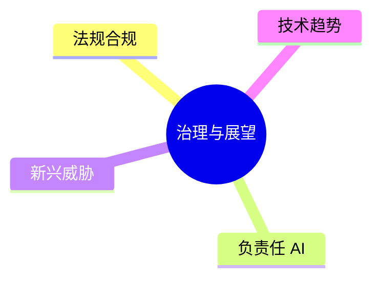

# 第十五章 安全治理与未来展望

LLM 安全不仅是技术问题，也涉及法规、伦理和社会责任。本章探讨更广泛的治理视角和未来发展方向。

本章聚焦于治理与展望，主要内容包括：

- **[15.1](15.1_regulations.md) AI 法规与合规要求**：了解全球 AI 监管趋势
- **[15.2](15.2_responsible_ai.md) 负责任 AI 实践**：构建负责任的 AI 开发文化
- **[15.3](15.3_emerging_threats.md) 新兴威胁趋势**：预见未来的安全挑战
- **[15.4](15.4_maturity_model.md) 大语言模型安全成熟度模型**：量化组织安全能力水平并指导落地
- **[15.5](15.5_future.md) 未来安全技术方向**：展望技术发展趋势
- **[15.6](15.6_compliance_operational.md) AI 安全合规实操指南**：提供可落地的合规实施路径
- **[15.7](15.7_trustworthy_agents.md) 可信智能体框架**：总结可信 Agent 的治理原则、落地检查点与标准化方向

其中，[15.4](15.4_maturity_model.md) 提供本章统一的安全成熟度阶梯，[15.7](15.7_trustworthy_agents.md) 则聚焦 Agent 场景下的原则与生产就绪检查点，两者互补而不重复。

通过本章的学习，读者将建立起更宏观的安全视角。

