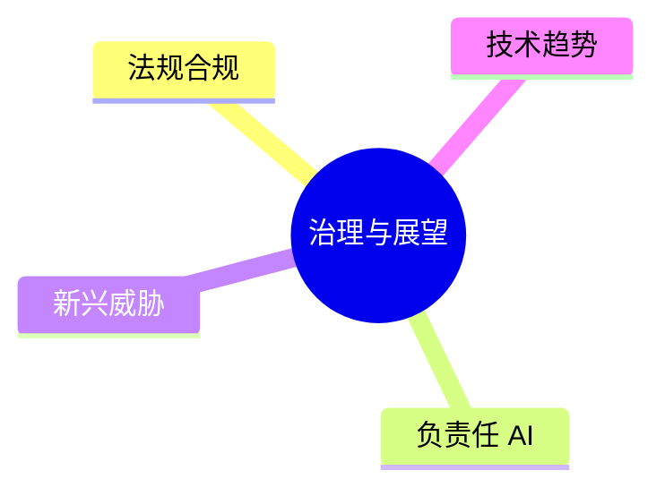

# 第十五章 安全治理与未来展望

LLM 安全不仅是技术问题，也涉及法规、伦理和社会责任。第 8-14 章的技术措施需要治理框架保障才能持续有效，[第 3 章](../03_frameworks/README.md)的框架标准则是本章合规要求的基础。本章讨论安全治理问题与未来发展方向：法规和伦理对组织提出哪些要求，组织如何衡量并落实自身的安全能力，以及威胁和安全技术接下来向哪里演进。

## 学习目标

读完本章，读者应能：

1. 按生效批次说明 EU AI Act 的主要义务，并区分欧盟、美国、中国三地监管路径的差异。
2. 借助 ISO/IEC 42001 与 NIST AI RMF，把法规要求映射为可审计的工程交付物，并用合规检查清单、事件响应模板和审计清单组织落地。
3. 用五级成熟度模型判断组织所处的等级，并说明升到下一级需要哪些最小证据。
4. 列举主要的新兴威胁，并说明守护智能体等概率性防御为何不能替代确定性的权限与出口控制。
5. 用可信智能体的五大原则和生产就绪清单，判断一个 Agent 是否具备上线条件。

## 本章结构

- [15.1](15.1_regulations.md) AI 法规与合规要求：主要法域分别要求什么，如何把条文变成可审计的工程控制？
- [15.2](15.2_responsible_ai.md) 负责任 AI 实践：组织应遵循哪些伦理原则，如何落实到流程中？
- [15.3](15.3_emerging_threats.md) 新兴威胁趋势：安全威胁正在向哪些方向演进，组织如何提前准备？
- [15.4](15.4_maturity_model.md) 大语言模型安全成熟度模型：组织当前处于哪一级，下一步应补什么？
- [15.5](15.5_future.md) 未来安全技术方向：安全技术向哪些方向发展，各方向目前能做到什么程度？
- [15.6](15.6_compliance_operational.md) AI 安全合规实操指南：如何用模板、流程和检查清单把合规要求落到日常工作中？
- [15.7](15.7_trustworthy_agents.md) 可信智能体框架：可信 Agent 应遵循哪些原则，上线前要检查哪些项？

各节按“要求 → 能力与演进 → 落地工具”展开：15.1、15.2 说明法规与伦理对组织提出的要求；15.3 分析威胁演进，15.4 给出衡量组织安全能力的成熟度阶梯，15.5 展望技术方向；15.6、15.7 是落地工具，分别提供合规模板和 Agent 生产检查点。其中 15.6 是 15.1 的实操延伸；[15.4](15.4_maturity_model.md) 提供本章统一的安全成熟度阶梯，[15.7](15.7_trustworthy_agents.md) 则聚焦 Agent 场景下的原则与生产就绪检查点，两者互为补充。

