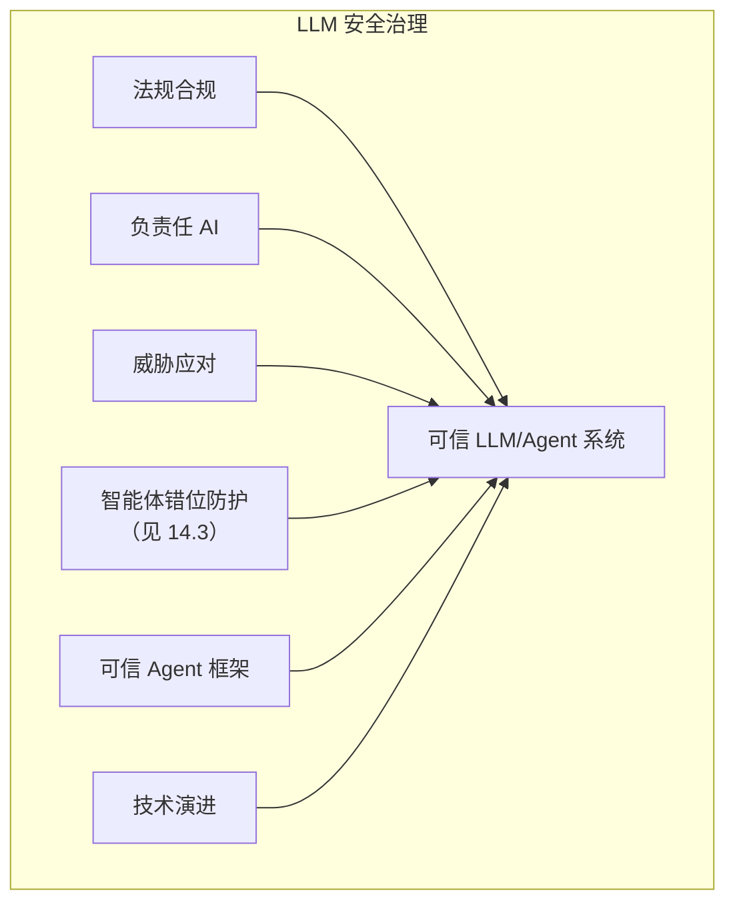

## 本章小结

本章从治理视角探讨了 LLM 安全的更广泛议题，包括法规合规、负责任 AI、新兴威胁和未来展望。

### 1. 核心要点回顾

**AI 法规与合规**：EU AI Act 已由 Regulation (EU) 2026/1744 修订，修订法于 2026-07-27 生效。除 2025 年起适用的批次外，Article 50 透明度义务通常自 2026-08-02 适用；Article 111(4) 仅给 2026-08-02 前已上市、生成合成音频/图像/视频/文本的 AI 系统（包括 GPAI 系统）的提供者至 2026-12-02 落实 Article 50(2)。修订还新增两类禁止实践（未经同意生成可识别个人私密影像、生成儿童性虐待材料），自 2026-12-02 起适用。两类高风险系统的相关规定分别自 2027-12-02、2028-08-02 适用（详见 [15.1](15.1_regulations.md)、[15.6](15.6_compliance_operational.md)）。组织应按角色、系统分类和具体条款映射控制。

**负责任 AI 实践**：公平性、透明性、安全性、隐私保护和问责制是负责任 AI 的核心原则。组织应建立与场景相称的治理机制、角色分工和影响评估流程。

**新兴威胁趋势**：AI 对 AI 攻击、深度伪造滥用、智能体风险升级、供应链风险深化，以及生命科学专用模型带来的双用途生物安全（[15.3.5](15.3_emerging_threats.md)）等，是需要关注的新兴威胁。

**可信 Agent 框架**：在 Agent 部署日益广泛的背景下，需要建立统一的可信框架，包括五大核心原则（人类控制、目标对齐、安全、透明、隐私保护）、四层系统构成（模型、Harness、工具、环境）以及行业生态标准化需求。组织级成熟度阶梯以 [15.4](15.4_maturity_model.md) 为主，[15.7](15.7_trustworthy_agents.md) 补充 Agent 专属的生产检查点。

**未来技术方向**：更强的安全对齐、形式化验证、可信基础设施、隐私增强技术、AI 驱动安全等是技术发展方向。

### 2. 治理框架

图 15-13：治理框架架构图

### 3. 行动建议

| 维度 | 建议 |
|------|------|
| 合规 | 建立法规追踪和合规管理 |
| 伦理 | 制定与场景相称的治理原则与评估模板 |
| 安全 | 持续关注威胁演进并更新控制 |
| 技术 | 投资安全研究和能力建设 |

### 4. 实操输出

本章汇总了四类治理输出：

- **法规时间线**：帮助团队按法域和生效批次安排项目排期
- **成熟度模型**：帮助组织判断“当前在哪一层，下一步补什么”；对 Agent 交付，再叠加专门的生产就绪检查点
- **模板与清单**：为风险评估、数据治理、事件响应和审计提供现成起点
- **可信 Agent 框架**：为后续 Agent 采购、评测和治理提供统一语言

## 与其他章节的关联

- **框架基础**：[第 3 章](../03_frameworks/README.md)框架标准是治理的基础，为本章合规要求提供量化指标
- **技术保障**：第 8-14 章的技术措施需要本章治理框架保障，实现可持续防护
- **学习资源**：附录提供持续学习资源，支持组织的安全能力建设

## 总结

LLM 安全是一个多维度的问题，需要技术、治理、伦理多方面协同。本书从基础概念到攻击技术，从防御措施到运营实践，再到治理与展望，提供了全面的知识框架。希望读者能够将这些知识应用于实践，构建更安全、更负责任的 LLM 系统。

随着 LLM 技术的发展，安全挑战和应对方法也会不断演进，从业者需要持续学习、保持警惕。

---

> 📝 **发现错误或有改进建议？** 欢迎提交 [Issue](https://github.com/yeasy/ai_security_guide/issues) 或 [PR](https://github.com/yeasy/ai_security_guide/pulls)。
