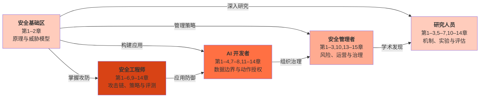

<div align="center">

# 大模型安全权威指南

[](https://creativecommons.org/licenses/by-nc-sa/4.0/)
[](https://github.com/yeasy/ai_security_guide)
[](https://github.com/yeasy/ai_security_guide/releases)
[](https://yeasy.gitbook.io/ai_security_guide)
[](https://github.com/yeasy/ai_security_guide/releases/latest)

> 从原理到实践，全面掌握大语言模型的安全攻防之道


</div>

---

## 开始阅读

- **在线阅读**：[GitBook 在线版](https://yeasy.gitbook.io/ai_security_guide/)（推荐）
- **PDF 下载**：前往 [GitHub Releases](https://github.com/yeasy/ai_security_guide/releases/latest) 下载最新版本

---

## 关于本书

大语言模型正在从“回答问题”走向“替人办事”：读网页和邮件、调用工具、执行代码、操作账户。安全问题也随之从“模型会说什么”扩展到“系统会做什么”。提示注入可以借一封邮件让助手把数据发出去，越狱能诱导模型生成有害内容，数据投毒可能在训练阶段埋下隐患；模型一旦被说服，一次工具调用就可能造成真实的损失。

本书从原理、攻击、防御到治理，系统梳理大语言模型与智能体的安全，主线是一个系统视角（[1.3](01_intro/1.3_llm_vs_traditional.md) 提出，[第 11 章](11_agent_foundations/README.md)展开为不可靠执行者模型）：模型会出错，也会被操纵，安全不能押在“模型大概不会错”上，而要由模型之外的确定性机制给后果设上界。

---

## 目标读者

- **AI/ML 工程师与开发者**：希望在开发 LLM 应用时融入安全设计，避免常见漏洞
- **安全工程师与渗透测试人员**：需要掌握 LLM 特有的攻击面与防御手段
- **技术管理者与架构师**：负责制定 AI 安全策略与合规方案
- **AI 安全研究人员**：关注学术前沿，探索新型攻击与防御方法
- **对 AI 安全感兴趣的技术爱好者**：希望系统性了解 LLM 安全全貌

---

## 你将学到什么

阅读本书后，你将能够：

1. **理解 LLM 安全的基本概念**
   - 掌握大语言模型的工作原理与安全边界
   - 了解 LLM 安全与传统软件安全的异同
   - 熟悉 OWASP LLM Top 10 等权威安全框架

2. **识别与分析 LLM 攻击手段**
   - 深入理解提示注入、越狱、数据投毒等核心攻击技术
   - 掌握针对智能体系统、RAG 架构的新型攻击向量
   - 学会使用红队测试方法评估模型安全性

3. **构建安全的 LLM 应用**
   - 设计具备纵深防御能力的安全架构，分清只降低频率的防护与能给后果设上界的边界
   - 在通用、自主、安全之间取舍时，说清放弃了什么、由什么机制兜底
   - 实施输入验证、输出过滤、权限控制等防护措施
   - 部署监控告警与应急响应机制

4. **应对合规与治理挑战**
   - 了解全球 AI 监管格局，包括 EU AI Act、中国《生成式人工智能服务管理暂行办法》等核心法规
   - 建立完善的 AI 治理框架与安全运营体系

---

## 本书特色

- **系统视角的安全模型**：把智能体安全归纳为不可靠执行者模型，即概率的部分出主意，确定的部分拿主意；会造成损失的动作，不问原因一律经过模型之外的检查点，即“闸”（[11.3](11_agent_foundations/11.3_unreliable_executor.md)）。
- **笔者提出的 CAS 原理**：通用性、自主性、安全性三者不可兼得。每种取舍都落到具体机制上，用来判断一个智能体放弃了什么、由什么兜底（[11.5](11_agent_foundations/11.5_cas_principle.md)、[13.2.5](13_agent_architecture/13.2_architectural_defenses.md)）。
- **分清“降频率”与“设上界”**：检测器、护栏和第二个模型只能降低攻击成功的频率，权限、沙箱、信息流控制与人工确认才能给后果设上界。书中按这条判据给各类防御定位（[4.5.11](04_prompt_injection/4.5_injection_defense.md)、[9.2.9](09_io_protection/9.2_output_moderation.md)、[13.5](13_agent_architecture/13.5_tooling_selection.md)）。
- **可运行的配套实验**：三个离线实验用合成数据与模型替身，把正文中的控制写成可执行的检查，并配有变异验收：关掉某项控制，对应的检查必须失败。
- **以一手来源为准**：规范、论文与源码均取原文核对，引用均附原文链接，主要资料编入[附录 C](16_appendix/C_references.md)。领域变化很快，附录同时给出持续跟踪的资源。

---

## 阅读建议

本书采用循序渐进的结构，建议按顺序阅读：

- **第一部分（第 1–3 章）** 建立基础认知，适合所有读者
- **第二部分（第 4–7 章）** 深入攻击技术，适合需要了解威胁的读者
- **第三部分（第 8–10 章）** 聚焦防御实践，适合需要构建安全系统的读者
- **第四部分（第 11–14 章）** 智能体安全：以不可靠执行者模型与 CAS 原理为主线，讲实现结构、攻击面、架构边界与实践，适合构建或评审智能体系统的读者
- **第五部分（[第 15 章](15_governance/README.md)与附录）** 治理展望与资源汇总，适合持续学习者

对于时间有限的读者，可按下节“五分钟快速上手”的顺序读。

---

## 五分钟快速上手

先建立整体认知，再开始完整实验：

1. 阅读 [1.3](01_intro/1.3_llm_vs_traditional.md) 与[第 4 章](04_prompt_injection/README.md)的提示注入示例，看攻击内容如何进入上下文并改变行为。
2. 阅读 [11.3](11_agent_foundations/11.3_unreliable_executor.md) 与 [11.5](11_agent_foundations/11.5_cas_principle.md) 的节首总述，了解不可靠执行者模型与 CAS 原理。
3. 阅读 [14.4](14_agent_practice/14.4_case_study.md) 的邮件助手案例，比较普通链路与按信任拆分的链路，再运行下方的邮件助手实验。

这五分钟用于定位问题和阅读入口；可运行实验及其验收见下方，完整的安全评估还要继续学习机制、权限与运营各章。

---

## 学习路线图



### 学习角色对比

| 角色 | 推荐章节 | 学习重点 | 预期成果 |
|------|---------|---------|---------|
| **安全工程师** | 第 1–6→9–14 章，再读[第 15 章](15_governance/README.md) | 追踪攻击链、实现出口策略、审查工具与身份边界，设计自适应评测 | 交付威胁模型、可复核的副作用轨迹与剩余风险清单 |
| **AI 开发者** | 第 1–4→7–8→11–14 章 | RAG 授权、类型化输入、来源传播、沙箱与动作网关 | 实现带权限、预算和失败处理的应用，并写出回归验收 |
| **安全管理者** | 第 1–3→10→13–15 章 | 风险口径、责任分工、事件响应与合规证据 | 将具体控制与责任人、证据及复验条件对应起来 |
| **研究人员** | 第 1–3→5–7→10–14 章 | 梯度与训练机制、攻击搜索、基准源码与统计分母 | 设计带对照、预算、正常效用与失败分析的可复现实验 |

工程路线需要 Python、HTTP、身份权限与日志基础；训练和攻击搜索路线还需要概率统计、线性代数与梯度基础。读懂章节后，应继续通过实现、对照实验和陌生系统评审检验能力；阅读本身不能替代这些训练。

### 三个可运行实验

实验使用 Python 标准库和固定合成数据，运行入口位于仓库根目录：

| 实验 | 连接的章节 | 需要观察的内部行为 |
|------|------------|--------------------|
| [邮件助手](examples/mail_assistant/README.md) | [13.2](13_agent_architecture/13.2_architectural_defenses.md)、[14.4](14_agent_practice/14.4_case_study.md)–[14.5](14_agent_practice/14.5_security_panorama.md) | 变量来源、读取授权、发送判定、参数摘要批准、发送箱与未知状态查询 |
| [支付预算](examples/payment_budget/README.md) | [11.9](11_agent_foundations/11.9_web3_agents.md)、[12.7](12_agent_attack_surface/12.7_multi_agent_security.md)、[13.4](13_agent_architecture/13.4_agent_identity.md) | 并发原子预留、参数绑定重放、UNKNOWN 占用与可信对账 |
| [RAG 轨迹](examples/rag_trace/README.md) | [7.3](07_rag_security/7.3_retrieval_manipulation.md)、[7.5](07_rag_security/7.5_vector_database_security.md)–[7.8](07_rag_security/7.8_rag_evaluation_best_practices.md) | 候选与排序、ACL、上下文、生成判定、缓存撤销及 ASR 分母 |

```bash
python3 examples/mail_assistant/lab.py
python3 examples/payment_budget/ledger.py
python3 examples/rag_trace/lab.py
```

先保留正常效用，再分别关闭控制，核对同一判定器是否捕获预期错误。合成实验不测真实模型攻击成功率、操作系统沙箱或生产支付；各实验说明列出了替换这些组件时需要补充的验收。

---

## 推荐阅读

本书是 AI 技术丛书的一部分。以下书籍与本书形成互补：

| 书名 | 与本书的关系 |
|------|------------|
| [《零基础学 AI》](https://yeasy.gitbook.io/ai_beginner_guide) | AI 零基础入门，适合缺乏 AI 背景的读者 |
| [《大模型提示词工程指南》](https://yeasy.gitbook.io/prompt_engineering_guide) | 理解提示注入攻击的前置知识 |
| [《大模型上下文工程权威指南》](https://yeasy.gitbook.io/context_engineering_guide) | 深入理解 RAG 安全的上下文工程基础 |
| [《智能体 AI 权威指南》](https://yeasy.gitbook.io/agentic_ai_guide) | 理解智能体系统的架构，为智能体安全提供背景 |
| [《Claude 技术指南》](https://yeasy.gitbook.io/claude_guide) | 了解 Claude 的安全设计理念（宪法式 AI）与工具安全 |
| [《OpenClaw 入门到精通》](https://yeasy.gitbook.io/openclaw_guide) | 智能体框架的安全基线与审计流程实践 |
| [《大模型原理与架构》](https://yeasy.gitbook.io/llm_internals) | 深入理解大语言模型底层逻辑与架构 |
| [《智能体 Harness 工程指南》](https://yeasy.gitbook.io/harness_engineering_guide) | 智能体 Harness 层的安全体系设计与沙箱隔离实践 |

---

## 许可证

本书采用 [CC BY-NC-SA 4.0](https://creativecommons.org/licenses/by-nc-sa/4.0/) 许可证。

您可以自由分享和演绎，但需署名、非商业使用、相同方式共享。
